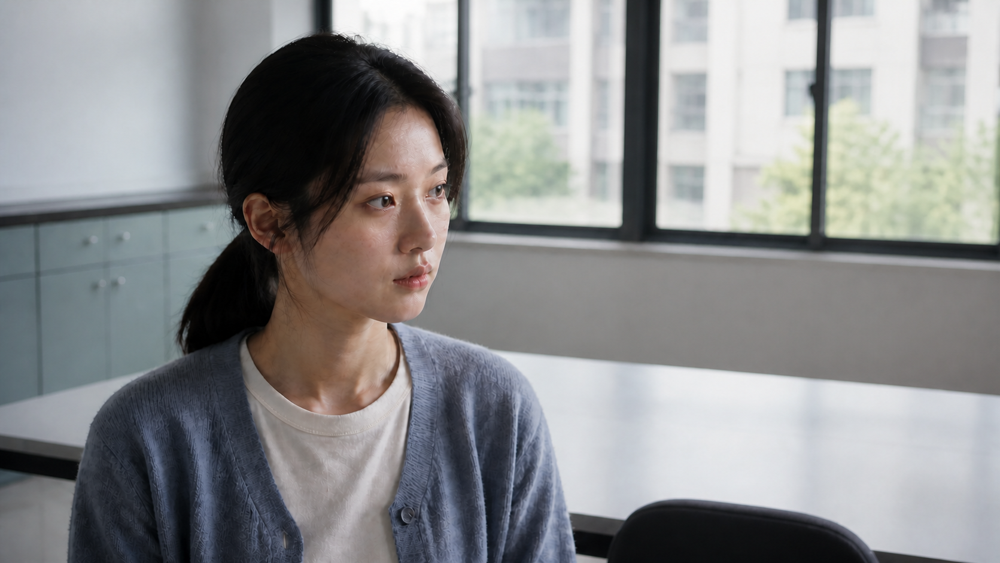

# S08 新旧真实感对照

本次使用内置 imagegen，仅生成一次新图。以原S08作为编辑参考，要求保留身份、服装、取景和场景，按新规范调整材质、布光与光学成像。不是固定随机种子的严格实验，也没有重新生成或替换原工程镜头。

| 原图 | 新规范参考重绘 |
|---|---|
|  |  |

[实际发送的完整提示词](./generation-prompt.txt)

观察：新图的面部明暗与背景虚化有变化，人物和构图基本保持。但皮肤尤其额头、衣料仍可见不自然的纹理，不能据此判断已达到完全实拍的质感。保留本次原始生成结果供直接比较，没有通过多次重抽挑选有利样片。

原始S08的SHA256保持不变：`ED0BFA3F918C9C035C6D75721512769361E96B68F5DDAF528691D3C0DA4C496A`。
