# 《窗帘后面的灯》AI视频分镜书

> 总时长：05:00  
> 分镜数量：36  
> 常规单镜：6—10秒  
> 画幅／首帧：16:9／1670—1672×941（尚未统一）

## 全片统一约束

- 实际影片尚未生成；300秒为36镜剪辑设计时长，片名计入最后一镜。
- 林澄与周屿身份、发型和全片服装稳定；双人主机位女左男右。
- 无人镜头不增加演员；手部特写不增加多余手指。
- 精确便笺文字及片名交后期，不在生成画面强求可读字。
- 深蓝记录本在S26交还后不再出现在宿舍；米色便笺始终留在林澄手中。
- 首帧只表现动作前静态状态，视频提示是接下来数秒的动作。

## 角色设定

### 林澄

23岁，偏中分低马尾，灰蓝开襟针织衫、米白T恤、深灰直筒裤、白帆布鞋；参考图固定身份和服装。

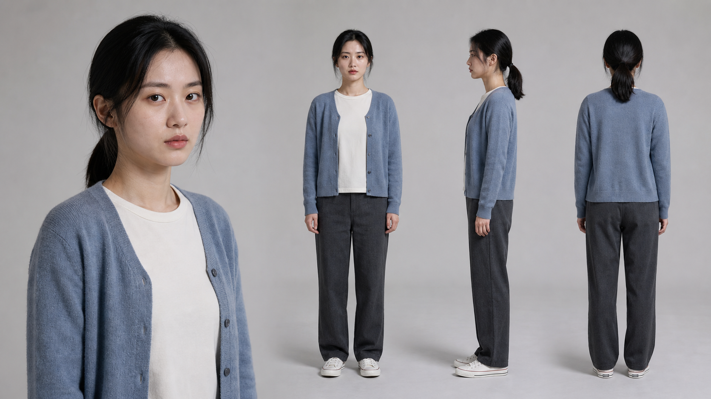

### 周屿

24岁，黑色短发侧分，深海军蓝敞襟衬衫、浅灰T恤、黑直筒裤、灰白帆布鞋；全片保持同一身份和服装。

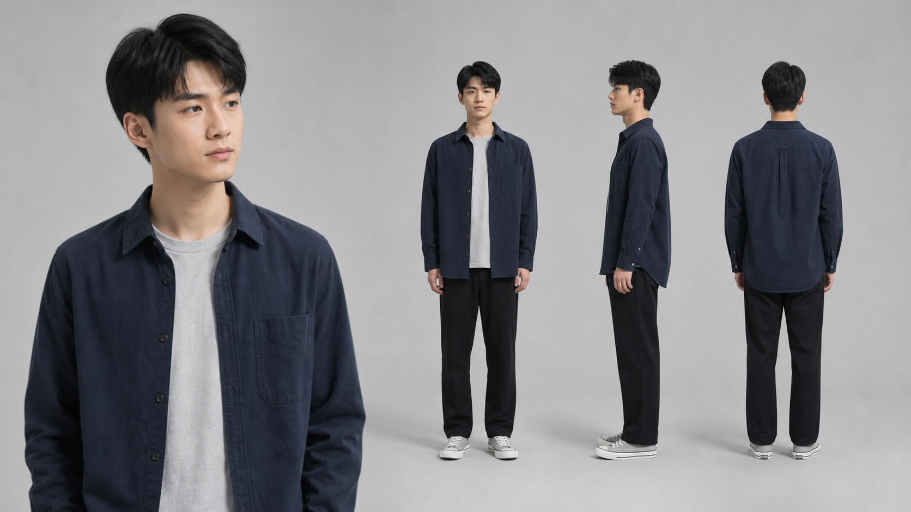

# 逐镜头分镜

## S01｜00:00—00:09｜9秒

- 场景：实验记录室的深夜，冷白顶灯照着白色长桌，金属窗外隔庭院有一格暖色宿舍窗
- 出镜：周屿（图中右侧的人）
- 景别／镜头：中远景，35mm镜头，大景深，固定机位
- 首帧画面：周屿独自站在实验桌右侧，深蓝记录本摊在手边，略倦的脸低头朝记录本；左侧座位空着
- 运动提示：周屿从记录本上抬眼，看向对面窗帘后的暖灯，保持温和疲倦的表情；无对白
- 对白／声音：无对白
- 声场／剪辑：实验楼低电流声、笔停纸面声
- 后期备注：建立两楼视线；不生成可读实验数据

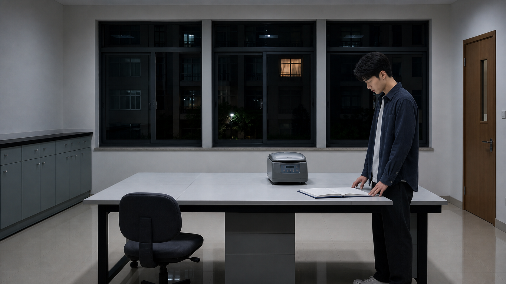

### 最终视频提示词（整段复制）

```text
[场景：实验记录室的深夜，冷白顶灯照着白色长桌，金属窗外隔庭院有一格暖色宿舍窗。角色：周屿（图中右侧的人）。镜头：中远景，35mm镜头，大景深，固定机位。动作：周屿从记录本上抬眼，看向对面窗帘后的暖灯，保持温和疲倦的表情；无对白；保持人物身份、发型、服装和空间结构稳定。]
```

<details><summary>首帧生成提示词</summary>

```text
生成《窗帘后面的灯》S01的单张剧情首帧，1672x941 PNG，16:9横版，写实电影摄影，真实肤质、克制自然光，无文字水印拼贴。参考图1：只用于周屿的脸、发型、服装和体型。参考图2：只用于实验室的窗框、白桌、左柜、右门和闭合灰色仪器；不得添加任何台灯、绿色灯或宿舍物件。场景：实验记录室的深夜，冷白顶灯照着白色长桌，金属窗外隔庭院有一格暖色宿舍窗。出镜及屏幕位置：周屿（图中右侧的人）。摄影：中远景，35mm镜头，大景深，固定机位，这是静止首帧，摄像机尚未运动。首帧可见事实：周屿独自站在实验桌右侧，深蓝记录本摊在手边，略倦的脸低头朝记录本；左侧座位空着。画面必须停在主要动作发生之前，不提前展示动作结束状态。只出现指定的人物和手，保持参考人物的身份、发型、体型、服装；场景门窗和家具几何稳定。纸面、封面、设备、手机均不需要可读文字，无字幕无标签。只生成一张电影镜头，不要角色多视图或多格图。
```

</details>

## S02｜00:09—00:17｜8秒

- 场景：深夜的研究生宿舍，奶油窗帘在画左，绿色圆顶台灯照着旧木桌，窗外是实验楼
- 出镜：林澄（图中中右侧的人）
- 景别／镜头：中景，50mm镜头，中等景深，固定机位
- 首帧画面：林澄坐在画中右的椅子上，双手搭着浅色课本，台灯在左侧亮着，视线尚落在课本上；桌上没有深蓝记录本
- 运动提示：林澄把视线从书页移到画左的窗缝，书页保持不动，像是在等对面的人结束工作；无对白
- 对白／声音：无对白
- 声场／剪辑：夜虫、远楼模糊设备声
- 后期备注：以目光揭示等待，不加旁白

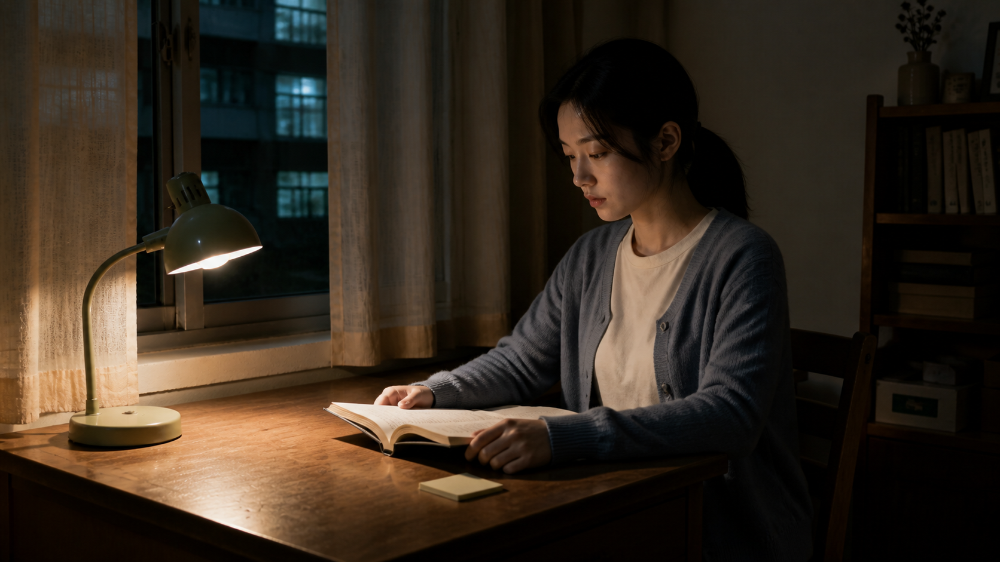

### 最终视频提示词（整段复制）

```text
[场景：深夜的研究生宿舍，奶油窗帘在画左，绿色圆顶台灯照着旧木桌，窗外是实验楼。角色：林澄（图中中右侧的人）。镜头：中景，50mm镜头，中等景深，固定机位。动作：林澄把视线从书页移到画左的窗缝，书页保持不动，像是在等对面的人结束工作；无对白；保持人物身份、发型、服装和空间结构稳定。]
```

<details><summary>首帧生成提示词</summary>

```text
生成《窗帘后面的灯》S02的单张剧情首帧，1672x941 PNG，16:9横版，写实电影摄影，真实肤质、克制自然光，无文字水印拼贴。参考图1：只用于林澄的脸、发型、服装和体型。参考图2：只用于宿舍空间、木桌、奶油窗帘和绿色圆顶台灯；本子、便笺和时段以本镜为准。场景：深夜的研究生宿舍，奶油窗帘在画左，绿色圆顶台灯照着旧木桌，窗外是实验楼。出镜及屏幕位置：林澄（图中中右侧的人）。摄影：中景，50mm镜头，中等景深，固定机位，这是静止首帧，摄像机尚未运动。首帧可见事实：林澄坐在画中右的椅子上，双手搭着浅色课本，台灯在左侧亮着，视线尚落在课本上；桌上没有深蓝记录本。画面必须停在主要动作发生之前，不提前展示动作结束状态。只出现指定的人物和手，保持参考人物的身份、发型、体型、服装；场景门窗和家具几何稳定。纸面、封面、设备、手机均不需要可读文字，无字幕无标签。只生成一张电影镜头，不要角色多视图或多格图。
```

</details>

## S03｜00:17—00:25｜8秒

- 场景：深夜的研究生宿舍，奶油窗帘在画左，绿色圆顶台灯照着旧木桌，窗外是实验楼
- 出镜：林澄（仅图中右侧伸来的右手出镜）
- 景别／镜头：手部特写，85mm镜头，浅景深，固定机位
- 首帧画面：绿色台灯亮着，右侧伸来的灰蓝针织袖口与一只自然右手停在圆底座开关旁，指尖尚未触到开关，背景无深蓝本子
- 运动提示：林澄的右手伸向台灯开关，指尖停住，随后轻轻收回；灯始终亮着，无对白
- 对白／声音：无对白
- 声场／剪辑：针织袖口轻擦木桌
- 后期备注：本镜绝不熄灯；与S35形成同构图差异

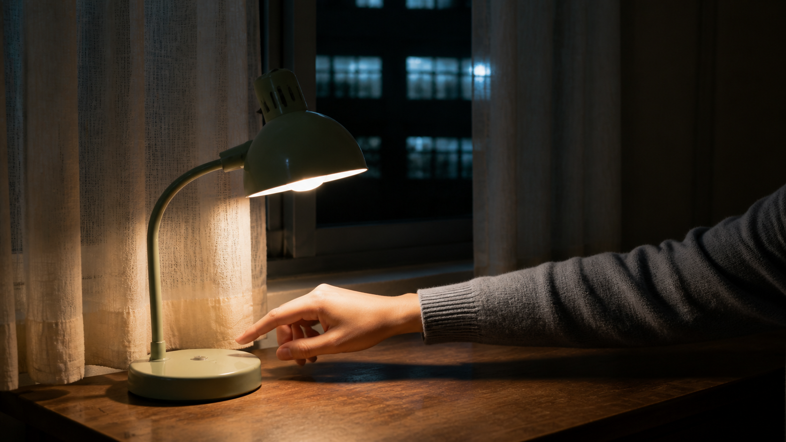

### 最终视频提示词（整段复制）

```text
[场景：深夜的研究生宿舍，奶油窗帘在画左，绿色圆顶台灯照着旧木桌，窗外是实验楼。角色：林澄（仅图中右侧伸来的右手出镜）。镜头：手部特写，85mm镜头，浅景深，固定机位。动作：林澄的右手伸向台灯开关，指尖停住，随后轻轻收回；灯始终亮着，无对白；保持人物身份、发型、服装和空间结构稳定。]
```

<details><summary>首帧生成提示词</summary>

```text
生成《窗帘后面的灯》S03的单张剧情首帧，1672x941 PNG，16:9横版，写实电影摄影，真实肤质、克制自然光，无文字水印拼贴。参考图1：只用于林澄的脸、发型、服装和体型。参考图2：只用于宿舍空间、木桌、奶油窗帘和绿色圆顶台灯；本子、便笺和时段以本镜为准。场景：深夜的研究生宿舍，奶油窗帘在画左，绿色圆顶台灯照着旧木桌，窗外是实验楼。出镜及屏幕位置：林澄（仅图中右侧伸来的右手出镜）。摄影：手部特写，85mm镜头，浅景深，固定机位，这是静止首帧，摄像机尚未运动。首帧可见事实：绿色台灯亮着，右侧伸来的灰蓝针织袖口与一只自然右手停在圆底座开关旁，指尖尚未触到开关，背景无深蓝本子。画面必须停在主要动作发生之前，不提前展示动作结束状态。只出现指定的人物和手，保持参考人物的身份、发型、体型、服装；场景门窗和家具几何稳定。纸面、封面、设备、手机均不需要可读文字，无字幕无标签。只生成一张电影镜头，不要角色多视图或多格图。
```

</details>

## S04｜00:25—00:34｜9秒

- 场景：实验记录室的深夜，冷白顶灯照着白色长桌，金属窗外隔庭院有一格暖色宿舍窗
- 出镜：周屿（图中右侧的人）
- 景别／镜头：中景，50mm镜头，中等景深，固定机位
- 首帧画面：周屿站在桌右，摊开的深蓝记录本在面前，黑色笔已平放，视线落在本子上；实验室窗口和右后木门可辨
- 运动提示：周屿把深蓝记录本慢慢合上，手掌在封面停一拍，结束这晚的工作；无对白
- 对白／声音：无对白
- 声场／剪辑：布面书合拢、椅脚声
- 后期备注：不添告白便笺，信尚未出现

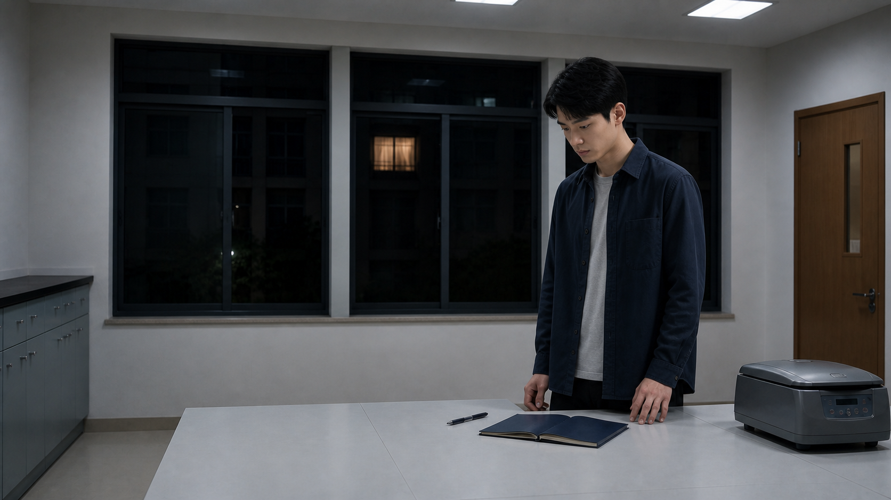

### 最终视频提示词（整段复制）

```text
[场景：实验记录室的深夜，冷白顶灯照着白色长桌，金属窗外隔庭院有一格暖色宿舍窗。角色：周屿（图中右侧的人）。镜头：中景，50mm镜头，中等景深，固定机位。动作：周屿把深蓝记录本慢慢合上，手掌在封面停一拍，结束这晚的工作；无对白；保持人物身份、发型、服装和空间结构稳定。]
```

<details><summary>首帧生成提示词</summary>

```text
生成《窗帘后面的灯》S04的单张剧情首帧，1672x941 PNG，16:9横版，写实电影摄影，真实肤质、克制自然光，无文字水印拼贴。参考图1：只用于周屿的脸、发型、服装和体型。参考图2：只用于实验室的窗框、白桌、左柜、右门和闭合灰色仪器；不得添加任何台灯、绿色灯或宿舍物件。场景：实验记录室的深夜，冷白顶灯照着白色长桌，金属窗外隔庭院有一格暖色宿舍窗。出镜及屏幕位置：周屿（图中右侧的人）。摄影：中景，50mm镜头，中等景深，固定机位，这是静止首帧，摄像机尚未运动。首帧可见事实：周屿站在桌右，摊开的深蓝记录本在面前，黑色笔已平放，视线落在本子上；实验室窗口和右后木门可辨。画面必须停在主要动作发生之前，不提前展示动作结束状态。只出现指定的人物和手，保持参考人物的身份、发型、体型、服装；场景门窗和家具几何稳定。纸面、封面、设备、手机均不需要可读文字，无字幕无标签。只生成一张电影镜头，不要角色多视图或多格图。
```

</details>

## S05｜00:34—00:40｜6秒

- 场景：深夜的研究生宿舍，奶油窗帘在画左，绿色圆顶台灯照着旧木桌，窗外是实验楼
- 出镜：无出镜人物
- 景别／镜头：主观远景，85mm镜头，大景深，固定机位
- 首帧画面：从宿舍奶油色窗帘的窄缝望出去，对面实验室一格冷白窗口仍亮着，画面边缘只有近处窗帘，无人影
- 运动提示：对面实验室的冷白灯光熄灭，窗格和近处窗帘位置不变；无对白
- 对白／声音：无对白
- 声场／剪辑：远处关门声
- 后期备注：只熄对面灯，不移动建筑

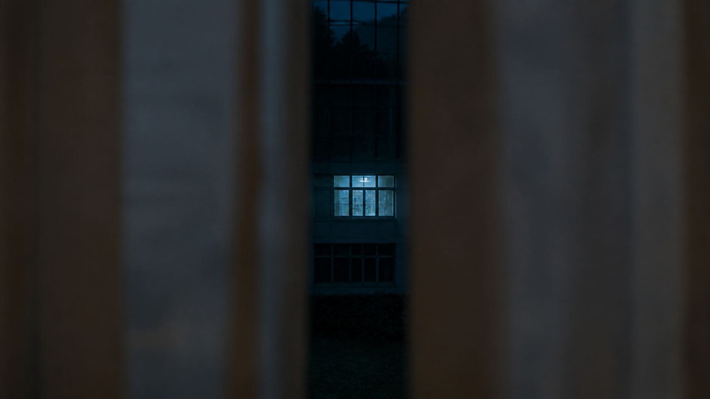

### 最终视频提示词（整段复制）

```text
[场景：深夜的研究生宿舍，奶油窗帘在画左，绿色圆顶台灯照着旧木桌，窗外是实验楼。角色：无出镜人物。镜头：主观远景，85mm镜头，大景深，固定机位。动作：对面实验室的冷白灯光熄灭，窗格和近处窗帘位置不变；无对白；保持空间结构稳定，不增加人物。]
```

<details><summary>首帧生成提示词</summary>

```text
生成《窗帘后面的灯》S05的单张剧情首帧，1672x941 PNG，16:9横版，写实电影摄影，真实肤质、克制自然光，无文字水印拼贴。参考图1：只用于宿舍空间、木桌、奶油窗帘和绿色圆顶台灯；本子、便笺和时段以本镜为准。场景：深夜的研究生宿舍，奶油窗帘在画左，绿色圆顶台灯照着旧木桌，窗外是实验楼。出镜及屏幕位置：无出镜人物。摄影：主观远景，85mm镜头，大景深，固定机位，这是静止首帧，摄像机尚未运动。首帧可见事实：从宿舍奶油色窗帘的窄缝望出去，对面实验室一格冷白窗口仍亮着，画面边缘只有近处窗帘，无人影。画面必须停在主要动作发生之前，不提前展示动作结束状态。只出现指定的人物和手，保持参考人物的身份、发型、体型、服装；场景门窗和家具几何稳定。纸面、封面、设备、手机均不需要可读文字，无字幕无标签。只生成一张电影镜头，不要角色多视图或多格图。
```

</details>

## S06｜00:40—00:50｜10秒

- 场景：深夜的研究生宿舍，奶油窗帘在画左，绿色圆顶台灯照着旧木桌，窗外是实验楼
- 出镜：林澄（图中中右侧的人）
- 景别／镜头：中景，50mm镜头，中等景深，固定机位
- 首帧画面：林澄坐在中右侧，向左看着已经暗下来的对面窗格，右手放在仍亮的绿色台灯底座旁，浅色课本在桌中
- 运动提示：林澄确认对面灯已熄，轻按自己的台灯开关，暖光熄灭后静坐片刻，留下窗外淡蓝夜光；无对白
- 对白／声音：无对白
- 声场／剪辑：台灯开关轻响、呼吸
- 后期备注：第一次关灯是跟随他；切次日下午

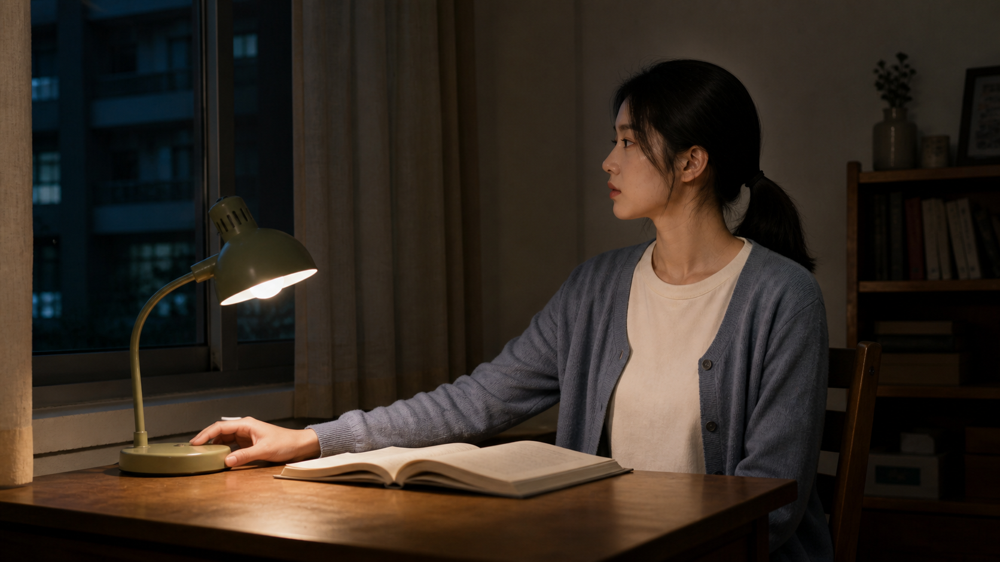

### 最终视频提示词（整段复制）

```text
[场景：深夜的研究生宿舍，奶油窗帘在画左，绿色圆顶台灯照着旧木桌，窗外是实验楼。角色：林澄（图中中右侧的人）。镜头：中景，50mm镜头，中等景深，固定机位。动作：林澄确认对面灯已熄，轻按自己的台灯开关，暖光熄灭后静坐片刻，留下窗外淡蓝夜光；无对白；保持人物身份、发型、服装和空间结构稳定。]
```

<details><summary>首帧生成提示词</summary>

```text
生成《窗帘后面的灯》S06的单张剧情首帧，1672x941 PNG，16:9横版，写实电影摄影，真实肤质、克制自然光，无文字水印拼贴。参考图1：只用于林澄的脸、发型、服装和体型。参考图2：只用于宿舍空间、木桌、奶油窗帘和绿色圆顶台灯；本子、便笺和时段以本镜为准。场景：深夜的研究生宿舍，奶油窗帘在画左，绿色圆顶台灯照着旧木桌，窗外是实验楼。出镜及屏幕位置：林澄（图中中右侧的人）。摄影：中景，50mm镜头，中等景深，固定机位，这是静止首帧，摄像机尚未运动。首帧可见事实：林澄坐在中右侧，向左看着已经暗下来的对面窗格，右手放在仍亮的绿色台灯底座旁，浅色课本在桌中。画面必须停在主要动作发生之前，不提前展示动作结束状态。只出现指定的人物和手，保持参考人物的身份、发型、体型、服装；场景门窗和家具几何稳定。纸面、封面、设备、手机均不需要可读文字，无字幕无标签。只生成一张电影镜头，不要角色多视图或多格图。
```

</details>

## S07｜00:50—00:58｜8秒

- 场景：次日下午的实验记录室，后窗自然天光照亮白色长桌，左边浅蓝灰柜、右后木门位置不变
- 出镜：林澄（图中左侧的人）、周屿（图中右侧的人）
- 景别／镜头：双人中景，40mm镜头，大景深，固定机位
- 首帧画面：林澄和周屿站在实验桌近侧面向镜头的三分之二侧面，女左男右，彼此看着对方；深蓝记录本合着放在男方一侧，白天天光来自后窗
- 运动提示：周屿带着刚收到好消息的笑，望向林澄，对她说“录取下来了。今晚就走”；林澄听着，没有抢话
- 对白／声音：周屿：录取下来了。今晚就走。
- 声场／剪辑：自然室内声，轻音乐低位
- 后期备注：女左男右；不要生成手机录取文字

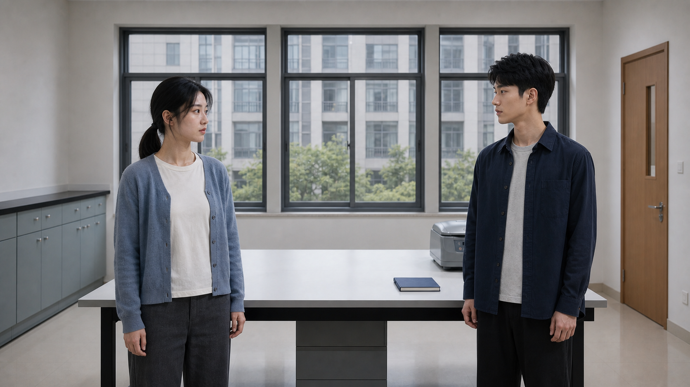

### 最终视频提示词（整段复制）

```text
[场景：次日下午的实验记录室，后窗自然天光照亮白色长桌，左边浅蓝灰柜、右后木门位置不变。角色：林澄（图中左侧的人）、周屿（图中右侧的人）。镜头：双人中景，40mm镜头，大景深，固定机位。动作：周屿带着刚收到好消息的笑，望向林澄，对她说“录取下来了。今晚就走”；林澄听着，没有抢话；保持人物身份、发型、服装和空间结构稳定。]
```

<details><summary>首帧生成提示词</summary>

```text
生成《窗帘后面的灯》S07的单张剧情首帧，1672x941 PNG，16:9横版，写实电影摄影，真实肤质、克制自然光，无文字水印拼贴。参考图1：只用于林澄的脸、发型、服装和体型。参考图2：只用于周屿的脸、发型、服装和体型。参考图3：只用于实验室的窗框、白桌、左柜、右门和闭合灰色仪器；不得添加任何台灯、绿色灯或宿舍物件。场景：次日下午的实验记录室，后窗自然天光照亮白色长桌，左边浅蓝灰柜、右后木门位置不变。出镜及屏幕位置：林澄（图中左侧的人）、周屿（图中右侧的人）。摄影：双人中景，40mm镜头，大景深，固定机位，这是静止首帧，摄像机尚未运动。首帧可见事实：林澄和周屿站在实验桌近侧面向镜头的三分之二侧面，女左男右，彼此看着对方；深蓝记录本合着放在男方一侧，白天天光来自后窗。画面必须停在主要动作发生之前，不提前展示动作结束状态。只出现指定的人物和手，保持参考人物的身份、发型、体型、服装；场景门窗和家具几何稳定。纸面、封面、设备、手机均不需要可读文字，无字幕无标签。只生成一张电影镜头，不要角色多视图或多格图。
```

</details>

## S08｜00:58—01:07｜9秒

- 场景：次日下午的实验记录室，后窗自然天光照亮白色长桌，左边浅蓝灰柜、右后木门位置不变
- 出镜：林澄（图中偏左的人）
- 景别／镜头：近景，85mm镜头，浅景深，眼平固定机位
- 首帧画面：只拍林澄一人，脸在左侧三分线，朝画右的周屿看，灰蓝针织衫和低马尾可见；背景是白天的金属窗框
- 运动提示：林澄先勉强保持笑意，停一拍后轻声问“这么快？”，目光仍看向画外右侧
- 对白／声音：林澄：这么快？
- 声场／剪辑：保留问句后的室内安静
- 后期备注：不让周屿出镜，不突然落泪

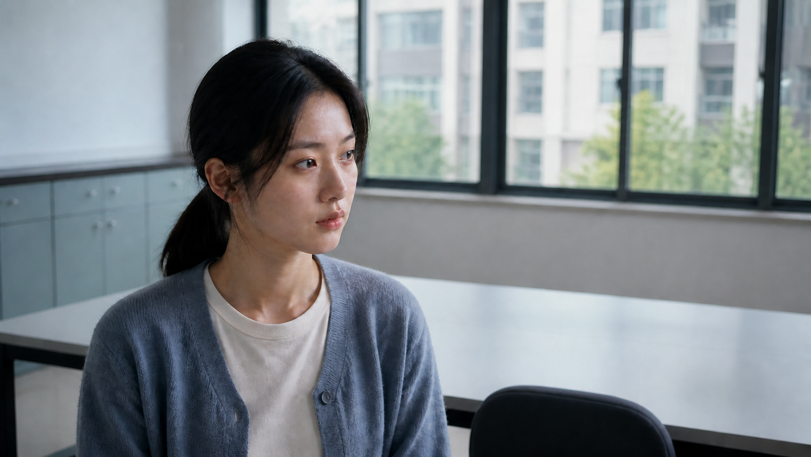

### 最终视频提示词（整段复制）

```text
[场景：次日下午的实验记录室，后窗自然天光照亮白色长桌，左边浅蓝灰柜、右后木门位置不变。角色：林澄（图中偏左的人）。镜头：近景，85mm镜头，浅景深，眼平固定机位。动作：林澄先勉强保持笑意，停一拍后轻声问“这么快？”，目光仍看向画外右侧；保持人物身份、发型、服装和空间结构稳定。]
```

<details><summary>首帧生成提示词</summary>

```text
生成《窗帘后面的灯》S08的单张剧情首帧，1672x941 PNG，16:9横版，写实电影摄影，真实肤质、克制自然光，无文字水印拼贴。参考图1：只用于林澄的脸、发型、服装和体型。参考图2：只用于实验室的窗框、白桌、左柜、右门和闭合灰色仪器；不得添加任何台灯、绿色灯或宿舍物件。场景：次日下午的实验记录室，后窗自然天光照亮白色长桌，左边浅蓝灰柜、右后木门位置不变。出镜及屏幕位置：林澄（图中偏左的人）。摄影：近景，85mm镜头，浅景深，眼平固定机位，这是静止首帧，摄像机尚未运动。首帧可见事实：只拍林澄一人，脸在左侧三分线，朝画右的周屿看，灰蓝针织衫和低马尾可见；背景是白天的金属窗框。画面必须停在主要动作发生之前，不提前展示动作结束状态。只出现指定的人物和手，保持参考人物的身份、发型、体型、服装；场景门窗和家具几何稳定。纸面、封面、设备、手机均不需要可读文字，无字幕无标签。只生成一张电影镜头，不要角色多视图或多格图。
```

</details>

## S09｜01:07—01:14｜7秒

- 场景：次日下午的实验记录室，后窗自然天光照亮白色长桌，左边浅蓝灰柜、右后木门位置不变
- 出镜：林澄（图中左侧的人）、周屿（图中右侧的人）
- 景别／镜头：双人中近景，50mm镜头，中等景深，固定机位
- 首帧画面：两人在白桌远侧女左男右，周屿的手搭在自己一侧的深蓝本封面，林澄双手靠近桌沿，本子尚未移动
- 运动提示：周屿把深蓝实验记录本朝林澄轻推一点，对她说“最后一页，帮我核一下？”
- 对白／声音：周屿：最后一页，帮我核一下？
- 声场／剪辑：布面本子滑过桌面
- 后期备注：接S10手部，不让两只手互相穿过

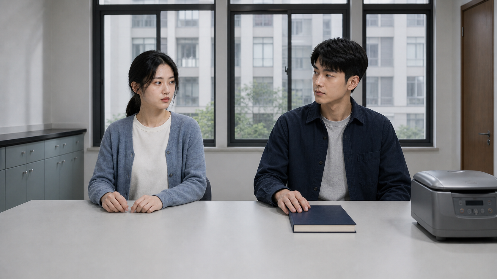

### 最终视频提示词（整段复制）

```text
[场景：次日下午的实验记录室，后窗自然天光照亮白色长桌，左边浅蓝灰柜、右后木门位置不变。角色：林澄（图中左侧的人）、周屿（图中右侧的人）。镜头：双人中近景，50mm镜头，中等景深，固定机位。动作：周屿把深蓝实验记录本朝林澄轻推一点，对她说“最后一页，帮我核一下？”；保持人物身份、发型、服装和空间结构稳定。]
```

<details><summary>首帧生成提示词</summary>

```text
生成《窗帘后面的灯》S09的单张剧情首帧，1672x941 PNG，16:9横版，写实电影摄影，真实肤质、克制自然光，无文字水印拼贴。参考图1：只用于林澄的脸、发型、服装和体型。参考图2：只用于周屿的脸、发型、服装和体型。参考图3：只用于实验室的窗框、白桌、左柜、右门和闭合灰色仪器；不得添加任何台灯、绿色灯或宿舍物件。场景：次日下午的实验记录室，后窗自然天光照亮白色长桌，左边浅蓝灰柜、右后木门位置不变。出镜及屏幕位置：林澄（图中左侧的人）、周屿（图中右侧的人）。摄影：双人中近景，50mm镜头，中等景深，固定机位，这是静止首帧，摄像机尚未运动。首帧可见事实：两人在白桌远侧女左男右，周屿的手搭在自己一侧的深蓝本封面，林澄双手靠近桌沿，本子尚未移动。画面必须停在主要动作发生之前，不提前展示动作结束状态。只出现指定的人物和手，保持参考人物的身份、发型、体型、服装；场景门窗和家具几何稳定。纸面、封面、设备、手机均不需要可读文字，无字幕无标签。只生成一张电影镜头，不要角色多视图或多格图。
```

</details>

## S10｜01:14—01:24｜10秒

- 场景：次日下午的实验记录室，后窗自然天光照亮白色长桌，左边浅蓝灰柜、右后木门位置不变
- 出镜：林澄（仅图中左侧伸来的双手出镜）、周屿（仅图中右侧伸来的右手出镜）
- 景别／镜头：道具特写，85mm镜头，浅景深，略俯固定机位
- 首帧画面：白桌中央一本闭合的深蓝记录本，左边是灰蓝针织袖口的双手，右边是一只深蓝衬衫袖口的右手；三只可见手互不重叠，本子还在两人之间
- 运动提示：林澄从画左稳稳接过记录本，周屿的右手松开，林澄在画外轻声说“好”；本子保持完整不变形
- 对白／声音：林澄画外：好。
- 声场／剪辑：纸页和袖口摩擦
- 后期备注：仅手部，不生成多余手指；借本动作完整留呼吸

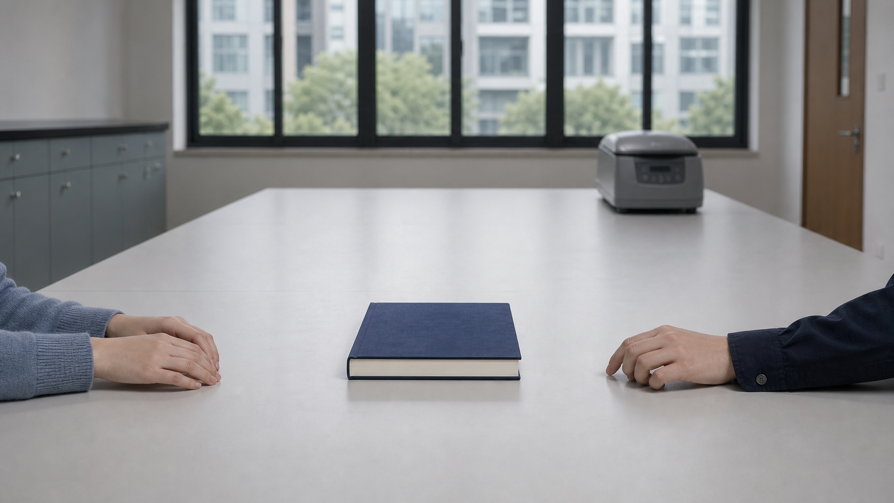

### 最终视频提示词（整段复制）

```text
[场景：次日下午的实验记录室，后窗自然天光照亮白色长桌，左边浅蓝灰柜、右后木门位置不变。角色：林澄（仅图中左侧伸来的双手出镜）、周屿（仅图中右侧伸来的右手出镜）。镜头：道具特写，85mm镜头，浅景深，略俯固定机位。动作：林澄从画左稳稳接过记录本，周屿的右手松开，林澄在画外轻声说“好”；本子保持完整不变形；保持人物身份、发型、服装和空间结构稳定。]
```

<details><summary>首帧生成提示词</summary>

```text
生成《窗帘后面的灯》S10的单张剧情首帧，1672x941 PNG，16:9横版，写实电影摄影，真实肤质、克制自然光，无文字水印拼贴。参考图1：只用于林澄的脸、发型、服装和体型。参考图2：只用于周屿的脸、发型、服装和体型。参考图3：只用于实验室的窗框、白桌、左柜、右门和闭合灰色仪器；不得添加任何台灯、绿色灯或宿舍物件。场景：次日下午的实验记录室，后窗自然天光照亮白色长桌，左边浅蓝灰柜、右后木门位置不变。出镜及屏幕位置：林澄（仅图中左侧伸来的双手出镜）、周屿（仅图中右侧伸来的右手出镜）。摄影：道具特写，85mm镜头，浅景深，略俯固定机位，这是静止首帧，摄像机尚未运动。首帧可见事实：白桌中央一本闭合的深蓝记录本，左边是灰蓝针织袖口的双手，右边是一只深蓝衬衫袖口的右手；三只可见手互不重叠，本子还在两人之间。画面必须停在主要动作发生之前，不提前展示动作结束状态。只出现指定的人物和手，保持参考人物的身份、发型、体型、服装；场景门窗和家具几何稳定。纸面、封面、设备、手机均不需要可读文字，无字幕无标签。只生成一张电影镜头，不要角色多视图或多格图。
```

</details>

## S11｜01:24—01:30｜6秒

- 场景：次日下午的实验记录室，后窗自然天光照亮白色长桌，左边浅蓝灰柜、右后木门位置不变
- 出镜：周屿（图中右侧的人）
- 景别／镜头：中近景，50mm镜头，中等景深，固定机位
- 首帧画面：周屿在右侧，身体三分之二转向后窗，嘴唇闭合，抬眼看对面的宿舍，双手空着；记录本已不在他手中
- 运动提示：周屿望着对面的窗户，随口说“对面那盏灯，总比我晚关”，语气只是普通观察
- 对白／声音：周屿：对面那盏灯，总比我晚关。
- 声场／剪辑：台词自然不中断
- 后期备注：无试探示爱表情；语速正常

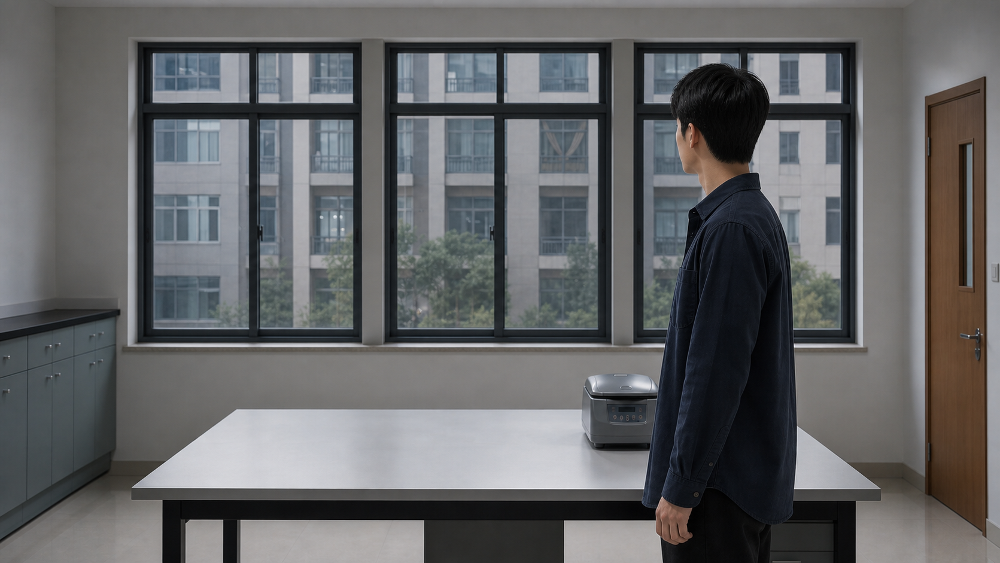

### 最终视频提示词（整段复制）

```text
[场景：次日下午的实验记录室，后窗自然天光照亮白色长桌，左边浅蓝灰柜、右后木门位置不变。角色：周屿（图中右侧的人）。镜头：中近景，50mm镜头，中等景深，固定机位。动作：周屿望着对面的窗户，随口说“对面那盏灯，总比我晚关”，语气只是普通观察；保持人物身份、发型、服装和空间结构稳定。]
```

<details><summary>首帧生成提示词</summary>

```text
生成《窗帘后面的灯》S11的单张剧情首帧，1672x941 PNG，16:9横版，写实电影摄影，真实肤质、克制自然光，无文字水印拼贴。参考图1：只用于周屿的脸、发型、服装和体型。参考图2：只用于实验室的窗框、白桌、左柜、右门和闭合灰色仪器；不得添加任何台灯、绿色灯或宿舍物件。场景：次日下午的实验记录室，后窗自然天光照亮白色长桌，左边浅蓝灰柜、右后木门位置不变。出镜及屏幕位置：周屿（图中右侧的人）。摄影：中近景，50mm镜头，中等景深，固定机位，这是静止首帧，摄像机尚未运动。首帧可见事实：周屿在右侧，身体三分之二转向后窗，嘴唇闭合，抬眼看对面的宿舍，双手空着；记录本已不在他手中。画面必须停在主要动作发生之前，不提前展示动作结束状态。只出现指定的人物和手，保持参考人物的身份、发型、体型、服装；场景门窗和家具几何稳定。纸面、封面、设备、手机均不需要可读文字，无字幕无标签。只生成一张电影镜头，不要角色多视图或多格图。
```

</details>

## S12｜01:30—01:40｜10秒

- 场景：次日下午的实验记录室，后窗自然天光照亮白色长桌，左边浅蓝灰柜、右后木门位置不变
- 出镜：林澄（图中偏左的人）
- 景别／镜头：近景，85mm镜头，浅景深，固定机位
- 首帧画面：林澄的脸在画左，手里抱着深蓝记录本，眼神看向画外右侧，嘴角有一丝被注意到的喜悦却还没开口
- 运动提示：林澄按住记录本书角，停顿后轻声回答“可能……忘了吧”，把差点显露的笑意压下去
- 对白／声音：林澄：可能……忘了吧。
- 声场／剪辑：台词间留一秒呼吸
- 后期备注：结尾停在想说未说；此处不是悲伤结论

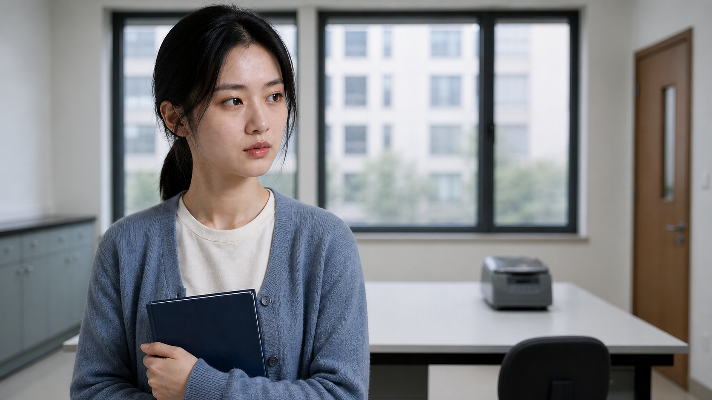

### 最终视频提示词（整段复制）

```text
[场景：次日下午的实验记录室，后窗自然天光照亮白色长桌，左边浅蓝灰柜、右后木门位置不变。角色：林澄（图中偏左的人）。镜头：近景，85mm镜头，浅景深，固定机位。动作：林澄按住记录本书角，停顿后轻声回答“可能……忘了吧”，把差点显露的笑意压下去；保持人物身份、发型、服装和空间结构稳定。]
```

<details><summary>首帧生成提示词</summary>

```text
生成《窗帘后面的灯》S12的单张剧情首帧，1672x941 PNG，16:9横版，写实电影摄影，真实肤质、克制自然光，无文字水印拼贴。参考图1：只用于林澄的脸、发型、服装和体型。参考图2：只用于实验室的窗框、白桌、左柜、右门和闭合灰色仪器；不得添加任何台灯、绿色灯或宿舍物件。场景：次日下午的实验记录室，后窗自然天光照亮白色长桌，左边浅蓝灰柜、右后木门位置不变。出镜及屏幕位置：林澄（图中偏左的人）。摄影：近景，85mm镜头，浅景深，固定机位，这是静止首帧，摄像机尚未运动。首帧可见事实：林澄的脸在画左，手里抱着深蓝记录本，眼神看向画外右侧，嘴角有一丝被注意到的喜悦却还没开口。画面必须停在主要动作发生之前，不提前展示动作结束状态。只出现指定的人物和手，保持参考人物的身份、发型、体型、服装；场景门窗和家具几何稳定。纸面、封面、设备、手机均不需要可读文字，无字幕无标签。只生成一张电影镜头，不要角色多视图或多格图。
```

</details>

## S13｜01:40—01:48｜8秒

- 场景：傍晚的研究生宿舍，奶油窗帘在画左，绿色圆顶台灯在木桌左侧亮着，暮色从窗外透入
- 出镜：林澄（图中中右侧的人）
- 景别／镜头：中景，50mm镜头，中等景深，固定机位
- 首帧画面：林澄坐在图中中右侧，绿色台灯在左边亮着，深蓝记录本合着放在桌左，米色便笺在桌中，她右手持笔停在纸上
- 运动提示：林澄在米色便笺上缓慢写下第一句话，写完短暂停笔；文字由后期处理，无对白
- 对白／声音：无对白
- 声场／剪辑：黑笔在纸上的沙沙声
- 后期备注：精确字不要求模型生成；已核完数据的记录本在旁

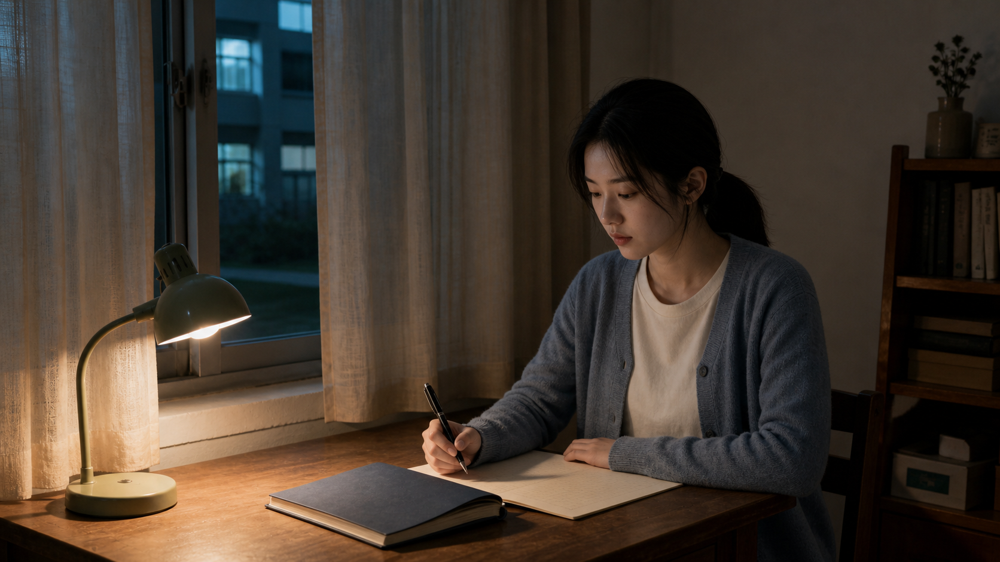

### 最终视频提示词（整段复制）

```text
[场景：傍晚的研究生宿舍，奶油窗帘在画左，绿色圆顶台灯在木桌左侧亮着，暮色从窗外透入。角色：林澄（图中中右侧的人）。镜头：中景，50mm镜头，中等景深，固定机位。动作：林澄在米色便笺上缓慢写下第一句话，写完短暂停笔；文字由后期处理，无对白；保持人物身份、发型、服装和空间结构稳定。]
```

<details><summary>首帧生成提示词</summary>

```text
生成《窗帘后面的灯》S13的单张剧情首帧，1672x941 PNG，16:9横版，写实电影摄影，真实肤质、克制自然光，无文字水印拼贴。参考图1：只用于林澄的脸、发型、服装和体型。参考图2：只用于宿舍空间、木桌、奶油窗帘和绿色圆顶台灯；本子、便笺和时段以本镜为准。场景：傍晚的研究生宿舍，奶油窗帘在画左，绿色圆顶台灯在木桌左侧亮着，暮色从窗外透入。出镜及屏幕位置：林澄（图中中右侧的人）。摄影：中景，50mm镜头，中等景深，固定机位，这是静止首帧，摄像机尚未运动。首帧可见事实：林澄坐在中右侧，绿色台灯在左边亮着，深蓝记录本打开在桌面，米色便笺铺在本子右侧，她右手持黑笔悬在纸上，尚未落笔。画面必须停在主要动作发生之前，不提前展示动作结束状态。只出现指定的人物和手，保持参考人物的身份、发型、体型、服装；场景门窗和家具几何稳定。纸面、封面、设备、手机均不需要可读文字，无字幕无标签。只生成一张电影镜头，不要角色多视图或多格图。
```

</details>

## S14｜01:48—01:54｜6秒

- 场景：傍晚的研究生宿舍，奶油窗帘在画左，绿色圆顶台灯在木桌左侧亮着，暮色从窗外透入
- 出镜：林澄（仅图中右下方持笔的右手出镜）
- 景别／镜头：纸面特写，85mm镜头，浅景深，略俯固定机位
- 首帧画面：一张完整米色便笺处于绿色台灯的暖光中，黑笔悬在纸面下半部，灰蓝袖口从右下伸入，深蓝本子仅在边缘露一角，纸面不生成可读字
- 运动提示：林澄握笔的右手在纸面下方补写一句，然后停住笔尖；无对白
- 对白／声音：无对白
- 声场／剪辑：笔尖停顿、轻呼吸
- 后期备注：后期纸面跟踪贴入：那盏灯，是我为你留的。其实，我喜欢你。持续本镜6秒

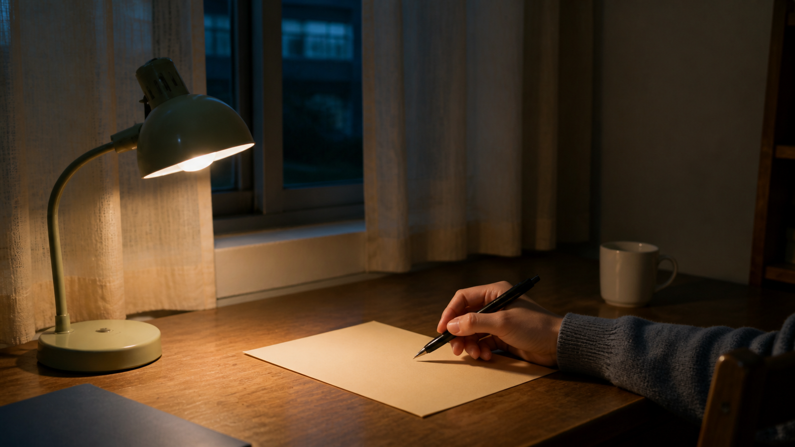

### 最终视频提示词（整段复制）

```text
[场景：傍晚的研究生宿舍，奶油窗帘在画左，绿色圆顶台灯在木桌左侧亮着，暮色从窗外透入。角色：林澄（仅图中右下方持笔的右手出镜）。镜头：纸面特写，85mm镜头，浅景深，略俯固定机位。动作：林澄握笔的右手在纸面下方补写一句，然后停住笔尖；无对白；保持人物身份、发型、服装和空间结构稳定。]
```

<details><summary>首帧生成提示词</summary>

```text
生成《窗帘后面的灯》S14的单张剧情首帧，1672x941 PNG，16:9横版，写实电影摄影，真实肤质、克制自然光，无文字水印拼贴。参考图1：只用于林澄的脸、发型、服装和体型。参考图2：只用于宿舍空间、木桌、奶油窗帘和绿色圆顶台灯；本子、便笺和时段以本镜为准。场景：傍晚的研究生宿舍，奶油窗帘在画左，绿色圆顶台灯在木桌左侧亮着，暮色从窗外透入。出镜及屏幕位置：林澄（仅图中右下方持笔的右手出镜）。摄影：纸面特写，85mm镜头，浅景深，略俯固定机位，这是静止首帧，摄像机尚未运动。首帧可见事实：一张完整米色便笺处于绿色台灯的暖光中，黑笔悬在纸面下半部，灰蓝袖口从右下伸入，深蓝本子仅在边缘露一角，纸面不生成可读字。画面必须停在主要动作发生之前，不提前展示动作结束状态。只出现指定的人物和手，保持参考人物的身份、发型、体型、服装；场景门窗和家具几何稳定。纸面、封面、设备、手机均不需要可读文字，无字幕无标签。只生成一张电影镜头，不要角色多视图或多格图。
```

</details>

## S15｜01:54—02:01｜7秒

- 场景：傍晚的研究生宿舍，奶油窗帘在画左，绿色圆顶台灯在木桌左侧亮着，暮色从窗外透入
- 出镜：林澄（仅图中中央的双手出镜）
- 景别／镜头：手部特写，85mm镜头，浅景深，固定机位
- 首帧画面：双手各持完整米色便笺一边，纸尚未对折，手指自然，灰蓝袖口可见；桌边深蓝本子打开，背景暖灯虚化
- 运动提示：林澄把米色便笺仔细对折成窄条，拇指压过折痕；无对白
- 对白／声音：无对白
- 声场／剪辑：干燥纸张折叠声
- 后期备注：只折纸，不在本镜夹入本子

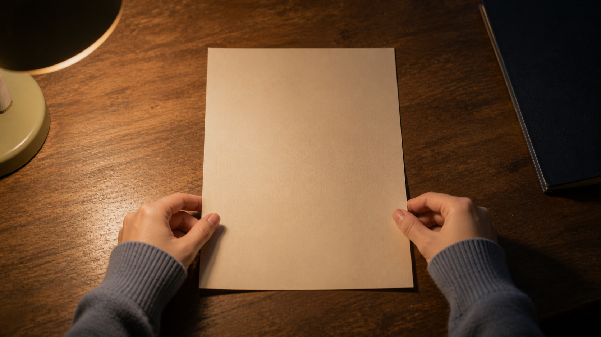

### 最终视频提示词（整段复制）

```text
[场景：傍晚的研究生宿舍，奶油窗帘在画左，绿色圆顶台灯在木桌左侧亮着，暮色从窗外透入。角色：林澄（仅图中中央的双手出镜）。镜头：手部特写，85mm镜头，浅景深，固定机位。动作：林澄把米色便笺仔细对折成窄条，拇指压过折痕；无对白；保持人物身份、发型、服装和空间结构稳定。]
```

<details><summary>首帧生成提示词</summary>

```text
生成《窗帘后面的灯》S15的单张剧情首帧，1672x941 PNG，16:9横版，写实电影摄影，真实肤质、克制自然光，无文字水印拼贴。参考图1：只用于林澄的脸、发型、服装和体型。参考图2：只用于宿舍空间、木桌、奶油窗帘和绿色圆顶台灯；本子、便笺和时段以本镜为准。场景：傍晚的研究生宿舍，奶油窗帘在画左，绿色圆顶台灯在木桌左侧亮着，暮色从窗外透入。出镜及屏幕位置：林澄（仅图中中央的双手出镜）。摄影：手部特写，85mm镜头，浅景深，固定机位，这是静止首帧，摄像机尚未运动。首帧可见事实：双手各持完整米色便笺一边，纸尚未对折，手指自然，灰蓝袖口可见；桌边深蓝本子打开，背景暖灯虚化。画面必须停在主要动作发生之前，不提前展示动作结束状态。只出现指定的人物和手，保持参考人物的身份、发型、体型、服装；场景门窗和家具几何稳定。纸面、封面、设备、手机均不需要可读文字，无字幕无标签。只生成一张电影镜头，不要角色多视图或多格图。
```

</details>

## S16｜02:01—02:10｜9秒

- 场景：傍晚的研究生宿舍，奶油窗帘在画左，绿色圆顶台灯在木桌左侧亮着，暮色从窗外透入
- 出镜：林澄（图中右侧的人）
- 景别／镜头：中近景，50mm镜头，中等景深，略俯固定机位
- 首帧画面：林澄坐在画右，右手捏着折成窄条的米色便笺，停在桌面打开的深蓝记录本上方，左手扶住书页，灯在画左亮着
- 运动提示：林澄把折好的便笺夹入记录本最后一页，纸角留出一点，缓慢合上本子；无对白
- 对白／声音：无对白
- 声场／剪辑：纸角掠过书页声
- 后期备注：一个完整夹信动作；收尾维持纸角可见

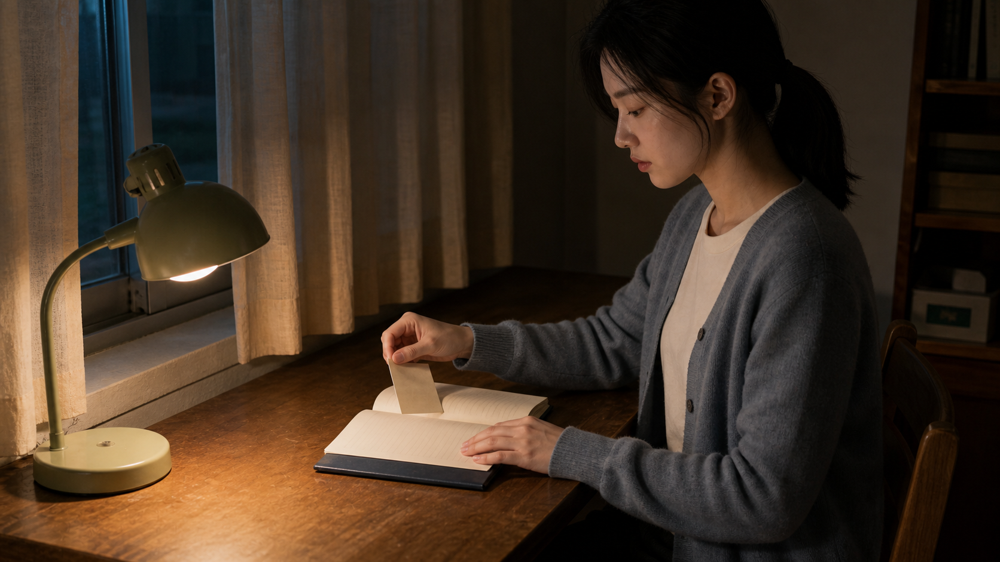

### 最终视频提示词（整段复制）

```text
[场景：傍晚的研究生宿舍，奶油窗帘在画左，绿色圆顶台灯在木桌左侧亮着，暮色从窗外透入。角色：林澄（图中右侧的人）。镜头：中近景，50mm镜头，中等景深，略俯固定机位。动作：林澄把折好的便笺夹入记录本最后一页，纸角留出一点，缓慢合上本子；无对白；保持人物身份、发型、服装和空间结构稳定。]
```

<details><summary>首帧生成提示词</summary>

```text
生成《窗帘后面的灯》S16的单张剧情首帧，1672x941 PNG，16:9横版，写实电影摄影，真实肤质、克制自然光，无文字水印拼贴。参考图1：只用于林澄的脸、发型、服装和体型。参考图2：只用于宿舍空间、木桌、奶油窗帘和绿色圆顶台灯；本子、便笺和时段以本镜为准。场景：傍晚的研究生宿舍，奶油窗帘在画左，绿色圆顶台灯在木桌左侧亮着，暮色从窗外透入。出镜及屏幕位置：林澄（仅图中中央偏右的双手出镜）。摄影：道具近景，65mm镜头，中等景深，略俯固定机位，这是静止首帧，摄像机尚未运动。首帧可见事实：桌中央深蓝记录本打开在最后一页，林澄右手捏着已折窄的米色便笺悬在书页上方，左手扶住本子，便笺尚未插入。画面必须停在主要动作发生之前，不提前展示动作结束状态。只出现指定的人物和手，保持参考人物的身份、发型、体型、服装；场景门窗和家具几何稳定。纸面、封面、设备、手机均不需要可读文字，无字幕无标签。只生成一张电影镜头，不要角色多视图或多格图。
```

</details>

## S17｜02:10—02:20｜10秒

- 场景：傍晚的研究生宿舍，奶油窗帘在画左，绿色圆顶台灯在木桌左侧亮着，暮色从窗外透入
- 出镜：林澄（图中中右侧的人）
- 景别／镜头：中近景，65mm镜头，浅景深，固定机位
- 首帧画面：林澄站在书桌中右侧，双手抱着合上的深蓝本子，露出细小米色纸角，眼睛看向画外的空门口，紧张但尚未开口
- 运动提示：林澄对着空门口低声练习“周屿，其实我……”，话停在这里，她吸一口气，不再接下去
- 对白／声音：林澄：周屿，其实我……
- 声场／剪辑：空房间的轻微回声
- 后期备注：练习没有额外听者，不加镜中倒影

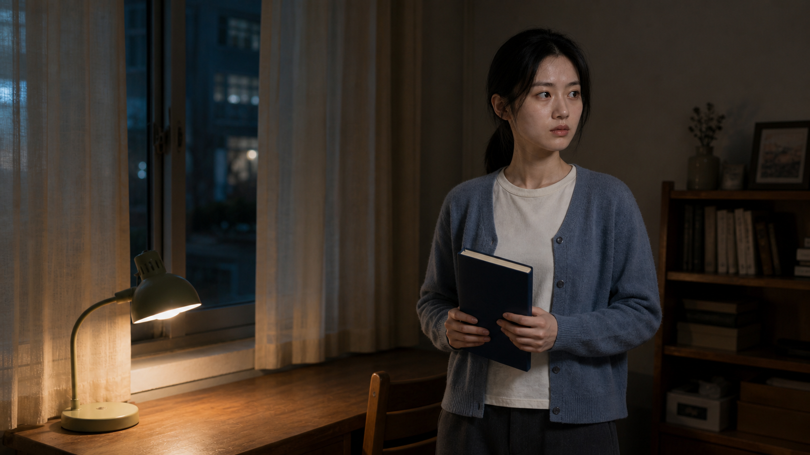

### 最终视频提示词（整段复制）

```text
[场景：傍晚的研究生宿舍，奶油窗帘在画左，绿色圆顶台灯在木桌左侧亮着，暮色从窗外透入。角色：林澄（图中中右侧的人）。镜头：中近景，65mm镜头，浅景深，固定机位。动作：林澄对着空门口低声练习“周屿，其实我……”，话停在这里，她吸一口气，不再接下去；保持人物身份、发型、服装和空间结构稳定。]
```

<details><summary>首帧生成提示词</summary>

```text
生成《窗帘后面的灯》S17的单张剧情首帧，1672x941 PNG，16:9横版，写实电影摄影，真实肤质、克制自然光，无文字水印拼贴。参考图1：只用于林澄的脸、发型、服装和体型。参考图2：只用于宿舍空间、木桌、奶油窗帘和绿色圆顶台灯；本子、便笺和时段以本镜为准。场景：傍晚的研究生宿舍，奶油窗帘在画左，绿色圆顶台灯在木桌左侧亮着，暮色从窗外透入。出镜及屏幕位置：林澄（图中中右侧的人）。摄影：中近景，65mm镜头，浅景深，固定机位，这是静止首帧，摄像机尚未运动。首帧可见事实：林澄站在书桌中右侧，双手抱着合上的深蓝本子，露出细小米色纸角，眼睛看向画外的空门口，紧张但尚未开口。画面必须停在主要动作发生之前，不提前展示动作结束状态。只出现指定的人物和手，保持参考人物的身份、发型、体型、服装；场景门窗和家具几何稳定。纸面、封面、设备、手机均不需要可读文字，无字幕无标签。只生成一张电影镜头，不要角色多视图或多格图。
```

</details>

## S18｜02:20—02:30｜10秒

- 场景：傍晚的研究生宿舍，奶油窗帘在画左，绿色圆顶台灯在木桌左侧亮着，暮色从窗外透入
- 出镜：林澄（图中右侧的人）
- 景别／镜头：中远景，35mm镜头，大景深，固定机位
- 首帧画面：林澄在桌右侧站定，抱着深蓝本子，身体朝画右出口，台灯仍亮，椅子空着；窗外已入暮色
- 运动提示：林澄抱紧记录本，从画右走出宿舍画面，镜头停留在亮着的台灯和空椅上；无对白
- 对白／声音：无对白
- 声场／剪辑：脚步接入下一镜的模糊谈笑
- 后期备注：不回头再关灯，进入聚会段落

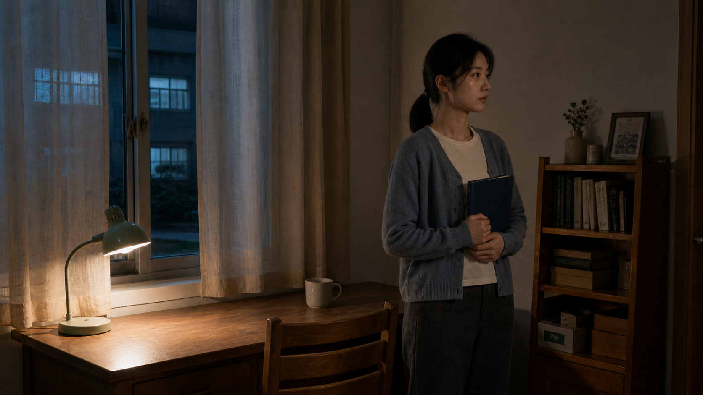

### 最终视频提示词（整段复制）

```text
[场景：傍晚的研究生宿舍，奶油窗帘在画左，绿色圆顶台灯在木桌左侧亮着，暮色从窗外透入。角色：林澄（图中右侧的人）。镜头：中远景，35mm镜头，大景深，固定机位。动作：林澄抱紧记录本，从画右走出宿舍画面，镜头停留在亮着的台灯和空椅上；无对白；保持人物身份、发型、服装和空间结构稳定。]
```

<details><summary>首帧生成提示词</summary>

```text
生成《窗帘后面的灯》S18的单张剧情首帧，1672x941 PNG，16:9横版，写实电影摄影，真实肤质、克制自然光，无文字水印拼贴。参考图1：只用于林澄的脸、发型、服装和体型。参考图2：只用于宿舍空间、木桌、奶油窗帘和绿色圆顶台灯；本子、便笺和时段以本镜为准。场景：傍晚的研究生宿舍，奶油窗帘在画左，绿色圆顶台灯在木桌左侧亮着，暮色从窗外透入。出镜及屏幕位置：林澄（图中右侧的人）。摄影：中远景，35mm镜头，大景深，固定机位，这是静止首帧，摄像机尚未运动。首帧可见事实：林澄在桌右侧站定，抱着深蓝本子，身体朝画右出口，台灯仍亮，椅子空着；窗外已入暮色。画面必须停在主要动作发生之前，不提前展示动作结束状态。只出现指定的人物和手，保持参考人物的身份、发型、体型、服装；场景门窗和家具几何稳定。纸面、封面、设备、手机均不需要可读文字，无字幕无标签。只生成一张电影镜头，不要角色多视图或多格图。
```

</details>

## S19｜02:30—02:40｜10秒

- 场景：夜晚实验记录室的小型送别聚会，白桌上放纸杯，后窗、左柜与右后木门不变，冷白顶灯保持自然
- 出镜：林澄（图中左侧的人）、周屿（图中右侧的人）、两名同学（图中后方虚焦的人）
- 景别／镜头：中远景，35mm镜头，中等景深，固定机位
- 首帧画面：原实验记录室的白桌、三组窗和右后木门不变；林澄坐在桌左侧，周屿坐右侧，相对三分之二朝镜头，两个同学在后方虚焦；纸杯在桌面，深蓝本子在她膝上
- 运动提示：两名同学轻轻碰杯，周屿随他们微笑，林澄的手始终压着膝上的记录本，视线朝他；无对白
- 对白／声音：无对白
- 声场／剪辑：两三声纸杯轻碰、低谈笑
- 后期备注：首次聚会建立；主要动作是碰杯，林澄保持等待

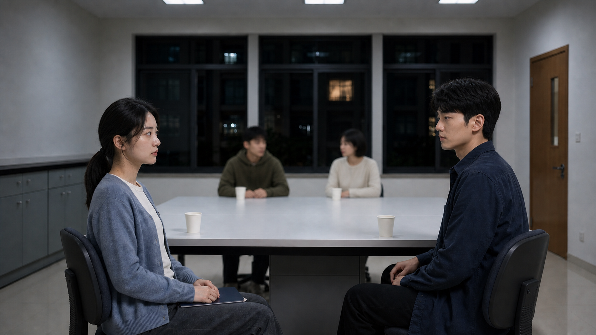

### 最终视频提示词（整段复制）

```text
[场景：夜晚实验记录室的小型送别聚会，白桌上放纸杯，后窗、左柜与右后木门不变，冷白顶灯保持自然。角色：林澄（图中左侧的人）、周屿（图中右侧的人）、两名同学（图中后方虚焦的人）。镜头：中远景，35mm镜头，中等景深，固定机位。动作：两名同学轻轻碰杯，周屿随他们微笑，林澄的手始终压着膝上的记录本，视线朝他；无对白；保持人物身份、发型、服装和空间结构稳定。]
```

<details><summary>首帧生成提示词</summary>

```text
生成《窗帘后面的灯》S19的单张剧情首帧，1672x941 PNG，16:9横版，写实电影摄影，真实肤质、克制自然光，无文字水印拼贴。参考图1：只用于林澄的脸、发型、服装和体型。参考图2：只用于周屿的脸、发型、服装和体型。参考图3：只用于实验室的窗框、白桌、左柜、右门和闭合灰色仪器；不得添加任何台灯、绿色灯或宿舍物件。场景：夜晚实验记录室的小型送别聚会，白桌上放纸杯，后窗、左柜与右后木门不变，冷白顶灯保持自然。出镜及屏幕位置：林澄（图中左侧的人）、周屿（图中右侧的人）、两名同学（图中后方虚焦的人）。摄影：中远景，35mm镜头，中等景深，固定机位，这是静止首帧，摄像机尚未运动。首帧可见事实：原实验记录室的白桌、三组窗和右后木门不变；林澄坐在桌左侧，周屿坐右侧，相对三分之二朝镜头，两个同学在后方虚焦；纸杯在桌面，深蓝本子在她膝上。画面必须停在主要动作发生之前，不提前展示动作结束状态。只出现指定的人物和手，保持参考人物的身份、发型、体型、服装；场景门窗和家具几何稳定。纸面、封面、设备、手机均不需要可读文字，无字幕无标签。只生成一张电影镜头，不要角色多视图或多格图。背景同学不可复制林澄或周屿，设为穿暗橄榄卫衣与米色上衣的普通同学，脸部极度虚焦且不正对镜头。主角不看摄影机。
```

</details>

## S20｜02:40—02:48｜8秒

- 场景：夜晚实验记录室的小型送别聚会，白桌上放纸杯，后窗、左柜与右后木门不变，冷白顶灯保持自然
- 出镜：周屿（图中右侧的人）、林澄（图中左侧前景虚焦的人）、两名同学（图中后方虚焦的人）
- 景别／镜头：中近景，65mm镜头，浅景深，固定机位
- 首帧画面：周屿在画右，纸杯拿在胸前尚未举高，笑意自然；画左边缘是虚焦的林澄灰蓝衣肩，后景两名同学不清晰
- 运动提示：周屿轻举纸杯，对在场同学说“终于可以去看更大的世界了”，声音轻快自然
- 对白／声音：周屿：终于可以去看更大的世界了。
- 声场／剪辑：同学低声附和，不添加清晰台词
- 后期备注：不改变聚会家具；女主左男主右

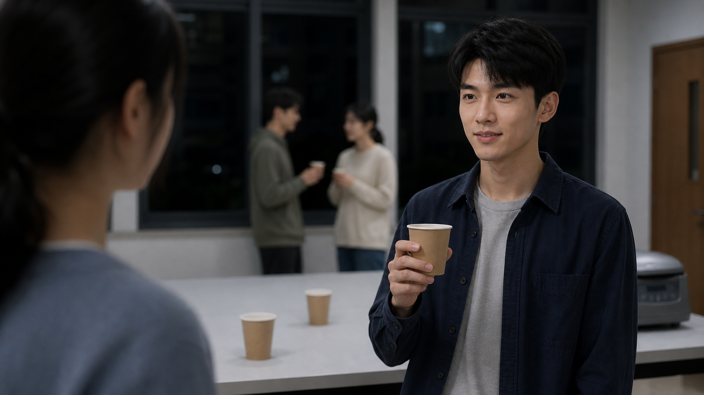

### 最终视频提示词（整段复制）

```text
[场景：夜晚实验记录室的小型送别聚会，白桌上放纸杯，后窗、左柜与右后木门不变，冷白顶灯保持自然。角色：周屿（图中右侧的人）、林澄（图中左侧前景虚焦的人）、两名同学（图中后方虚焦的人）。镜头：中近景，65mm镜头，浅景深，固定机位。动作：周屿轻举纸杯，对在场同学说“终于可以去看更大的世界了”，声音轻快自然；保持人物身份、发型、服装和空间结构稳定。]
```

<details><summary>首帧生成提示词</summary>

```text
生成《窗帘后面的灯》S20的单张剧情首帧，1672x941 PNG，16:9横版，写实电影摄影，真实肤质、克制自然光，无文字水印拼贴。参考图1：只用于林澄的脸、发型、服装和体型。参考图2：只用于周屿的脸、发型、服装和体型。参考图3：只用于实验室的窗框、白桌、左柜、右门和闭合灰色仪器；不得添加任何台灯、绿色灯或宿舍物件。场景：夜晚实验记录室的小型送别聚会，白桌上放纸杯，后窗、左柜与右后木门不变，冷白顶灯保持自然。出镜及屏幕位置：周屿（图中右侧的人）、林澄（图中左侧边缘虚焦的人）。摄影：中近景，65mm镜头，浅景深，固定机位，这是静止首帧，摄像机尚未运动。首帧可见事实：周屿在画右，纸杯拿在胸前尚未举高，笑意自然；画左边缘是虚焦的林澄灰蓝衣肩，后景两名同学不清晰。画面必须停在主要动作发生之前，不提前展示动作结束状态。只出现指定的人物和手，保持参考人物的身份、发型、体型、服装；场景门窗和家具几何稳定。纸面、封面、设备、手机均不需要可读文字，无字幕无标签。只生成一张电影镜头，不要角色多视图或多格图。背景同学不可复制林澄或周屿，设为穿暗橄榄卫衣与米色上衣的普通同学，脸部极度虚焦且不正对镜头。主角不看摄影机。
```

</details>

## S21｜02:48—02:55｜7秒

- 场景：夜晚实验记录室的小型送别聚会，白桌上放纸杯，后窗、左柜与右后木门不变，冷白顶灯保持自然
- 出镜：林澄（图中左侧的人，脸部仅局部可见）、两名同学（图中后方虚焦的人）
- 景别／镜头：局部中近景，65mm镜头，浅景深，略俯固定机位
- 首帧画面：林澄双手托着膝上的合拢深蓝本子，米色折纸在最后几页露出一个小角，灰蓝针织袖口和深灰裤子可辨，本子尚未递出
- 运动提示：林澄把记录本从膝上缓慢抬起一点，尚未递出去；同学在画外问“到了那边，一个人能习惯吗？”
- 对白／声音：同学画外：到了那边，一个人能习惯吗？
- 声场／剪辑：问话压过细微书页声
- 后期备注：出镜者只有林澄局部；同学不出镜、不做嘴型

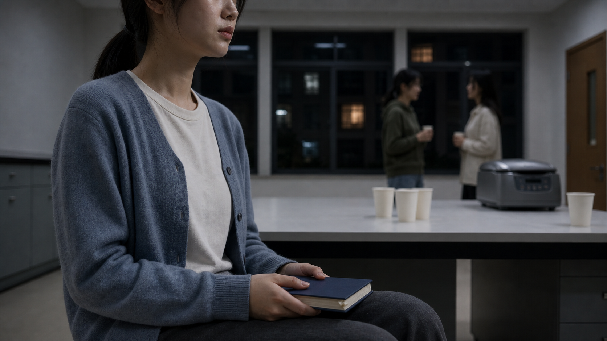

### 最终视频提示词（整段复制）

```text
[场景：夜晚实验记录室的小型送别聚会，白桌上放纸杯，后窗、左柜与右后木门不变，冷白顶灯保持自然。角色：林澄（图中左侧的人，脸部仅局部可见）、两名同学（图中后方虚焦的人）。镜头：局部中近景，65mm镜头，浅景深，略俯固定机位。动作：林澄把记录本从膝上缓慢抬起一点，尚未递出去；同学在画外问“到了那边，一个人能习惯吗？”；保持人物身份、发型、服装和空间结构稳定。]
```

<details><summary>首帧生成提示词</summary>

```text
生成《窗帘后面的灯》S21的单张剧情首帧，1672x941 PNG，16:9横版，写实电影摄影，真实肤质、克制自然光，无文字水印拼贴。参考图1：只用于林澄的脸、发型、服装和体型。参考图2：只用于实验室的窗框、白桌、左柜、右门和闭合灰色仪器；不得添加任何台灯、绿色灯或宿舍物件。场景：夜晚实验记录室的小型送别聚会，白桌上放纸杯，后窗、左柜与右后木门不变，冷白顶灯保持自然。出镜及屏幕位置：林澄（仅图中中央的膝部与双手出镜）。摄影：道具特写，85mm镜头，浅景深，略俯固定机位，这是静止首帧，摄像机尚未运动。首帧可见事实：林澄双手托着膝上的合拢深蓝本子，米色折纸在最后几页露出一个小角，灰蓝针织袖口和深灰裤子可辨，本子尚未递出。画面必须停在主要动作发生之前，不提前展示动作结束状态。只出现指定的人物和手，保持参考人物的身份、发型、体型、服装；场景门窗和家具几何稳定。纸面、封面、设备、手机均不需要可读文字，无字幕无标签。只生成一张电影镜头，不要角色多视图或多格图。背景同学不可复制林澄或周屿，设为穿暗橄榄卫衣与米色上衣的普通同学，脸部极度虚焦且不正对镜头。主角不看摄影机。
```

</details>

## S22｜02:55—03:05｜10秒

- 场景：夜晚实验记录室的小型送别聚会，白桌上放纸杯，后窗、左柜与右后木门不变，冷白顶灯保持自然
- 出镜：周屿（图中右侧的人）、男同学（图中左侧前景虚焦的背影）
- 景别／镜头：过肩近景，85mm镜头，浅景深，眼平固定机位
- 首帧画面：周屿的脸在右侧三分线，身体朝向左侧同学方向，纸杯已放下，嘴唇闭合，眼中是谈到亲近之人的自然温柔；背景窗框虚化
- 运动提示：周屿自然地笑起来，回答画外的同学“不是一个人。她在那边等我”，说完保留那一点安心的笑
- 对白／声音：周屿：不是一个人。她在那边等我。
- 声场／剪辑：“她”字前撤音乐，保留现场声
- 后期备注：核心反转；无手机照片、无女友实体、无恶意炫耀

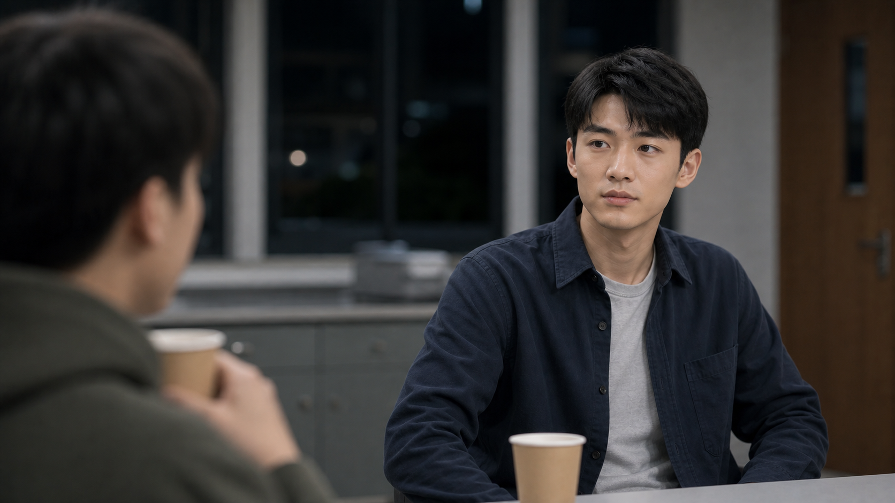

### 最终视频提示词（整段复制）

```text
[场景：夜晚实验记录室的小型送别聚会，白桌上放纸杯，后窗、左柜与右后木门不变，冷白顶灯保持自然。角色：周屿（图中右侧的人）、男同学（图中左侧前景虚焦的背影）。镜头：过肩近景，85mm镜头，浅景深，眼平固定机位。动作：周屿自然地笑起来，回答画外的同学“不是一个人。她在那边等我”，说完保留那一点安心的笑；保持人物身份、发型、服装和空间结构稳定。]
```

<details><summary>首帧生成提示词</summary>

```text
生成《窗帘后面的灯》S22的单张剧情首帧，1672x941 PNG，16:9横版，写实电影摄影，真实肤质、克制自然光，无文字水印拼贴。参考图1：只用于周屿的脸、发型、服装和体型。参考图2：只用于实验室的窗框、白桌、左柜、右门和闭合灰色仪器；不得添加任何台灯、绿色灯或宿舍物件。场景：夜晚实验记录室的小型送别聚会，白桌上放纸杯，后窗、左柜与右后木门不变，冷白顶灯保持自然。出镜及屏幕位置：周屿（图中偏右的人）。摄影：近景，85mm镜头，浅景深，眼平固定机位，这是静止首帧，摄像机尚未运动。首帧可见事实：周屿的脸在右侧三分线，身体朝向左侧同学方向，纸杯已放下，嘴唇闭合，眼中是谈到亲近之人的自然温柔；背景窗框虚化。画面必须停在主要动作发生之前，不提前展示动作结束状态。只出现指定的人物和手，保持参考人物的身份、发型、体型、服装；场景门窗和家具几何稳定。纸面、封面、设备、手机均不需要可读文字，无字幕无标签。只生成一张电影镜头，不要角色多视图或多格图。背景同学不可复制林澄或周屿，设为穿暗橄榄卫衣与米色上衣的普通同学，脸部极度虚焦且不正对镜头。主角不看摄影机。
```

</details>

## S23｜03:05—03:14｜9秒

- 场景：夜晚实验记录室的小型送别聚会，白桌上放纸杯，后窗、左柜与右后木门不变，冷白顶灯保持自然
- 出镜：林澄（图中左侧的人）、两名同学（图中后方虚焦的人）
- 景别／镜头：面部近景，85mm镜头，浅景深，极缓慢推近
- 首帧画面：林澄在画左近景，眼睛看向画外右侧，嘴角还留着社交微笑，眼里尚未落泪，背景白桌和同学虚焦
- 运动提示：林澄嘴角的笑慢半拍消失，目光轻轻下落，忍住想说的话，只保留自然呼吸；无对白
- 对白／声音：无对白
- 声场／剪辑：一声真实纸杯轻碰，谈笑声转模糊
- 后期备注：情绪变化不可用突然大哭代替；推近幅度很小

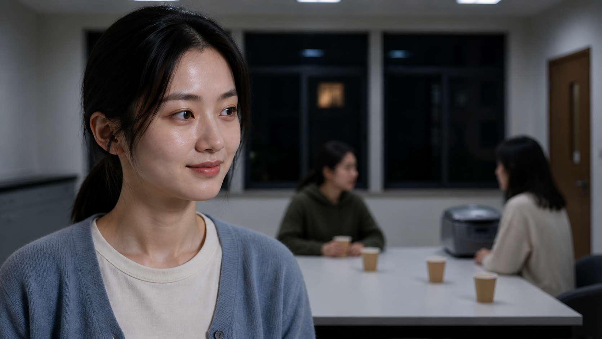

### 最终视频提示词（整段复制）

```text
[场景：夜晚实验记录室的小型送别聚会，白桌上放纸杯，后窗、左柜与右后木门不变，冷白顶灯保持自然。角色：林澄（图中左侧的人）、两名同学（图中后方虚焦的人）。镜头：面部近景，85mm镜头，浅景深，极缓慢推近。动作：林澄嘴角的笑慢半拍消失，目光轻轻下落，忍住想说的话，只保留自然呼吸；无对白；保持人物身份、发型、服装和空间结构稳定。]
```

<details><summary>首帧生成提示词</summary>

```text
生成《窗帘后面的灯》S23的单张剧情首帧，1672x941 PNG，16:9横版，写实电影摄影，真实肤质、克制自然光，无文字水印拼贴。参考图1：只用于林澄的脸、发型、服装和体型。参考图2：只用于实验室的窗框、白桌、左柜、右门和闭合灰色仪器；不得添加任何台灯、绿色灯或宿舍物件。场景：夜晚实验记录室的小型送别聚会，白桌上放纸杯，后窗、左柜与右后木门不变，冷白顶灯保持自然。出镜及屏幕位置：林澄（图中偏左的人）。摄影：面部近景，85mm镜头，浅景深，极缓慢推近，这是静止首帧，摄像机尚未运动。首帧可见事实：林澄在画左近景，眼睛看向画外右侧，嘴角还留着社交微笑，眼里尚未落泪，背景白桌和同学虚焦。画面必须停在主要动作发生之前，不提前展示动作结束状态。只出现指定的人物和手，保持参考人物的身份、发型、体型、服装；场景门窗和家具几何稳定。纸面、封面、设备、手机均不需要可读文字，无字幕无标签。只生成一张电影镜头，不要角色多视图或多格图。背景同学不可复制林澄或周屿，设为穿暗橄榄卫衣与米色上衣的普通同学，脸部极度虚焦且不正对镜头。主角不看摄影机。
```

</details>

## S24｜03:14—03:20｜6秒

- 场景：夜晚实验记录室的小型送别聚会，白桌上放纸杯，后窗、左柜与右后木门不变，冷白顶灯保持自然
- 出镜：林澄（图中左中部的人，仅躯干、双手与膝部出镜）
- 景别／镜头：手部特写，85mm镜头，浅景深，固定机位
- 首帧画面：林澄双手托着膝前微微倾斜的深蓝记录本，灰蓝针织衫、手和深灰裤子可见，脸部不出镜
- 运动提示：林澄将尚未递出的记录本缓慢放回膝上，手指压住本子下沿；无对白
- 对白／声音：无对白
- 声场／剪辑：针织和布面本子摩擦
- 后期备注：本镜只放回本子，下一镜才抽纸

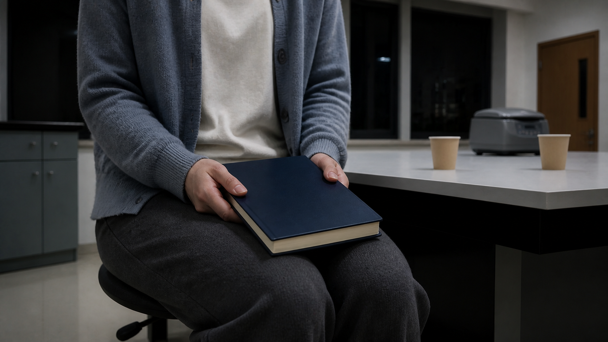

### 最终视频提示词（整段复制）

```text
[场景：夜晚实验记录室的小型送别聚会，白桌上放纸杯，后窗、左柜与右后木门不变，冷白顶灯保持自然。角色：林澄（图中左中部的人，仅躯干、双手与膝部出镜）。镜头：手部特写，85mm镜头，浅景深，固定机位。动作：林澄将尚未递出的记录本缓慢放回膝上，手指压住本子下沿；无对白；保持人物身份、发型、服装和空间结构稳定。]
```

<details><summary>首帧生成提示词</summary>

```text
生成《窗帘后面的灯》S24的单张剧情首帧，1672x941 PNG，16:9横版，写实电影摄影，真实肤质、克制自然光，无文字水印拼贴。参考图1：只用于林澄的脸、发型、服装和体型。参考图2：只用于实验室的窗框、白桌、左柜、右门和闭合灰色仪器；不得添加任何台灯、绿色灯或宿舍物件。场景：夜晚实验记录室的小型送别聚会，白桌上放纸杯，后窗、左柜与右后木门不变，冷白顶灯保持自然。出镜及屏幕位置：林澄（仅图中中央的双手与膝部出镜）。摄影：手部特写，85mm镜头，浅景深，固定机位，这是静止首帧，摄像机尚未运动。首帧可见事实：林澄双手托着略高于膝部的深蓝记录本，米色纸角露着，指尖稍绷紧，人物灰蓝袖口清楚。画面必须停在主要动作发生之前，不提前展示动作结束状态。只出现指定的人物和手，保持参考人物的身份、发型、体型、服装；场景门窗和家具几何稳定。纸面、封面、设备、手机均不需要可读文字，无字幕无标签。只生成一张电影镜头，不要角色多视图或多格图。背景同学不可复制林澄或周屿，设为穿暗橄榄卫衣与米色上衣的普通同学，脸部极度虚焦且不正对镜头。主角不看摄影机。
```

</details>

## S25｜03:20—03:28｜8秒

- 场景：夜晚实验记录室的小型送别聚会，白桌上放纸杯，后窗、左柜与右后木门不变，冷白顶灯保持自然
- 出镜：林澄（图中左中部的人，仅躯干、双手与膝部出镜）
- 景别／镜头：道具特写，85mm镜头，浅景深，固定机位
- 首帧画面：深蓝记录本在林澄膝上微微打开，米色折纸仍夹在最后一页，左手托本子，右手刚捏住纸角
- 运动提示：林澄将米色便笺从记录本中抽出，悄悄藏进自己右掌，左手稳住本子；无对白
- 对白／声音：无对白
- 声场／剪辑：纸从书页间抽出的轻响
- 后期备注：信纸完整抽出，不凭空消失，不落到周屿脚边

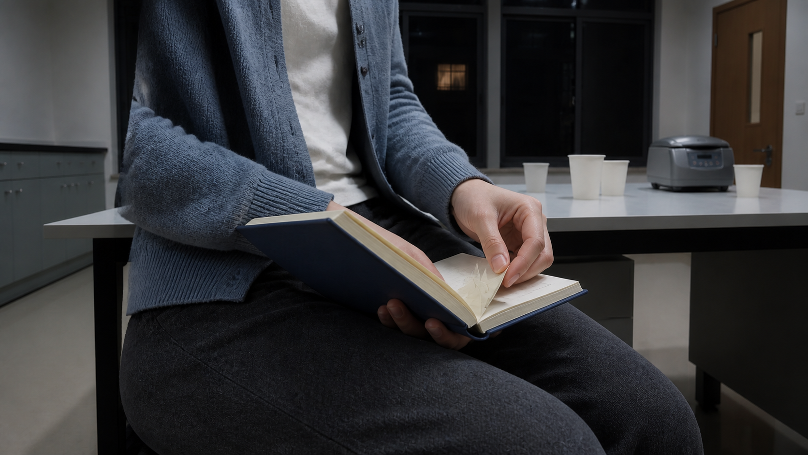

### 最终视频提示词（整段复制）

```text
[场景：夜晚实验记录室的小型送别聚会，白桌上放纸杯，后窗、左柜与右后木门不变，冷白顶灯保持自然。角色：林澄（图中左中部的人，仅躯干、双手与膝部出镜）。镜头：道具特写，85mm镜头，浅景深，固定机位。动作：林澄将米色便笺从记录本中抽出，悄悄藏进自己右掌，左手稳住本子；无对白；保持人物身份、发型、服装和空间结构稳定。]
```

<details><summary>首帧生成提示词</summary>

```text
生成《窗帘后面的灯》S25的单张剧情首帧，1672x941 PNG，16:9横版，写实电影摄影，真实肤质、克制自然光，无文字水印拼贴。参考图1：只用于林澄的脸、发型、服装和体型。参考图2：只用于实验室的窗框、白桌、左柜、右门和闭合灰色仪器；不得添加任何台灯、绿色灯或宿舍物件。场景：夜晚实验记录室的小型送别聚会，白桌上放纸杯，后窗、左柜与右后木门不变，冷白顶灯保持自然。出镜及屏幕位置：林澄（仅图中中央的双手与膝部出镜）。摄影：道具特写，85mm镜头，浅景深，固定机位，这是静止首帧，摄像机尚未运动。首帧可见事实：深蓝记录本在林澄膝上微微打开，米色折纸仍夹在最后一页，左手托本子，右手刚捏住纸角。画面必须停在主要动作发生之前，不提前展示动作结束状态。只出现指定的人物和手，保持参考人物的身份、发型、体型、服装；场景门窗和家具几何稳定。纸面、封面、设备、手机均不需要可读文字，无字幕无标签。只生成一张电影镜头，不要角色多视图或多格图。背景同学不可复制林澄或周屿，设为穿暗橄榄卫衣与米色上衣的普通同学，脸部极度虚焦且不正对镜头。主角不看摄影机。
```

</details>

## S26｜03:28—03:37｜9秒

- 场景：夜晚实验记录室的小型送别聚会，白桌上放纸杯，后窗、左柜与右后木门不变，冷白顶灯保持自然
- 出镜：林澄（图中左侧的人）、周屿（图中右侧的人）、两名同学（图中左后方虚焦的人）
- 景别／镜头：双人中景，50mm镜头，中等景深，固定机位
- 首帧画面：林澄左、周屿右，坐在白桌旁；无纸角的深蓝记录本在她左手前，右手在桌边低处握着折纸，周屿尚未接本子
- 运动提示：林澄用左手将记录本推给周屿，抬眼对他说“都核过了。一路顺风”，语气轻而清楚
- 对白／声音：林澄：都核过了。一路顺风。
- 声场／剪辑：短暂安静、书本触桌声
- 后期备注：告白不随本子交出；维护左右关系

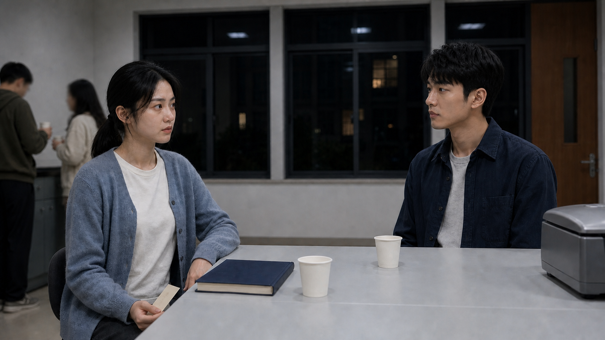

### 最终视频提示词（整段复制）

```text
[场景：夜晚实验记录室的小型送别聚会，白桌上放纸杯，后窗、左柜与右后木门不变，冷白顶灯保持自然。角色：林澄（图中左侧的人）、周屿（图中右侧的人）、两名同学（图中左后方虚焦的人）。镜头：双人中景，50mm镜头，中等景深，固定机位。动作：林澄用左手将记录本推给周屿，抬眼对他说“都核过了。一路顺风”，语气轻而清楚；保持人物身份、发型、服装和空间结构稳定。]
```

<details><summary>首帧生成提示词</summary>

```text
生成《窗帘后面的灯》S26的单张剧情首帧，1672x941 PNG，16:9横版，写实电影摄影，真实肤质、克制自然光，无文字水印拼贴。参考图1：只用于林澄的脸、发型、服装和体型。参考图2：只用于周屿的脸、发型、服装和体型。参考图3：只用于实验室的窗框、白桌、左柜、右门和闭合灰色仪器；不得添加任何台灯、绿色灯或宿舍物件。场景：夜晚实验记录室的小型送别聚会，白桌上放纸杯，后窗、左柜与右后木门不变，冷白顶灯保持自然。出镜及屏幕位置：林澄（图中左侧的人）、周屿（图中右侧的人）。摄影：双人中景，50mm镜头，中等景深，固定机位，这是静止首帧，摄像机尚未运动。首帧可见事实：林澄左、周屿右，坐在白桌两端的远侧；没有纸角的深蓝记录本在她左手前，右掌握着折纸藏在桌下，周屿的手还未接本子。画面必须停在主要动作发生之前，不提前展示动作结束状态。只出现指定的人物和手，保持参考人物的身份、发型、体型、服装；场景门窗和家具几何稳定。纸面、封面、设备、手机均不需要可读文字，无字幕无标签。只生成一张电影镜头，不要角色多视图或多格图。背景同学不可复制林澄或周屿，设为穿暗橄榄卫衣与米色上衣的普通同学，脸部极度虚焦且不正对镜头。主角不看摄影机。
```

</details>

## S27｜03:37—03:44｜7秒

- 场景：夜晚实验记录室的小型送别聚会，白桌上放纸杯，后窗、左柜与右后木门不变，冷白顶灯保持自然
- 出镜：周屿（图中右侧的人）、林澄（图中左侧前景虚焦的人）、男同学（图中右后方虚焦的人）
- 景别／镜头：中近景，65mm镜头，浅景深，固定机位
- 首帧画面：周屿在右侧拿着已归还的深蓝记录本，左侧边缘是林澄虚焦的肩；周屿低头看本子，尚未张嘴
- 运动提示：周屿收好记录本，看向林澄，真诚地说“这三年，多亏你”，表情只有同学间的感谢
- 对白／声音：周屿：这三年，多亏你。
- 声场／剪辑：保持普通语气，不加伤情配乐重音
- 后期备注：记录本此后归周屿；不是爱情回应

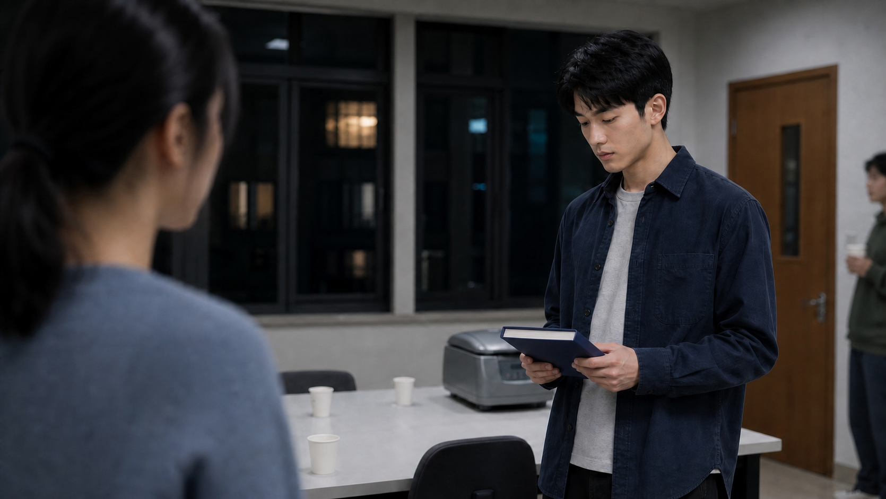

### 最终视频提示词（整段复制）

```text
[场景：夜晚实验记录室的小型送别聚会，白桌上放纸杯，后窗、左柜与右后木门不变，冷白顶灯保持自然。角色：周屿（图中右侧的人）、林澄（图中左侧前景虚焦的人）、男同学（图中右后方虚焦的人）。镜头：中近景，65mm镜头，浅景深，固定机位。动作：周屿收好记录本，看向林澄，真诚地说“这三年，多亏你”，表情只有同学间的感谢；保持人物身份、发型、服装和空间结构稳定。]
```

<details><summary>首帧生成提示词</summary>

```text
生成《窗帘后面的灯》S27的单张剧情首帧，1672x941 PNG，16:9横版，写实电影摄影，真实肤质、克制自然光，无文字水印拼贴。参考图1：只用于林澄的脸、发型、服装和体型。参考图2：只用于周屿的脸、发型、服装和体型。参考图3：只用于实验室的窗框、白桌、左柜、右门和闭合灰色仪器；不得添加任何台灯、绿色灯或宿舍物件。场景：夜晚实验记录室的小型送别聚会，白桌上放纸杯，后窗、左柜与右后木门不变，冷白顶灯保持自然。出镜及屏幕位置：周屿（图中右侧的人）、林澄（图中左侧边缘虚焦的人）。摄影：中近景，65mm镜头，浅景深，固定机位，这是静止首帧，摄像机尚未运动。首帧可见事实：周屿在右侧拿着已归还的深蓝记录本，左侧边缘是林澄虚焦的肩；周屿低头看本子，尚未张嘴。画面必须停在主要动作发生之前，不提前展示动作结束状态。只出现指定的人物和手，保持参考人物的身份、发型、体型、服装；场景门窗和家具几何稳定。纸面、封面、设备、手机均不需要可读文字，无字幕无标签。只生成一张电影镜头，不要角色多视图或多格图。背景同学不可复制林澄或周屿，设为穿暗橄榄卫衣与米色上衣的普通同学，脸部极度虚焦且不正对镜头。主角不看摄影机。
```

</details>

## S28｜03:44—03:52｜8秒

- 场景：夜晚实验记录室的小型送别聚会，白桌上放纸杯，后窗、左柜与右后木门不变，冷白顶灯保持自然
- 出镜：林澄（图中左侧的人）、周屿（图中右侧的人）、两名同学（图中后方虚焦的人）
- 景别／镜头：中远景，35mm镜头，大景深，固定机位
- 首帧画面：白桌前林澄坐在左边，周屿在右边已经站起，深蓝记录本握在手中，右后木门未关，背景同学离席虚焦
- 运动提示：周屿拿着记录本从画右后方的木门离开，林澄留在原处，没有叫住他；无对白
- 对白／声音：无对白
- 声场／剪辑：周屿脚步渐远
- 后期备注：不拍突然回头；切同夜稍后的宿舍

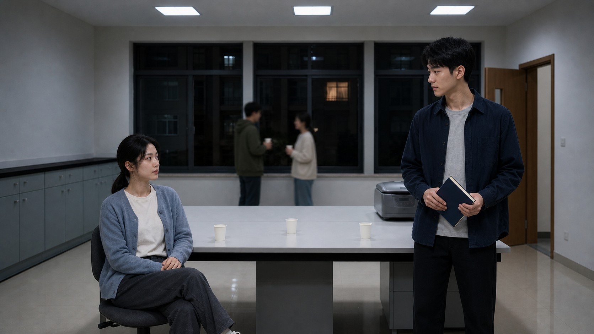

### 最终视频提示词（整段复制）

```text
[场景：夜晚实验记录室的小型送别聚会，白桌上放纸杯，后窗、左柜与右后木门不变，冷白顶灯保持自然。角色：林澄（图中左侧的人）、周屿（图中右侧的人）、两名同学（图中后方虚焦的人）。镜头：中远景，35mm镜头，大景深，固定机位。动作：周屿拿着记录本从画右后方的木门离开，林澄留在原处，没有叫住他；无对白；保持人物身份、发型、服装和空间结构稳定。]
```

<details><summary>首帧生成提示词</summary>

```text
生成《窗帘后面的灯》S28的单张剧情首帧，1672x941 PNG，16:9横版，写实电影摄影，真实肤质、克制自然光，无文字水印拼贴。参考图1：只用于林澄的脸、发型、服装和体型。参考图2：只用于周屿的脸、发型、服装和体型。参考图3：只用于实验室的窗框、白桌、左柜、右门和闭合灰色仪器；不得添加任何台灯、绿色灯或宿舍物件。场景：夜晚实验记录室的小型送别聚会，白桌上放纸杯，后窗、左柜与右后木门不变，冷白顶灯保持自然。出镜及屏幕位置：林澄（图中左侧的人）、周屿（图中右侧的人）。摄影：中远景，35mm镜头，大景深，固定机位，这是静止首帧，摄像机尚未运动。首帧可见事实：白桌前林澄坐在左边，周屿在右边已经站起，深蓝记录本握在手中，右后木门未关，背景同学离席虚焦。画面必须停在主要动作发生之前，不提前展示动作结束状态。只出现指定的人物和手，保持参考人物的身份、发型、体型、服装；场景门窗和家具几何稳定。纸面、封面、设备、手机均不需要可读文字，无字幕无标签。只生成一张电影镜头，不要角色多视图或多格图。背景同学不可复制林澄或周屿，设为穿暗橄榄卫衣与米色上衣的普通同学，脸部极度虚焦且不正对镜头。主角不看摄影机。
```

</details>

## S29｜03:52—04:00｜8秒

- 场景：离校之夜的宿舍，绿色台灯在木桌左侧亮着，奶油窗帘合着留窄缝，桌上已没有深蓝记录本
- 出镜：林澄（图中中右侧的人）
- 景别／镜头：中景，50mm镜头，中等景深，固定机位
- 首帧画面：林澄站在宿舍书桌中右侧，台灯已重新打开，桌上没有深蓝记录本，右手握着完整折纸，木椅空着
- 运动提示：林澄坐到空椅上，把握着便笺的手放到台灯光圈里，动作轻缓；无对白
- 对白／声音：无对白
- 声场／剪辑：椅子轻响、呼吸
- 后期备注：记录本不得重现；灯已在本镜之前打开

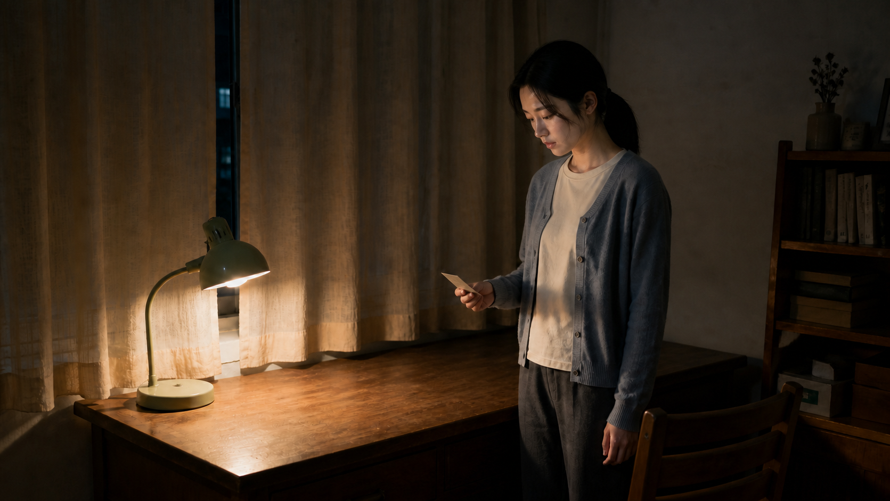

### 最终视频提示词（整段复制）

```text
[场景：离校之夜的宿舍，绿色台灯在木桌左侧亮着，奶油窗帘合着留窄缝，桌上已没有深蓝记录本。角色：林澄（图中中右侧的人）。镜头：中景，50mm镜头，中等景深，固定机位。动作：林澄坐到空椅上，把握着便笺的手放到台灯光圈里，动作轻缓；无对白；保持人物身份、发型、服装和空间结构稳定。]
```

<details><summary>首帧生成提示词</summary>

```text
生成《窗帘后面的灯》S29的单张剧情首帧，1672x941 PNG，16:9横版，写实电影摄影，真实肤质、克制自然光，无文字水印拼贴。参考图1：只用于林澄的脸、发型、服装和体型。参考图2：只用于宿舍空间、木桌、奶油窗帘和绿色圆顶台灯；本子、便笺和时段以本镜为准。场景：离校之夜的宿舍，绿色台灯在木桌左侧亮着，奶油窗帘合着留窄缝，桌上已没有深蓝记录本。出镜及屏幕位置：林澄（图中中右侧的人）。摄影：中景，50mm镜头，中等景深，固定机位，这是静止首帧，摄像机尚未运动。首帧可见事实：林澄站在宿舍书桌中右侧，台灯已重新打开，桌上没有深蓝记录本，右手握着完整折纸，木椅空着。画面必须停在主要动作发生之前，不提前展示动作结束状态。只出现指定的人物和手，保持参考人物的身份、发型、体型、服装；场景门窗和家具几何稳定。纸面、封面、设备、手机均不需要可读文字，无字幕无标签。只生成一张电影镜头，不要角色多视图或多格图。
```

</details>

## S30｜04:00—04:10｜10秒

- 场景：离校之夜的宿舍，绿色台灯在木桌左侧亮着，奶油窗帘合着留窄缝，桌上已没有深蓝记录本
- 出镜：林澄（仅图中中央偏右的双手出镜）
- 景别／镜头：手部近景，65mm镜头，中等景深，略俯固定机位
- 首帧画面：绿色台灯暖光下，林澄双手托着折成窄条的米色便笺，桌面无深蓝本子，纸还未展开
- 运动提示：林澄缓慢展开便笺，用指腹试图压平折痕，随后停住；无对白
- 对白／声音：无对白
- 声场／剪辑：纸张展开声，末尾预入极轻箱轮声
- 后期备注：保持完整纸张，文字无需可读

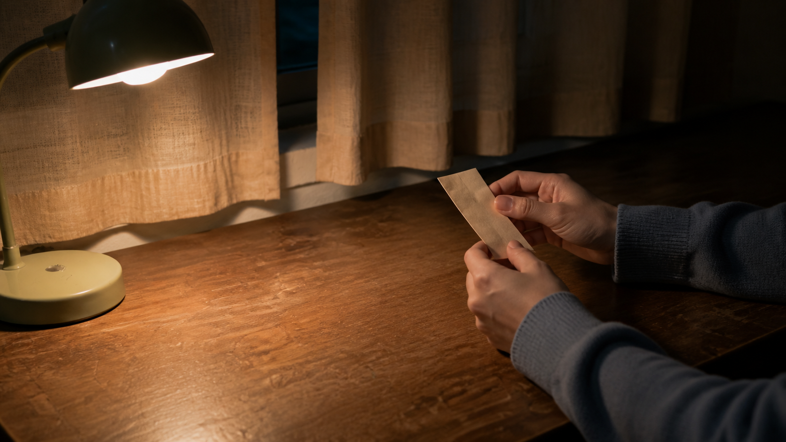

### 最终视频提示词（整段复制）

```text
[场景：离校之夜的宿舍，绿色台灯在木桌左侧亮着，奶油窗帘合着留窄缝，桌上已没有深蓝记录本。角色：林澄（仅图中中央偏右的双手出镜）。镜头：手部近景，65mm镜头，中等景深，略俯固定机位。动作：林澄缓慢展开便笺，用指腹试图压平折痕，随后停住；无对白；保持人物身份、发型、服装和空间结构稳定。]
```

<details><summary>首帧生成提示词</summary>

```text
生成《窗帘后面的灯》S30的单张剧情首帧，1672x941 PNG，16:9横版，写实电影摄影，真实肤质、克制自然光，无文字水印拼贴。参考图1：只用于林澄的脸、发型、服装和体型。参考图2：只用于宿舍空间、木桌、奶油窗帘和绿色圆顶台灯；本子、便笺和时段以本镜为准。场景：离校之夜的宿舍，绿色台灯在木桌左侧亮着，奶油窗帘合着留窄缝，桌上已没有深蓝记录本。出镜及屏幕位置：林澄（仅图中中央偏右的双手出镜）。摄影：手部近景，65mm镜头，中等景深，略俯固定机位，这是静止首帧，摄像机尚未运动。首帧可见事实：绿色台灯暖光下，林澄双手托着折成窄条的米色便笺，桌面无深蓝本子，纸还未展开。画面必须停在主要动作发生之前，不提前展示动作结束状态。只出现指定的人物和手，保持参考人物的身份、发型、体型、服装；场景门窗和家具几何稳定。纸面、封面、设备、手机均不需要可读文字，无字幕无标签。只生成一张电影镜头，不要角色多视图或多格图。
```

</details>

## S31｜04:10—04:18｜8秒

- 场景：离校之夜的校园砖路，宿舍墙与树影在背景，低饱和路灯照亮通往画右出口的道路
- 出镜：周屿（图中左侧的人）
- 景别／镜头：全景，40mm镜头，大景深，固定机位
- 首帧画面：深夜普通校园砖路，宿舍墙和树影在背景，路朝画右出口延伸；周屿在画左三分线，深蓝衬衫和黑裤，单手握着身后深灰硬壳箱拉杆，轮子接地，准备出发
- 运动提示：周屿拖着深灰行李箱从画左走向画右，步速普通，不回头，箱轮始终沿砖路滚动；无对白
- 对白／声音：无对白
- 声场／剪辑：箱轮清晰碾过砖缝，接S32
- 后期备注：一次性外景；行李箱不腾空、不变色

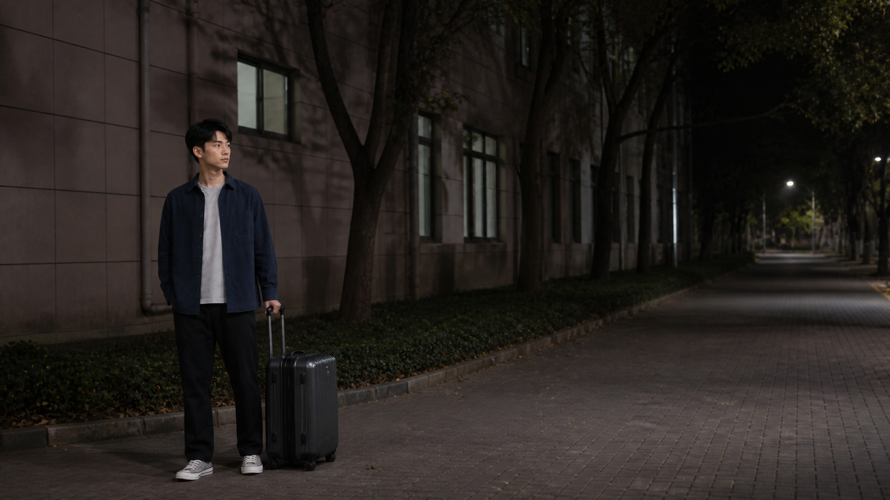

### 最终视频提示词（整段复制）

```text
[场景：离校之夜的校园砖路，宿舍墙与树影在背景，低饱和路灯照亮通往画右出口的道路。角色：周屿（图中左侧的人）。镜头：全景，40mm镜头，大景深，固定机位。动作：周屿拖着深灰行李箱从画左走向画右，步速普通，不回头，箱轮始终沿砖路滚动；无对白；保持人物身份、发型、服装和空间结构稳定。]
```

<details><summary>首帧生成提示词</summary>

```text
生成《窗帘后面的灯》S31的单张剧情首帧，1672x941 PNG，16:9横版，写实电影摄影，真实肤质、克制自然光，无文字水印拼贴。参考图1：只用于周屿的脸、发型、服装和体型。场景：离校之夜的校园砖路，宿舍墙与树影在背景，低饱和路灯照亮通往画右出口的道路。出镜及屏幕位置：周屿（图中左侧的人）。摄影：全景，40mm镜头，大景深，固定机位，这是静止首帧，摄像机尚未运动。首帧可见事实：深夜普通校园砖路，宿舍墙和树影在背景，路朝画右出口延伸；周屿在画左三分线，深蓝衬衫和黑裤，单手握着身后深灰硬壳箱拉杆，轮子接地，准备出发。画面必须停在主要动作发生之前，不提前展示动作结束状态。只出现指定的人物和手，保持参考人物的身份、发型、体型、服装；场景门窗和家具几何稳定。纸面、封面、设备、手机均不需要可读文字，无字幕无标签。只生成一张电影镜头，不要角色多视图或多格图。
```

</details>

## S32｜04:18—04:25｜7秒

- 场景：离校之夜的宿舍，绿色台灯在木桌左侧亮着，奶油窗帘合着留窄缝，桌上已没有深蓝记录本
- 出镜：林澄（图中中右侧的人）
- 景别／镜头：中景，50mm镜头，中等景深，固定机位
- 首帧画面：林澄站在中右侧窗帘后，脸朝画左窄帘缝，指尖搭在帘边但没有拉开，暖台灯映着一侧脸，另一侧为蓝夜光
- 运动提示：林澄目送画外离去的人，嘴唇微微动了一下却没有叫出声，手指离开帘边；无对白
- 对白／声音：无对白
- 声场／剪辑：S31箱轮声L-cut逐渐远去
- 后期备注：不拉开窗、不追下楼、不生成镜中另一个人

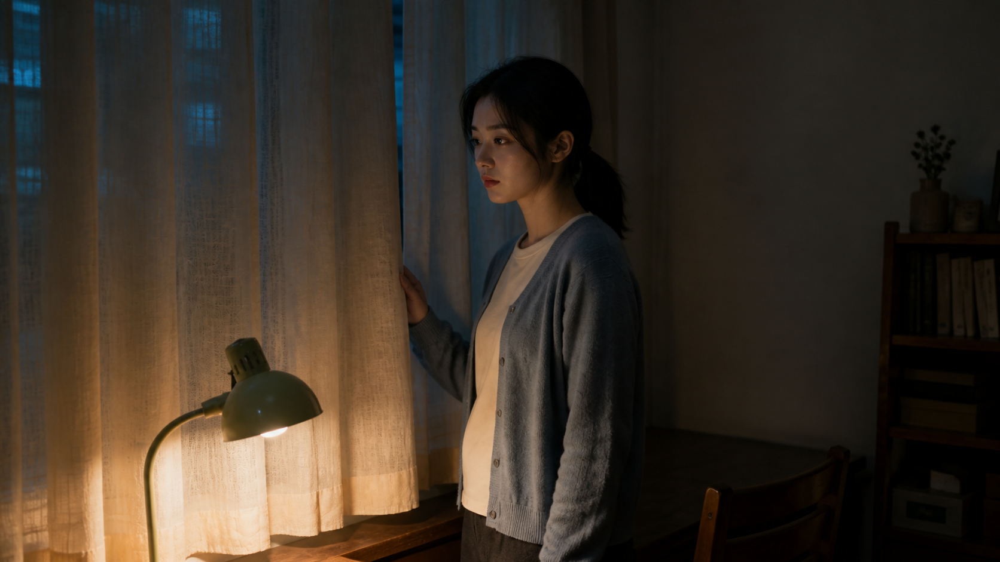

### 最终视频提示词（整段复制）

```text
[场景：离校之夜的宿舍，绿色台灯在木桌左侧亮着，奶油窗帘合着留窄缝，桌上已没有深蓝记录本。角色：林澄（图中中右侧的人）。镜头：中景，50mm镜头，中等景深，固定机位。动作：林澄目送画外离去的人，嘴唇微微动了一下却没有叫出声，手指离开帘边；无对白；保持人物身份、发型、服装和空间结构稳定。]
```

<details><summary>首帧生成提示词</summary>

```text
生成《窗帘后面的灯》S32的单张剧情首帧，1672x941 PNG，16:9横版，写实电影摄影，真实肤质、克制自然光，无文字水印拼贴。参考图1：只用于林澄的脸、发型、服装和体型。参考图2：只用于宿舍空间、木桌、奶油窗帘和绿色圆顶台灯；本子、便笺和时段以本镜为准。场景：离校之夜的宿舍，绿色台灯在木桌左侧亮着，奶油窗帘合着留窄缝，桌上已没有深蓝记录本。出镜及屏幕位置：林澄（图中中右侧的人）。摄影：近景，85mm镜头，浅景深，固定机位，这是静止首帧，摄像机尚未运动。首帧可见事实：林澄站在中右侧窗帘后，脸朝画左窄帘缝，指尖搭在帘边但没有拉开，暖台灯映着一侧脸，另一侧为蓝夜光。画面必须停在主要动作发生之前，不提前展示动作结束状态。只出现指定的人物和手，保持参考人物的身份、发型、体型、服装；场景门窗和家具几何稳定。纸面、封面、设备、手机均不需要可读文字，无字幕无标签。只生成一张电影镜头，不要角色多视图或多格图。
```

</details>

## S33｜04:25—04:35｜10秒

- 场景：离校之夜的宿舍，绿色台灯在木桌左侧亮着，奶油窗帘合着留窄缝，桌上已没有深蓝记录本
- 出镜：林澄（仅图中中右部的双手出镜）
- 景别／镜头：手部特写，85mm镜头，浅景深，固定机位
- 首帧画面：林澄双手各捏完整米色便笺的一侧，沿折痕准备撕纸，纸还没有撕开；桌面为空，没有预先铺满碎纸，绿色灯在左侧虚焦
- 运动提示：林澄沿便笺折痕缓慢撕下一条细纸，纸条自然落在木桌上，手指和纸张物理真实；无对白
- 对白／声音：无对白
- 声场／剪辑：清晰克制的撕纸声
- 后期备注：一条撕纸动作，不能同镜瞬间凭空变一堆雪

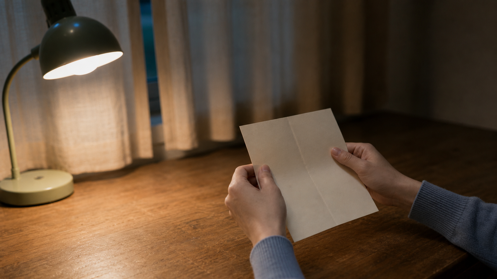

### 最终视频提示词（整段复制）

```text
[场景：离校之夜的宿舍，绿色台灯在木桌左侧亮着，奶油窗帘合着留窄缝，桌上已没有深蓝记录本。角色：林澄（仅图中中右部的双手出镜）。镜头：手部特写，85mm镜头，浅景深，固定机位。动作：林澄沿便笺折痕缓慢撕下一条细纸，纸条自然落在木桌上，手指和纸张物理真实；无对白；保持人物身份、发型、服装和空间结构稳定。]
```

<details><summary>首帧生成提示词</summary>

```text
生成《窗帘后面的灯》S33的单张剧情首帧，1672x941 PNG，16:9横版，写实电影摄影，真实肤质、克制自然光，无文字水印拼贴。参考图1：只用于林澄的脸、发型、服装和体型。参考图2：只用于宿舍空间、木桌、奶油窗帘和绿色圆顶台灯；本子、便笺和时段以本镜为准。场景：离校之夜的宿舍，绿色台灯在木桌左侧亮着，奶油窗帘合着留窄缝，桌上已没有深蓝记录本。出镜及屏幕位置：林澄（仅图中中央的双手出镜）。摄影：手部特写，85mm镜头，浅景深，固定机位，这是静止首帧，摄像机尚未运动。首帧可见事实：林澄双手各捏完整米色便笺的一侧，沿折痕准备撕纸，纸还没有撕开；桌面为空，没有预先铺满碎纸，绿色灯在左侧虚焦。画面必须停在主要动作发生之前，不提前展示动作结束状态。只出现指定的人物和手，保持参考人物的身份、发型、体型、服装；场景门窗和家具几何稳定。纸面、封面、设备、手机均不需要可读文字，无字幕无标签。只生成一张电影镜头，不要角色多视图或多格图。
```

</details>

## S34｜04:35—04:43｜8秒

- 场景：离校之夜的宿舍，绿色台灯在木桌左侧亮着，奶油窗帘合着留窄缝，桌上已没有深蓝记录本
- 出镜：林澄（图中中右侧的人）
- 景别／镜头：中景，50mm镜头，中等景深，固定机位
- 首帧画面：同夜稍后，林澄坐在中右侧，双手空着搭在桌边，几条撕好的米色细纸平放桌面，台灯仍亮，窗帘合着只留窄缝，没有深蓝本子
- 运动提示：林澄看着桌上的细纸，缓慢松开紧绷的手指，继续坐着，台灯不熄；无对白
- 对白／声音：无对白
- 声场／剪辑：房间静声、呼吸
- 后期备注：从S33省略重复撕纸；随后切清晨

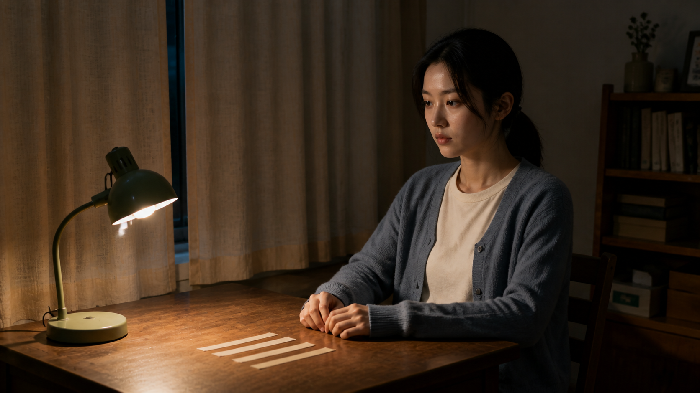

### 最终视频提示词（整段复制）

```text
[场景：离校之夜的宿舍，绿色台灯在木桌左侧亮着，奶油窗帘合着留窄缝，桌上已没有深蓝记录本。角色：林澄（图中中右侧的人）。镜头：中景，50mm镜头，中等景深，固定机位。动作：林澄看着桌上的细纸，缓慢松开紧绷的手指，继续坐着，台灯不熄；无对白；保持人物身份、发型、服装和空间结构稳定。]
```

<details><summary>首帧生成提示词</summary>

```text
生成《窗帘后面的灯》S34的单张剧情首帧，1672x941 PNG，16:9横版，写实电影摄影，真实肤质、克制自然光，无文字水印拼贴。参考图1：只用于林澄的脸、发型、服装和体型。参考图2：只用于宿舍空间、木桌、奶油窗帘和绿色圆顶台灯；本子、便笺和时段以本镜为准。场景：离校之夜的宿舍，绿色台灯在木桌左侧亮着，奶油窗帘合着留窄缝，桌上已没有深蓝记录本。出镜及屏幕位置：林澄（图中中右侧的人）。摄影：中景，50mm镜头，中等景深，固定机位，这是静止首帧，摄像机尚未运动。首帧可见事实：同夜稍后，林澄坐在中右侧，双手空着搭在桌边，几条撕好的米色细纸平放桌面，台灯仍亮，窗帘合着只留窄缝，没有深蓝本子。画面必须停在主要动作发生之前，不提前展示动作结束状态。只出现指定的人物和手，保持参考人物的身份、发型、体型、服装；场景门窗和家具几何稳定。纸面、封面、设备、手机均不需要可读文字，无字幕无标签。只生成一张电影镜头，不要角色多视图或多格图。
```

</details>

## S35｜04:43—04:50｜7秒

- 场景：次日清晨的宿舍，灰白天光透过画左的奶油窗帘，绿色圆顶台灯在旧木桌左侧，细纸留在桌上
- 出镜：林澄（仅图中右侧伸来的右手出镜）
- 景别／镜头：手部特写，85mm镜头，浅景深，固定机位
- 首帧画面：清晨灰白天光透过奶油窗帘，绿色台灯仍亮着，几条米色碎纸留桌上，林澄右手指尖悬在圆底座开关上方，灯未关
- 运动提示：林澄按下绿色台灯的开关，暖光熄灭而清晨自然光留下，手指不再迟疑；无对白
- 对白／声音：无对白
- 声场／剪辑：开关一声清响
- 后期备注：清晨转场由环境光完成；与S03相同道具方向

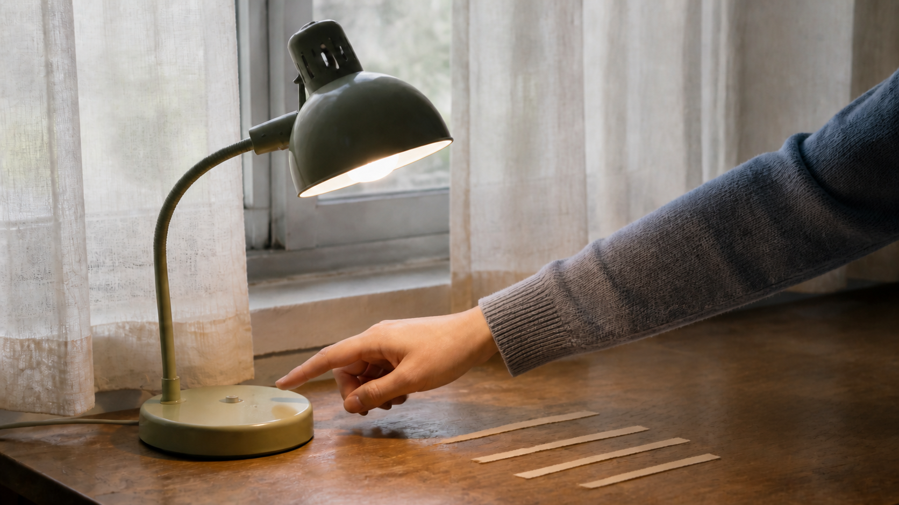

### 最终视频提示词（整段复制）

```text
[场景：次日清晨的宿舍，灰白天光透过画左的奶油窗帘，绿色圆顶台灯在旧木桌左侧，细纸留在桌上。角色：林澄（仅图中右侧伸来的右手出镜）。镜头：手部特写，85mm镜头，浅景深，固定机位。动作：林澄按下绿色台灯的开关，暖光熄灭而清晨自然光留下，手指不再迟疑；无对白；保持人物身份、发型、服装和空间结构稳定。]
```

<details><summary>首帧生成提示词</summary>

```text
生成《窗帘后面的灯》S35的单张剧情首帧，1672x941 PNG，16:9横版，写实电影摄影，真实肤质、克制自然光，无文字水印拼贴。参考图1：只用于林澄的脸、发型、服装和体型。参考图2：只用于宿舍空间、木桌、奶油窗帘和绿色圆顶台灯；本子、便笺和时段以本镜为准。场景：次日清晨的宿舍，灰白天光透过画左的奶油窗帘，绿色圆顶台灯在旧木桌左侧，细纸留在桌上。出镜及屏幕位置：林澄（仅图中右侧伸来的右手出镜）。摄影：手部特写，85mm镜头，浅景深，固定机位，这是静止首帧，摄像机尚未运动。首帧可见事实：清晨灰白天光透过奶油窗帘，绿色台灯仍亮着，几条米色碎纸留桌上，林澄右手指尖悬在圆底座开关上方，灯未关。画面必须停在主要动作发生之前，不提前展示动作结束状态。只出现指定的人物和手，保持参考人物的身份、发型、体型、服装；场景门窗和家具几何稳定。纸面、封面、设备、手机均不需要可读文字，无字幕无标签。只生成一张电影镜头，不要角色多视图或多格图。
```

</details>

## S36｜04:50—05:00｜10秒

- 场景：次日清晨的宿舍，灰白天光透过画左的奶油窗帘，绿色圆顶台灯在旧木桌左侧，细纸留在桌上
- 出镜：林澄（图中中右侧的人）
- 景别／镜头：中远景，35mm镜头，大景深，固定机位
- 首帧画面：宿舍同一书桌，绿色台灯已熄，米色细纸留在桌中，没有深蓝本子；林澄在中右侧站定，右手轻搭画左仍合着的奶油窗帘边缘，天光透帘
- 运动提示：林澄把奶油色窗帘缓慢拉开，让清晨天光进入房间，站在原处平静呼吸，没有突然微笑；无对白
- 对白／声音：无对白
- 声场／剪辑：窗帘摩擦、清晨鸟鸣
- 后期备注：最后4秒后期淡入片名“窗帘后面的灯”；计入本镜10秒，不额外加时

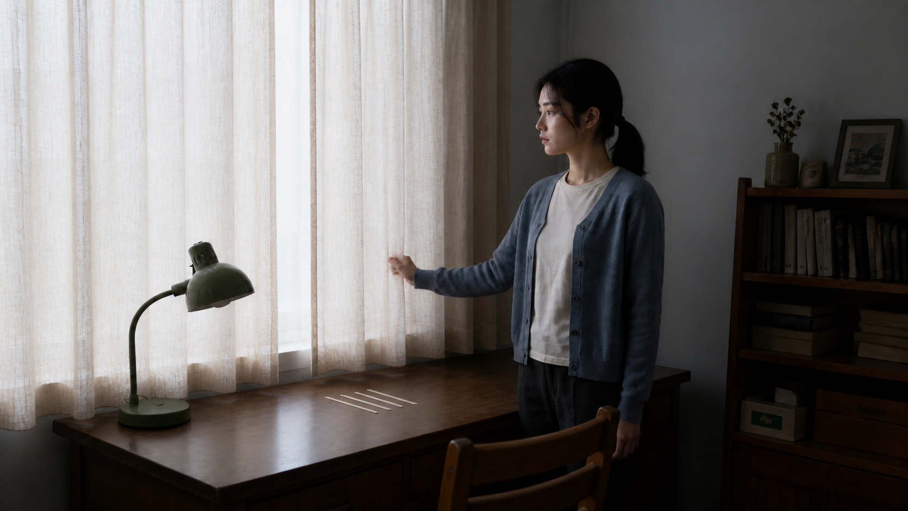

### 最终视频提示词（整段复制）

```text
[场景：次日清晨的宿舍，灰白天光透过画左的奶油窗帘，绿色圆顶台灯在旧木桌左侧，细纸留在桌上。角色：林澄（图中中右侧的人）。镜头：中远景，35mm镜头，大景深，固定机位。动作：林澄把奶油色窗帘缓慢拉开，让清晨天光进入房间，站在原处平静呼吸，没有突然微笑；无对白；保持人物身份、发型、服装和空间结构稳定。]
```

<details><summary>首帧生成提示词</summary>

```text
生成《窗帘后面的灯》S36的单张剧情首帧，1672x941 PNG，16:9横版，写实电影摄影，真实肤质、克制自然光，无文字水印拼贴。参考图1：只用于林澄的脸、发型、服装和体型。参考图2：只用于宿舍空间、木桌、奶油窗帘和绿色圆顶台灯；本子、便笺和时段以本镜为准。场景：次日清晨的宿舍，灰白天光透过画左的奶油窗帘，绿色圆顶台灯在旧木桌左侧，细纸留在桌上。出镜及屏幕位置：林澄（图中中右侧的人）。摄影：中远景，35mm镜头，大景深，固定机位，这是静止首帧，摄像机尚未运动。首帧可见事实：宿舍同一书桌，绿色台灯已熄，米色细纸留在桌中，没有深蓝本子；林澄在中右侧站定，右手轻搭画左仍合着的奶油窗帘边缘，天光透帘。画面必须停在主要动作发生之前，不提前展示动作结束状态。只出现指定的人物和手，保持参考人物的身份、发型、体型、服装；场景门窗和家具几何稳定。纸面、封面、设备、手机均不需要可读文字，无字幕无标签。只生成一张电影镜头，不要角色多视图或多格图。
```

</details>
