# 《雨停在你站台》AI视频分镜书

> 总时长：05:00  
> 分镜数量：40  
> 常规单镜：5—10秒  
> 画幅／首帧：16:9／1672x941

## 全片统一约束

- 只依据M403故事正文创作
- 所有首帧、角色与场景资产均未生成
- 首帧只记录动作开始前的静态状态
- 不生成可读站牌、纸条或调度文字
- 剧情审查通过前禁止创建视觉资产

## 角色设定

### 沈川


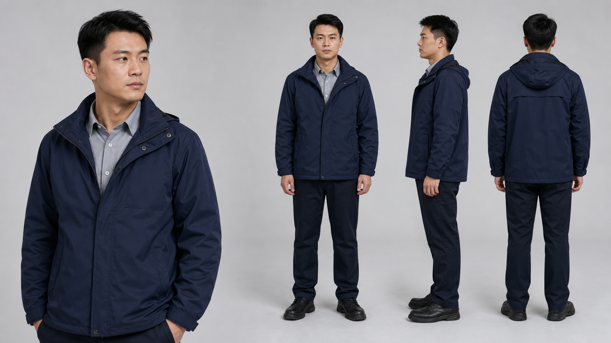

### 许禾


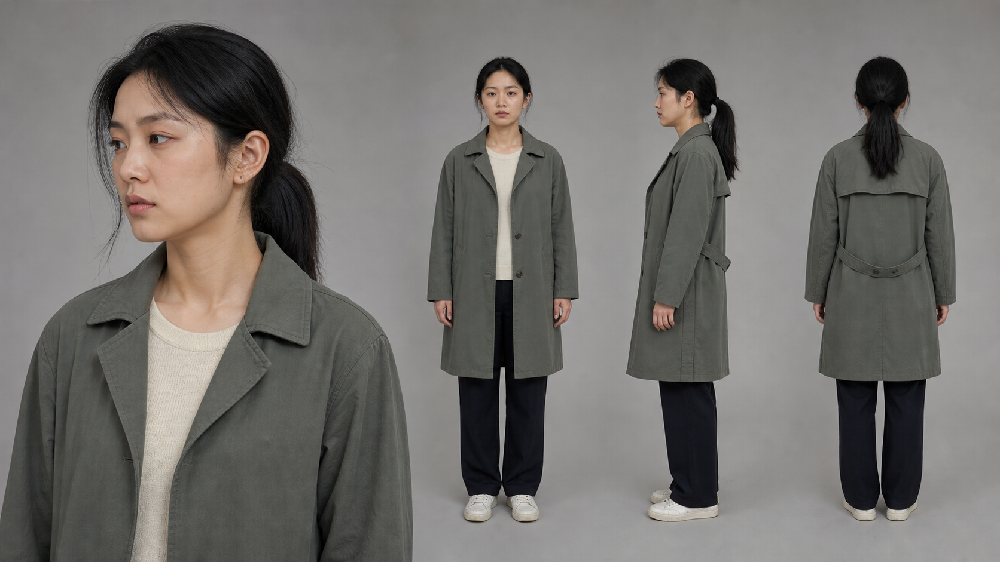

# 逐镜头分镜

## S01｜00:00—00:08｜8秒

- 场景：河东站外的清晨
- 出镜：无出镜人物
- 景别／镜头：大全景，35mm镜头，大景深，固定机位
- 首帧画面：雨后潮湿的河东站雨棚与空路口，远处公交尚未入画。
- 运动提示：公交从远处缓慢驶近。
- 对白／声音：无对白
- 声场／剪辑：
- 后期备注：站牌文字后期处理。

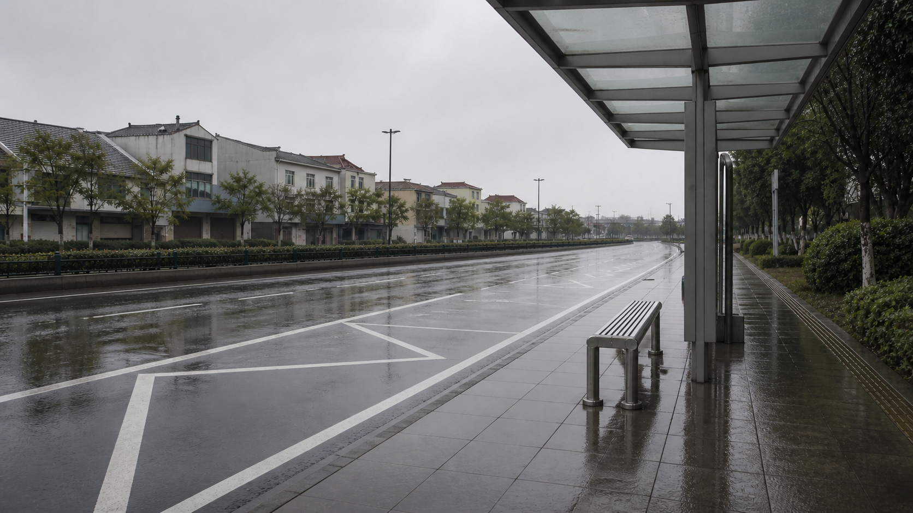

### 最终视频提示词（整段复制）

```text
[场景：清晨的河东站雨棚外，雨后湿地面反射灰白天光，路口空旷。角色：无出镜人物。镜头：大全景，35mm镜头，大景深，固定机位，保留真实街道的自然透视与潮湿材质。动作：一辆公交从远处缓慢驶近，雨棚和积水保持稳定；无对白。]
```

<details><summary>首帧生成提示词</summary>

```text
Generated as an independent 16:9 live-action narrative-film first frame using the accepted character and scene continuity references; static state: 站台无人，六点四十前的湿地面反射灰白天光。 Scene: 河东站外的清晨 Framing: 大全景，35mm镜头，大景深，固定机位 Constraints: natural skin and fabric, sourceable light, credible contact, no CGI/beauty retouch/readable text/watermark.
```

</details>

## S02｜00:08—00:15｜7秒

- 场景：行驶中的公交驾驶位
- 出镜：沈川（图中中央的驾驶位）
- 景别／镜头：中近景，50mm镜头，中等景深，驾驶位侧后方固定机位
- 首帧画面：沈川坐在驾驶位，后视镜映着空车厢前半段。
- 运动提示：他确认车厢后抬眼看向河东站。
- 对白／声音：无对白
- 声场／剪辑：
- 后期备注：不显示路线文字。

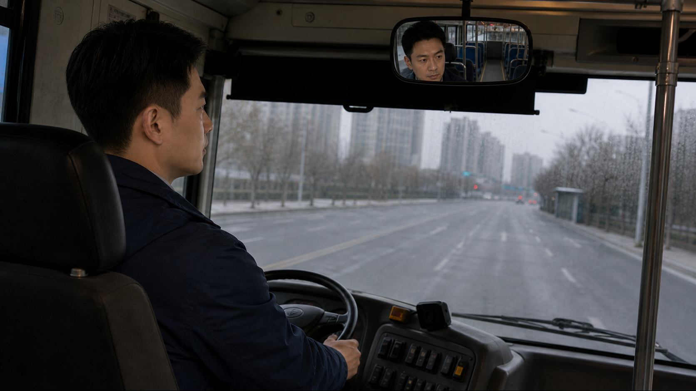

### 最终视频提示词（整段复制）

```text
[场景：清晨行驶中的公交驾驶位，挡风玻璃外有雨后反光，车厢自然偏暗。角色：沈川（图中中央的驾驶位），保持普通公交司机的自然肤质和工作服受力褶皱。镜头：中近景，50mm镜头，中等景深，驾驶位侧后方固定机位，对焦在沈川与后视镜，成像具有真人现场摄影层次。动作：沈川先从后视镜确认空车厢，再抬眼看向河东站方向；无对白。]
```

<details><summary>首帧生成提示词</summary>

```text
Generated as an independent 16:9 live-action narrative-film first frame using the accepted character and scene continuity references; static state: 沈川双手稳握方向盘，目光先落在后视镜。 Scene: 行驶中的公交驾驶位 Framing: 中近景，50mm镜头，中等景深，驾驶位侧后方固定机位 Constraints: natural skin and fabric, sourceable light, credible contact, no CGI/beauty retouch/readable text/watermark.
```

</details>

## S03｜00:15—00:22｜7秒

- 场景：河东站雨棚
- 出镜：许禾（图中右侧的雨棚下）
- 景别／镜头：中景，50mm镜头，中等景深，眼平固定机位
- 首帧画面：许禾站在雨棚内，手提保温桶，车道仍空。
- 运动提示：她听见发动机声后向车门位置走半步。
- 对白／声音：无对白
- 声场／剪辑：
- 后期备注：桶上无可读商标。

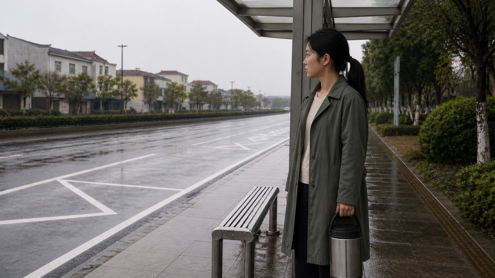

### 最终视频提示词（整段复制）

```text
[场景：清晨的河东站雨棚下，滴水的棚沿遮住潮湿人行道，灰白自然天光从路口进入。角色：许禾（图中右侧的人），手提保温桶，衣料因湿冷天气自然垂坠。镜头：中景，50mm镜头，中等景深，眼平固定机位，对焦在许禾的视线与保温桶，呈现真实站台空间。动作：许禾听见公交发动机声后向车门位置走半步，目光停在来车方向；无对白。]
```

<details><summary>首帧生成提示词</summary>

```text
Generated as an independent 16:9 live-action narrative-film first frame using the accepted character and scene continuity references; static state: 她侧身靠近立柱，保温桶垂在腿侧，望向来车方向。 Scene: 河东站雨棚 Framing: 中景，50mm镜头，中等景深，眼平固定机位 Constraints: natural skin and fabric, sourceable light, credible contact, no CGI/beauty retouch/readable text/watermark.
```

</details>

## S04｜00:22—00:30｜8秒

- 场景：河东站公交车门
- 出镜：沈川（图中左侧的驾驶位）、许禾（图中右侧的站台）
- 景别／镜头：双人中景，40mm镜头，中等景深，车门内侧固定机位
- 首帧画面：公交刚停稳，车门打开，许禾站在踏板外，沈川向她看去。
- 运动提示：许禾把一杯冒着热气的豆浆递进车门。
- 对白／声音：无对白
- 声场／剪辑：
- 后期备注：杯身无文字。

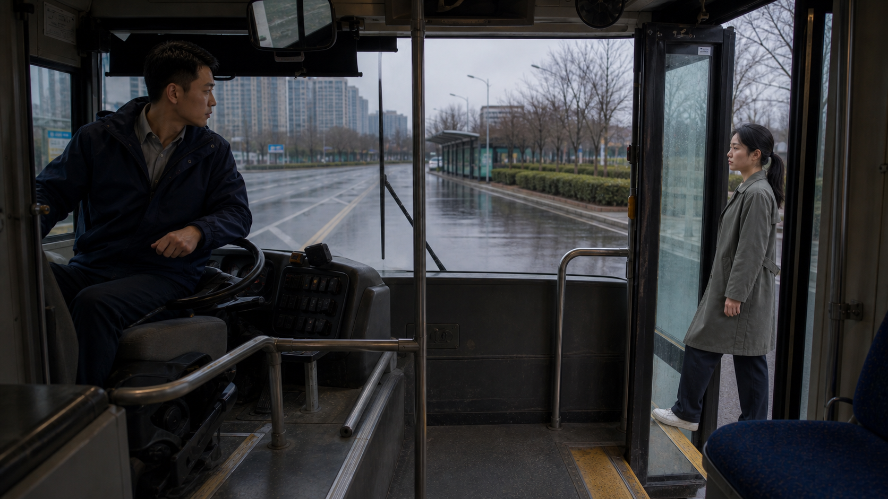

### 最终视频提示词（整段复制）

```text
[场景：清晨的河东站公交车门，开启的车门让灰白天光照进偏暗车厢，站台地面潮湿。角色：沈川（图中左侧的驾驶位）、许禾（图中右侧的站台），两人保持自然肤质和符合湿冷天气的衣料状态。镜头：双人中景，40mm镜头，中等景深，车门内侧固定机位，对焦在两人之间的门槛与豆浆。动作：许禾把一杯冒着热气的豆浆递进车门，沈川转头接近杯子；无对白。]
```

<details><summary>首帧生成提示词</summary>

```text
Generated as an independent 16:9 live-action narrative-film first frame using the accepted character and scene continuity references; static state: 许禾一脚仍在站台，沈川转头等待她的动作。 Scene: 河东站公交车门 Framing: 双人中景，40mm镜头，中等景深，车门内侧固定机位 Constraints: natural skin and fabric, sourceable light, credible contact, no CGI/beauty retouch/readable text/watermark.
```

</details>

## S05｜00:30—00:37｜7秒

- 场景：河东站公交车门
- 出镜：沈川（图中左侧的驾驶位）、许禾（图中右侧的站台）
- 景别／镜头：手部与双人近景，65mm镜头，浅景深，固定机位
- 首帧画面：沈川的手已托住纸杯，许禾仍没有踏上车。
- 运动提示：许禾松开纸杯，对沈川说话后退。
- 对白／声音：许禾：今天微甜。
- 声场／剪辑：
- 后期备注：纸杯无文字。

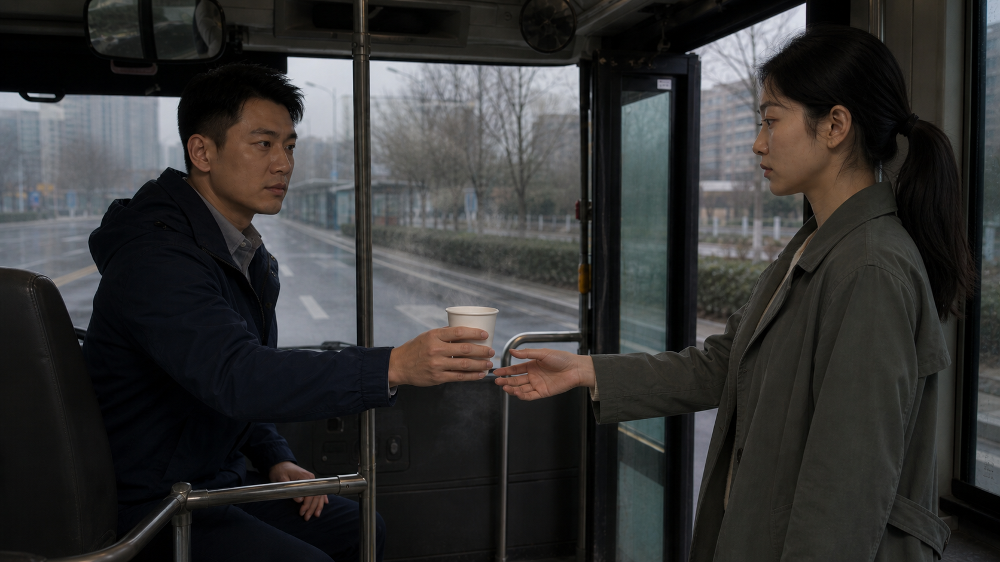

### 最终视频提示词（整段复制）

```text
[场景：清晨的河东站公交车门，纸杯热气在冷空气里升起，车门光线照亮两人的手。角色：沈川（图中左侧的驾驶位）、许禾（图中右侧的站台），手部皮肤和纸杯接触真实，衣袖有自然褶皱。镜头：手部与双人近景，65mm镜头，浅景深，固定机位，对焦在纸杯与交接的手指。动作：许禾松开纸杯后退半步，对沈川说“今天微甜”，沈川没有立刻移开视线。]
```

<details><summary>首帧生成提示词</summary>

```text
Generated as an independent 16:9 live-action narrative-film first frame using the accepted character and scene continuity references; static state: 两人的手在纸杯两侧短暂停住，热气遮过车门边缘。 Scene: 河东站公交车门 Framing: 手部与双人近景，65mm镜头，浅景深，固定机位 Constraints: natural skin and fabric, sourceable light, credible contact, no CGI/beauty retouch/readable text/watermark.
```

</details>

## S06｜00:37—00:44｜7秒

- 场景：离开河东站的公交
- 出镜：沈川（图中左侧的车内）、许禾（图中右侧的站台）
- 景别／镜头：隔窗双人中景，50mm镜头，中等景深，随车平移
- 首帧画面：公交起步，许禾停在雨棚边，沈川在车窗后握着豆浆。
- 运动提示：公交缓慢前行，二人的视线短暂错开。
- 对白／声音：无对白
- 声场／剪辑：
- 后期备注：无。

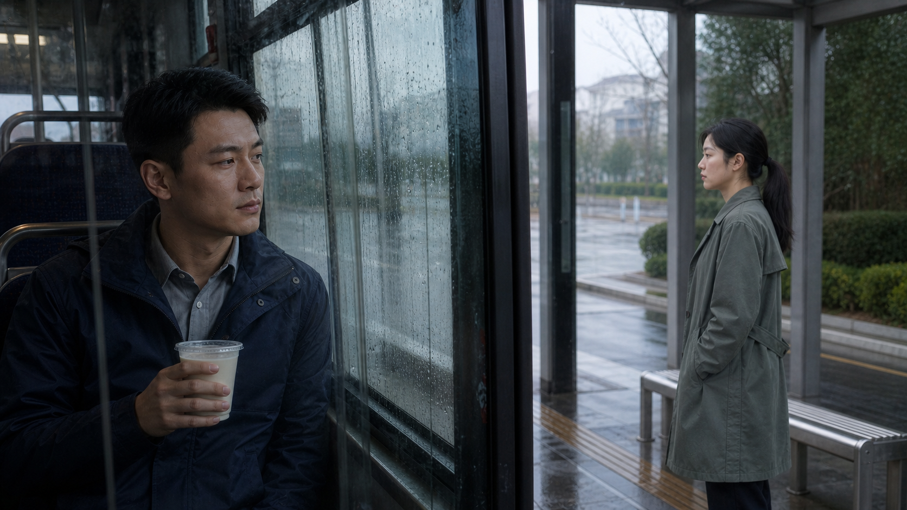

### 最终视频提示词（整段复制）

```text
[场景：清晨离开河东站的公交旁，湿玻璃与雨棚把车内外隔开，路面反射自然晨光。角色：沈川（图中左侧的车内）、许禾（图中右侧的站台），人物不看摄影机，身体重心符合车辆起步。镜头：隔窗双人中景，50mm镜头，中等景深，随车平移，对焦随车窗水痕轻微变化。动作：公交缓慢前行，两人的视线隔着玻璃短暂错开；无对白。]
```

<details><summary>首帧生成提示词</summary>

```text
Generated as an independent 16:9 live-action narrative-film first frame using the accepted character and scene continuity references; static state: 车刚离站，玻璃上的水痕把两人隔开。 Scene: 离开河东站的公交 Framing: 隔窗双人中景，50mm镜头，中等景深，随车平移 Constraints: natural skin and fabric, sourceable light, credible contact, no CGI/beauty retouch/readable text/watermark.
```

</details>

## S07｜00:44—00:52｜8秒

- 场景：数日后的河东站
- 出镜：沈川（图中左侧的驾驶位）、许禾（图中右侧的站台）
- 景别／镜头：双人中景，40mm镜头，大景深，固定机位
- 首帧画面：另一清晨的公交再次靠站，许禾在保温桶旁用小杯试温。
- 运动提示：沈川推开车门，说出他记住的口味；许禾停住动作。
- 对白／声音：沈川：你自己的那杯也是微甜。
- 声场／剪辑：
- 后期备注：以较干的站台和不同晨光标示另一个清晨；小杯无文字。

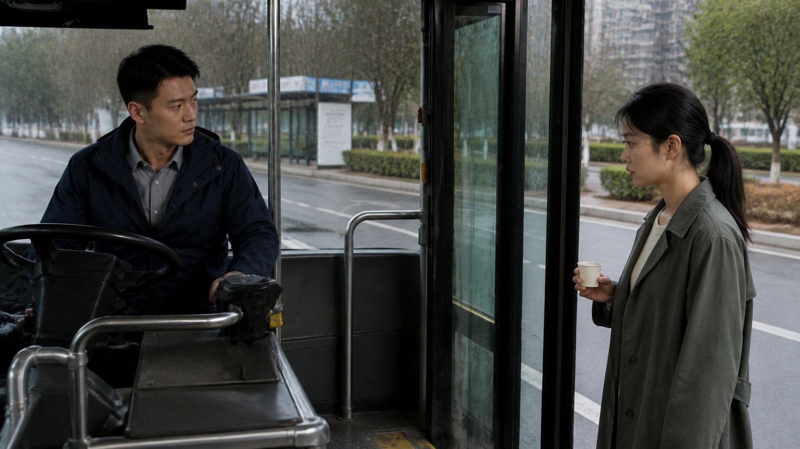

### 最终视频提示词（整段复制）

```text
[场景：另一清晨的河东站，较干的站台旁早市刚开始，冷色天光从路口照进车门。角色：沈川（图中左侧的驾驶位）、许禾（图中右侧的站台），许禾端着自己的小杯，保温桶自然垂在身侧。镜头：双人中景，40mm镜头，大景深，固定机位，空间关系清楚，人物有真实衣料重量。动作：沈川推开车门对许禾说“你自己的那杯也是微甜”，许禾试温的动作停住。]
```

<details><summary>首帧生成提示词</summary>

```text
Generated as an independent 16:9 live-action narrative-film first frame using the accepted character and scene continuity references; static state: 沈川踩住刹车，许禾端着自己的小杯站在车门外，保温桶仍在身侧。 Scene: 数日后的河东站 Framing: 双人中景，40mm镜头，大景深，固定机位 Constraints: natural skin and fabric, sourceable light, credible contact, no CGI/beauty retouch/readable text/watermark.
```

</details>

## S08｜00:52—01:00｜8秒

- 场景：河东站公交车门
- 出镜：沈川（图中左侧的驾驶位）、许禾（图中右侧的站台）
- 景别／镜头：双人近景，50mm镜头，浅景深，固定机位
- 首帧画面：许禾放下自己的小杯，将给沈川的豆浆递到门内。
- 运动提示：许禾点头后把豆浆递近，沈川侧身接过。
- 对白／声音：无对白
- 声场／剪辑：
- 后期备注：无。

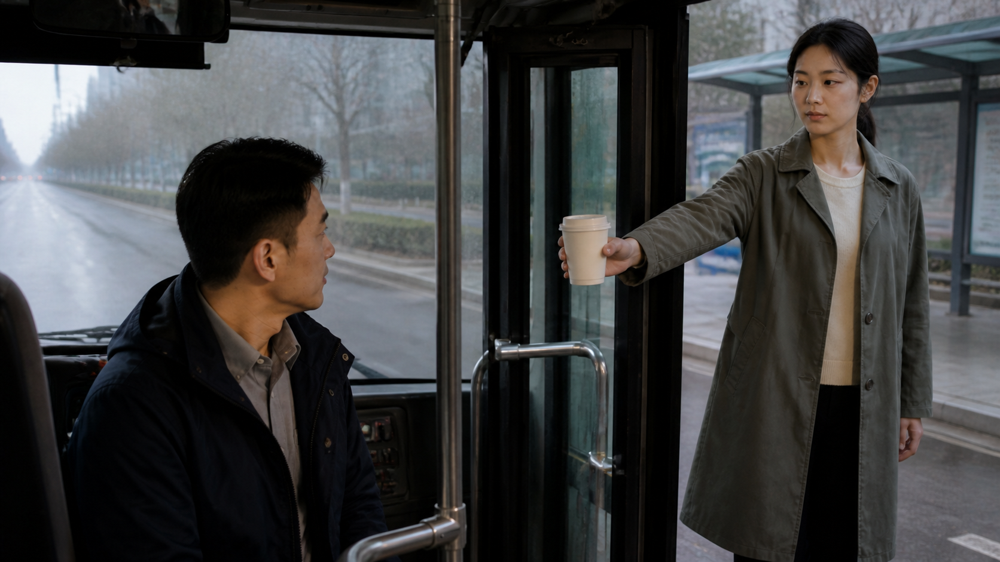

### 最终视频提示词（整段复制）

```text
[场景：清晨河东站的公交车门，门内暖些的顶灯与站台冷天光交界清晰。角色：沈川（图中左侧的驾驶位）、许禾（图中右侧的站台），纸杯、手指和衣袖接触符合真实物理。镜头：双人近景，50mm镜头，浅景深，固定机位，对焦在纸杯和许禾移开的视线。动作：许禾点头后把豆浆递近，沈川侧身接过，许禾仍不迈上车；无对白。]
```

<details><summary>首帧生成提示词</summary>

```text
Generated as an independent 16:9 live-action narrative-film first frame using the accepted character and scene continuity references; static state: 杯盖完好，许禾手臂伸直但脚仍在站台，她先看一眼沈川再移开视线。 Scene: 河东站公交车门 Framing: 双人近景，50mm镜头，浅景深，固定机位 Constraints: natural skin and fabric, sourceable light, credible contact, no CGI/beauty retouch/readable text/watermark.
```

</details>

## S09｜01:00—01:08｜8秒

- 场景：公交车厢前门
- 出镜：许禾（图中右侧的车门外）
- 景别／镜头：过肩中景，45mm镜头，中等景深，驾驶位方向固定机位
- 首帧画面：前门内的座位空着，许禾站在门外看见它。
- 运动提示：许禾轻轻摇头，退回雨棚。
- 对白／声音：无对白
- 声场／剪辑：
- 后期备注：空座不放置任何人或包。

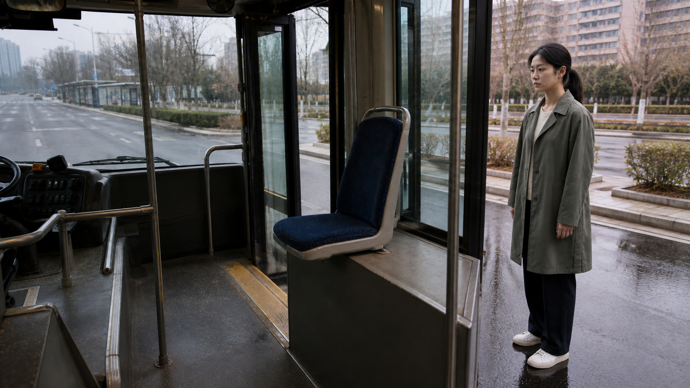

### 最终视频提示词（整段复制）

```text
[场景：清晨公交车厢前门，靠近门口的一张空座被车内顶灯照亮，站台在门外偏冷。角色：许禾（图中右侧的车门外），只露自然的侧身与停住的脚尖。镜头：过肩中景，45mm镜头，中等景深，驾驶位方向固定机位，对焦在空座与许禾之间的门槛。动作：许禾看见空座后轻轻摇头，退回雨棚；无对白。]
```

<details><summary>首帧生成提示词</summary>

```text
Generated as an independent 16:9 live-action narrative-film first frame using the accepted character and scene continuity references; static state: 她的手已离开纸杯，脚尖停在车门门槛外。 Scene: 公交车厢前门 Framing: 过肩中景，45mm镜头，中等景深，驾驶位方向固定机位 Constraints: natural skin and fabric, sourceable light, credible contact, no CGI/beauty retouch/readable text/watermark.
```

</details>

## S10｜01:08—01:16｜8秒

- 场景：公交驾驶位后视镜
- 出镜：沈川（图中前景左侧）、许禾（图中后视镜中央）
- 景别／镜头：后视镜特写，85mm镜头，浅景深，固定机位
- 首帧画面：沈川的眼睛在前景虚焦，后视镜里许禾走回雨棚。
- 运动提示：沈川在车门关闭前多停一秒。
- 对白／声音：无对白
- 声场／剪辑：
- 后期备注：保持驾驶位视线方向正确。

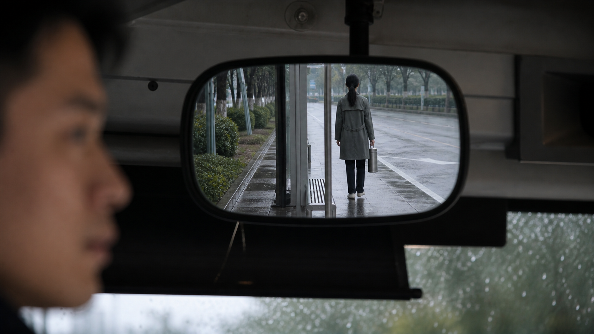

### 最终视频提示词（整段复制）

```text
[场景：清晨公交驾驶位，后视镜映出河东站雨棚和湿路面，车厢前景自然偏暗。角色：沈川（图中前景左侧）、许禾（图中后视镜中央的背影），保温桶随手臂自然下垂。镜头：后视镜特写，85mm镜头，浅景深，固定机位，对焦在镜中的许禾，真实镜面反射不过度锐利。动作：沈川在车门关闭前多停一秒，看着许禾走回雨棚；无对白。]
```

<details><summary>首帧生成提示词</summary>

```text
Generated as an independent 16:9 live-action narrative-film first frame using the accepted character and scene continuity references; static state: 后视镜准确映出她的背影与保温桶。 Scene: 公交驾驶位后视镜 Framing: 后视镜特写，85mm镜头，浅景深，固定机位 Constraints: natural skin and fabric, sourceable light, credible contact, no CGI/beauty retouch/readable text/watermark.
```

</details>

## S11｜01:16—01:24｜8秒

- 场景：河东站雨棚
- 出镜：许禾（图中中央的雨棚下）
- 景别／镜头：近景，85mm镜头，浅景深，固定机位
- 首帧画面：许禾侧头整理被风吹乱的头发，耳后小痣短暂显出。
- 运动提示：她将头发别回耳后，望向驶离的公交。
- 对白／声音：无对白
- 声场／剪辑：
- 后期备注：只在当前景别自然可见的小痣，不夸张强调。

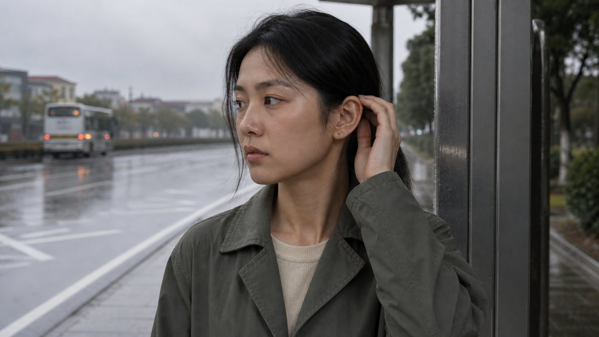

### 最终视频提示词（整段复制）

```text
[场景：清晨的河东站雨棚下，棚沿滴水，驶离的公交声从湿街道远去。角色：许禾（图中中央的人），头发被风吹乱后自然别到耳后，耳后小痣在近景中短暂可见。镜头：近景，85mm镜头，浅景深，固定机位，对焦在许禾的眼神与耳侧自然发丝。动作：许禾将头发别回耳后，望向驶离的公交；无对白。]
```

<details><summary>首帧生成提示词</summary>

```text
Generated as an independent 16:9 live-action narrative-film first frame using the accepted character and scene continuity references; static state: 她站在雨棚立柱旁，保温桶放在脚边。 Scene: 河东站雨棚 Framing: 近景，85mm镜头，浅景深，固定机位 Constraints: natural skin and fabric, sourceable light, credible contact, no CGI/beauty retouch/readable text/watermark.
```

</details>

## S12｜01:24—01:31｜7秒

- 场景：旧日雨中的河东站路边
- 出镜：沈川（图中左侧的路边）、许禾（图中右侧的雨中）
- 景别／镜头：中景，40mm镜头，大景深，手持轻微跟随
- 首帧画面：透明伞被风吹到停车公交前，沈川已下车弯腰捡起。
- 运动提示：沈川直起身把伞递向许禾。
- 对白／声音：无对白
- 声场／剪辑：
- 后期备注：这是原作“替她捡伞”的可视化回忆。

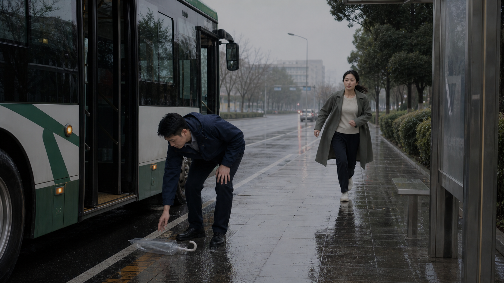

### 最终视频提示词（整段复制）

```text
[场景：旧日暴雨中的河东站路边，公交前方积着浅水，雨棚与车门提供明确光源反射。角色：沈川（图中左侧的人）、许禾（图中右侧的雨中），衣料被雨打湿但保持真实重量，透明伞在两人之间。镜头：中景，40mm镜头，大景深，轻微手持跟随，透视符合真实街道。动作：沈川直起身把被风吹走的透明伞递向许禾，许禾快步接近；无对白。]
```

<details><summary>首帧生成提示词</summary>

```text
Generated as an independent 16:9 live-action narrative-film first frame using the accepted character and scene continuity references; static state: 透明伞停在沈川手边，许禾从雨棚外快步赶来。 Scene: 旧日雨中的河东站路边 Framing: 中景，40mm镜头，大景深，手持轻微跟随 Constraints: natural skin and fabric, sourceable light, credible contact, no CGI/beauty retouch/readable text/watermark.
```

</details>

## S13｜01:31—01:38｜7秒

- 场景：旧日雨中的公交车门
- 出镜：沈川（图中左侧的车门内）、许禾（图中右侧的站台）
- 景别／镜头：双人近景，55mm镜头，浅景深，固定机位
- 首帧画面：许禾双手接住透明伞，沈川站在车门内侧。
- 运动提示：许禾收回伞，对沈川道谢。
- 对白／声音：许禾：谢谢你。
- 声场／剪辑：
- 后期备注：不显示可读线路信息。

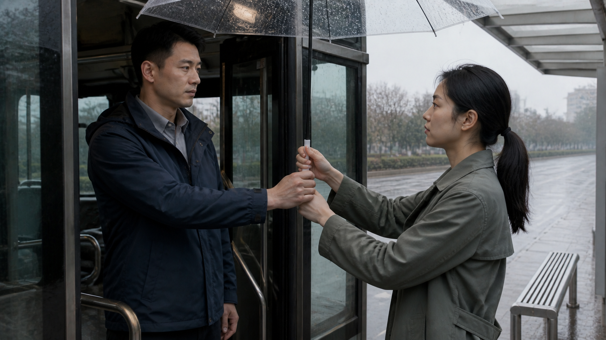

### 最终视频提示词（整段复制）

```text
[场景：旧日暴雨中的公交车门，车内顶灯映在透明伞面上，站台雨水沿伞边滴落。角色：沈川（图中左侧的车门内）、许禾（图中右侧的站台），两人手指与伞柄接触真实。镜头：双人近景，55mm镜头，浅景深，固定机位，对焦在伞柄交接与许禾的表情。动作：许禾收回透明伞，对沈川说“谢谢你”，沈川安静站在门内。]
```

<details><summary>首帧生成提示词</summary>

```text
Generated as an independent 16:9 live-action narrative-film first frame using the accepted character and scene continuity references; static state: 伞柄仍在两人之间，雨水沿透明伞面流下。 Scene: 旧日雨中的公交车门 Framing: 双人近景，55mm镜头，浅景深，固定机位 Constraints: natural skin and fabric, sourceable light, credible contact, no CGI/beauty retouch/readable text/watermark.
```

</details>

## S14｜01:38—01:46｜8秒

- 场景：回到现在的公交驾驶位
- 出镜：沈川（图中中央的驾驶位）
- 景别／镜头：近景，85mm镜头，浅景深，固定机位
- 首帧画面：沈川握着已喝空的豆浆杯，望向后视镜。
- 运动提示：他想开口，最终只把视线移回前方。
- 对白／声音：无对白
- 声场／剪辑：
- 后期备注：无。

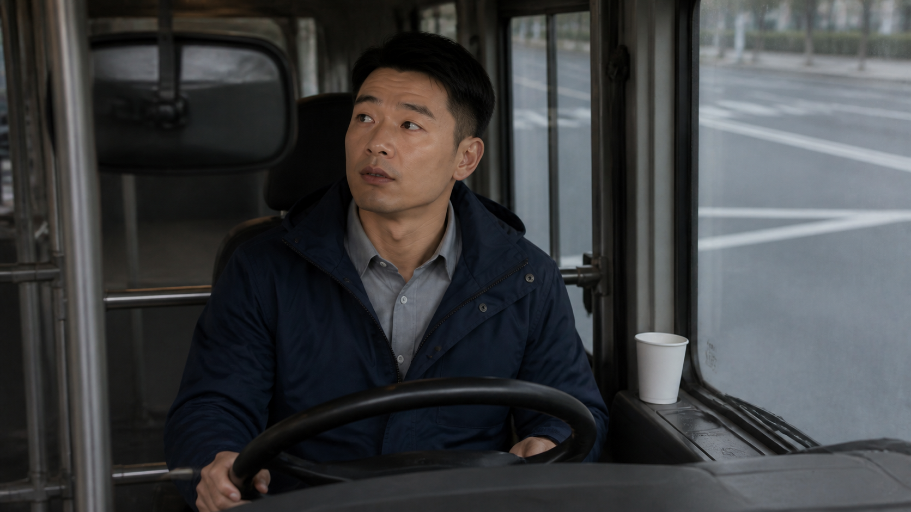

### 最终视频提示词（整段复制）

```text
[场景：回到现在的公交驾驶位，清晨天光从挡风玻璃照进来，驾驶台边放着喝空的纸杯。角色：沈川（图中中央的驾驶位），面部有自然疲惫感，工作服与座椅接触真实。镜头：近景，85mm镜头，浅景深，固定机位，对焦在沈川欲言又止的表情。动作：沈川想开口却最终把视线移回前方，手没有离开方向盘；无对白。]
```

<details><summary>首帧生成提示词</summary>

```text
Generated as an independent 16:9 live-action narrative-film first frame using the accepted character and scene continuity references; static state: 空纸杯放在驾驶台边，沈川的嘴唇微张又停住。 Scene: 回到现在的公交驾驶位 Framing: 近景，85mm镜头，浅景深，固定机位 Constraints: natural skin and fabric, sourceable light, credible contact, no CGI/beauty retouch/readable text/watermark.
```

</details>

## S15｜01:46—01:53｜7秒

- 场景：河东站公交车门
- 出镜：沈川（图中左侧的驾驶位）、许禾（图中右侧的车门外）
- 景别／镜头：双人中景，50mm镜头，中等景深，固定机位
- 首帧画面：车门保持开启，沈川的手停在控制键旁，许禾站在门槛外。
- 运动提示：沈川多留半拍车门，许禾低下眼睛。
- 对白／声音：无对白
- 声场／剪辑：
- 后期备注：不再重复空座信息，强调新的行动机会。

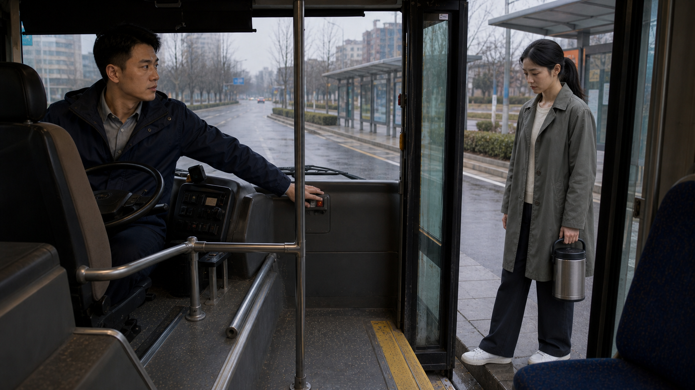

### 最终视频提示词（整段复制）

```text
[场景：清晨河东站的公交前门，车内顶灯与车外自然天光在门槛处相接，站台湿润。角色：沈川（图中左侧的驾驶位）、许禾（图中右侧的车门外），两人保持克制表演与真实站姿。镜头：双人中景，50mm镜头，中等景深，固定机位，对焦在沈川停在控制键旁的手和许禾未跨出的脚。动作：沈川多留半拍车门，许禾低下眼睛却没有上车；无对白。]
```

<details><summary>首帧生成提示词</summary>

```text
Generated as an independent 16:9 live-action narrative-film first frame using the accepted character and scene continuity references; static state: 沈川没有立刻发车，许禾握着保温桶把手，脚尖仍未跨过门槛。 Scene: 河东站公交车门 Framing: 双人中景，50mm镜头，中等景深，固定机位 Constraints: natural skin and fabric, sourceable light, credible contact, no CGI/beauty retouch/readable text/watermark.
```

</details>

## S16｜01:53—02:01｜8秒

- 场景：河东站站台
- 出镜：沈川（图中左侧的车内）、许禾（图中右侧的站台）
- 景别／镜头：双人中景，40mm镜头，大景深，固定机位
- 首帧画面：车门即将关闭，沈川和许禾隔着门槛对望。
- 运动提示：车门缓慢合拢，切断两人的视线。
- 对白／声音：无对白
- 声场／剪辑：
- 后期备注：作为“把下一步交给明天”的视觉表达。

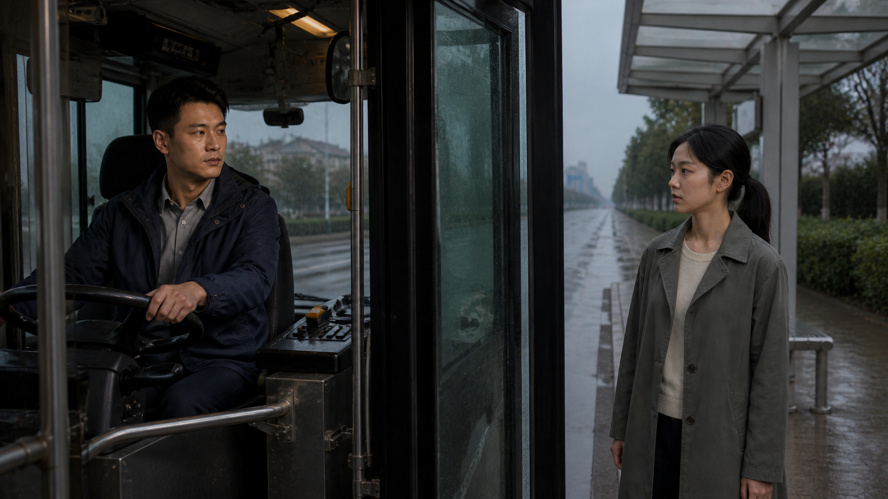

### 最终视频提示词（整段复制）

```text
[场景：清晨的河东站车门，车内偏暖顶灯与车外冷天光在门槛处相接，站台湿润。角色：沈川（图中左侧的车内）、许禾（图中右侧的站台），两人保持克制表演，不看摄影机。镜头：双人中景，40mm镜头，大景深，固定机位，门框形成真实遮挡。动作：车门缓慢合拢，沈川和许禾隔着门槛的视线被切断；无对白。]
```

<details><summary>首帧生成提示词</summary>

```text
Generated as an independent 16:9 live-action narrative-film first frame using the accepted character and scene continuity references; static state: 许禾没有上车，沈川一手仍扶方向盘。 Scene: 河东站站台 Framing: 双人中景，40mm镜头，大景深，固定机位 Constraints: natural skin and fabric, sourceable light, credible contact, no CGI/beauty retouch/readable text/watermark.
```

</details>

## S17｜02:01—02:08｜7秒

- 场景：一个普通清晨驶离后的河东站
- 出镜：许禾（图中右侧的雨棚下）
- 景别／镜头：远中景，65mm镜头，中等景深，固定机位
- 首帧画面：公交已驶出画面，许禾站在较干的雨棚下，透明伞靠在立柱旁。
- 运动提示：她看着空路，随后转身离开画面。
- 对白／声音：无对白
- 声场／剪辑：
- 后期备注：本镜结束的是一个普通清晨；S18硬切到数个清晨后的暴雨日，不以字幕说明。

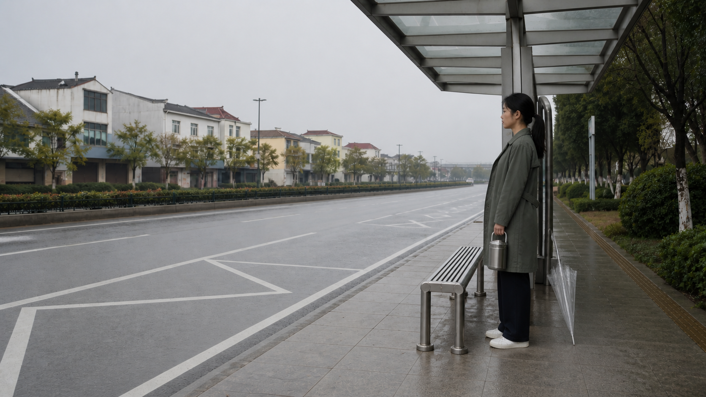

### 最终视频提示词（整段复制）

```text
[场景：一个普通清晨驶离公交后的河东站，路面只有零星旧水痕，雨棚下有靠在立柱旁的透明伞。角色：许禾（图中右侧的人），手提保温桶，站姿自然不摆拍。镜头：远中景，65mm镜头，中等景深，固定机位，空间留白表现这个早晨已经结束。动作：许禾看着空路，随后转身离开画面；无对白。]
```

<details><summary>首帧生成提示词</summary>

```text
Generated as an independent 16:9 live-action narrative-film first frame using the accepted character and scene continuity references; static state: 她与立柱保持一段距离，保温桶仍在手里，路面只有零星旧水痕。 Scene: 一个普通清晨驶离后的河东站 Framing: 远中景，65mm镜头，中等景深，固定机位 Constraints: natural skin and fabric, sourceable light, credible contact, no CGI/beauty retouch/readable text/watermark.
```

</details>

## S18｜02:08—02:15｜7秒

- 场景：数个清晨后的另一个暴雨清晨的河东站
- 出镜：无出镜人物
- 景别／镜头：大全景，35mm镜头，大景深，固定机位
- 首帧画面：夜雨持续到另一个清晨，暴雨压低天空，雨棚边缘连续滴水，路面积水明显加深。
- 运动提示：雨势加大，水面被密集雨点击碎。
- 对白／声音：无对白
- 声场／剪辑：
- 后期备注：以硬切、连续暴雨声和道具状态变化表现日次切换，不用字幕。

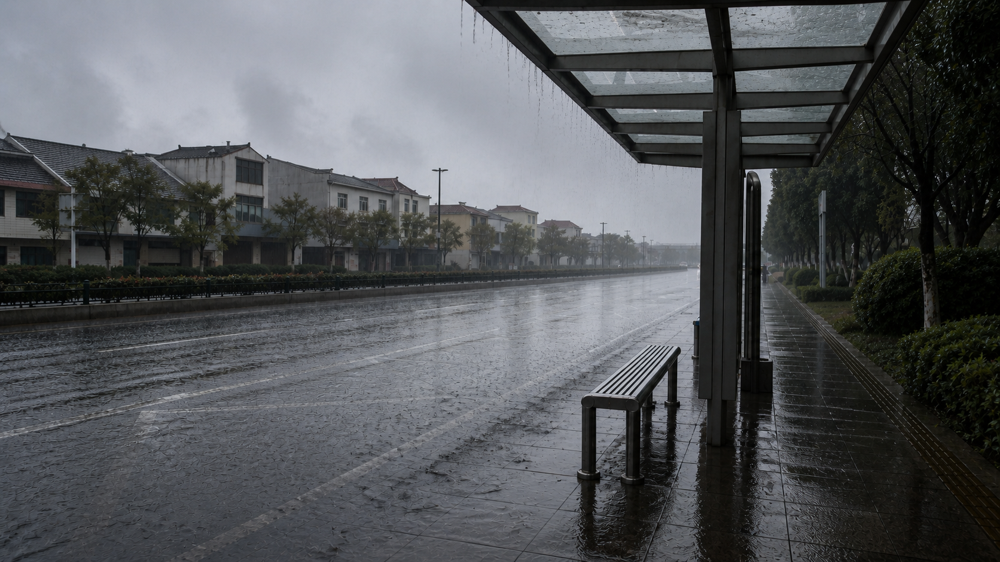

### 最终视频提示词（整段复制）

```text
[场景：数个清晨后的另一个暴雨清晨，河东站低云压住街道，雨棚边缘连续滴水，路面积水不断扩散。角色：无出镜人物。镜头：大全景，35mm镜头，大景深，固定机位，雨幕密度与水面反射符合真实天气，与上一普通清晨形成可见天气断层。动作：雨势加大，水面被密集雨点击碎；无对白。]
```

<details><summary>首帧生成提示词</summary>

```text
Generated as an independent 16:9 live-action narrative-film first frame using the accepted character and scene continuity references; static state: 站台空着，暴雨和深积水与上一镜的较干路面形成可见断层。 Scene: 数个清晨后的另一个暴雨清晨的河东站 Framing: 大全景，35mm镜头，大景深，固定机位 Constraints: natural skin and fabric, sourceable light, credible contact, no CGI/beauty retouch/readable text/watermark.
```

</details>

## S19｜02:15—02:22｜7秒

- 场景：另一个暴雨清晨的河东站雨棚
- 出镜：许禾（图中中央的雨棚下）
- 景别／镜头：中近景，50mm镜头，中等景深，固定机位
- 首帧画面：许禾将封好的保温桶放在雨棚长椅旁，手按住口袋里的纸条。
- 运动提示：她取出折好的纸条，目光落向车道。
- 对白／声音：无对白
- 声场／剪辑：
- 后期备注：纸条内容不生成。

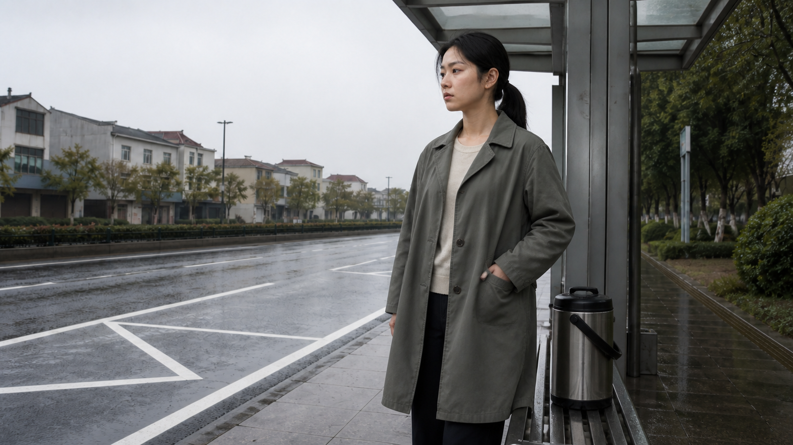

### 最终视频提示词（整段复制）

```text
[场景：另一个暴雨清晨的河东站雨棚，雨幕在棚外形成白色水线，棚内仍有可辨的自然反射光。角色：许禾（图中中央的人），将封好的保温桶稳放在长椅旁，外套和头发有真实湿气状态。镜头：中近景，50mm镜头，中等景深，固定机位，对焦在许禾按住口袋的手。动作：许禾取出折好的纸条，目光不再回避车道；无对白。]
```

<details><summary>首帧生成提示词</summary>

```text
Generated as an independent 16:9 live-action narrative-film first frame using the accepted character and scene continuity references; static state: 保温桶稳放在干燥处，没有准备递出的纸杯；她的另一手攥在外套口袋前。 Scene: 另一个暴雨清晨的河东站雨棚 Framing: 中近景，50mm镜头，中等景深，固定机位 Constraints: natural skin and fabric, sourceable light, credible contact, no CGI/beauty retouch/readable text/watermark.
```

</details>

## S20｜02:22—02:29｜7秒

- 场景：雨棚内的纸条
- 出镜：许禾（图中背景左侧，只露部分手臂）
- 景别／镜头：手部特写，85mm镜头，浅景深，固定机位
- 首帧画面：许禾的手将无可读文字的号码纸条重新折紧。
- 运动提示：她把纸条攥入掌心。
- 对白／声音：无对白
- 声场／剪辑：
- 后期备注：号码文字后期处理，不要求模型生成。

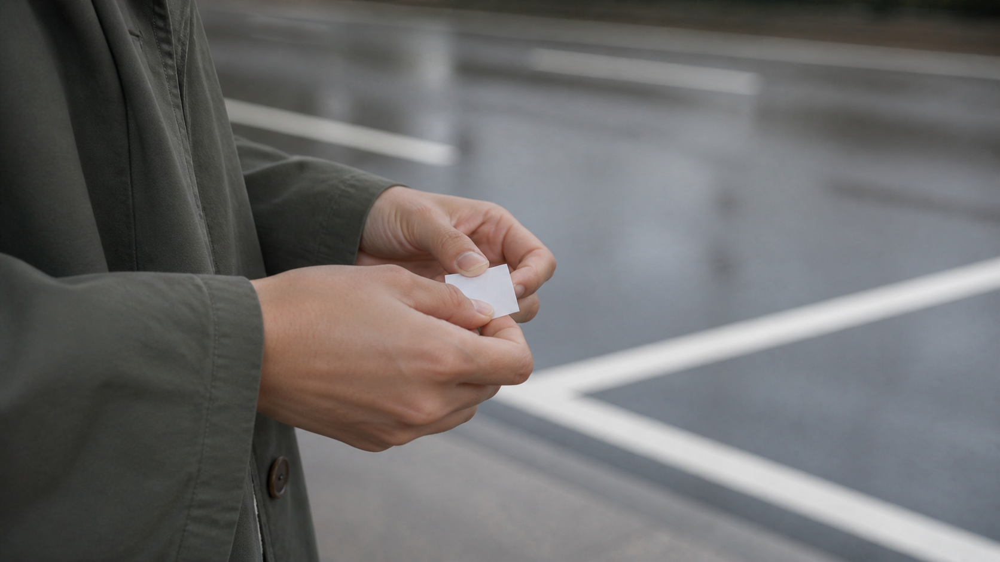

### 最终视频提示词（整段复制）

```text
[场景：暴雨中的河东站雨棚内，棚沿滴水形成前景虚化，纸条被雨棚遮住仍保持干燥。角色：许禾（图中背景左侧，只露自然的手臂和衣袖）。镜头：手部特写，85mm镜头，浅景深，固定机位，对焦在折好的纸条与手指。动作：许禾把纸条攥入掌心，手指因紧张略微收紧；无对白。]
```

<details><summary>首帧生成提示词</summary>

```text
Generated as an independent 16:9 live-action narrative-film first frame using the accepted character and scene continuity references; static state: 纸条干燥地夹在两指间，雨水未直接打到纸面。 Scene: 雨棚内的纸条 Framing: 手部特写，85mm镜头，浅景深，固定机位 Constraints: natural skin and fabric, sourceable light, credible contact, no CGI/beauty retouch/readable text/watermark.
```

</details>

## S21｜02:29—02:36｜7秒

- 场景：河东站雨棚立柱
- 出镜：许禾（图中左侧的雨棚下）
- 景别／镜头：中景，40mm镜头，大景深，固定机位
- 首帧画面：许禾拿着透明伞站在立柱旁，另一手攥着纸条，车道被雨幕遮住。
- 运动提示：许禾把透明伞靠在立柱旁腾出手，再向雨棚边缘迈一步。
- 对白／声音：无对白
- 声场／剪辑：
- 后期备注：透明伞状态需与S33、S34、S38连续。

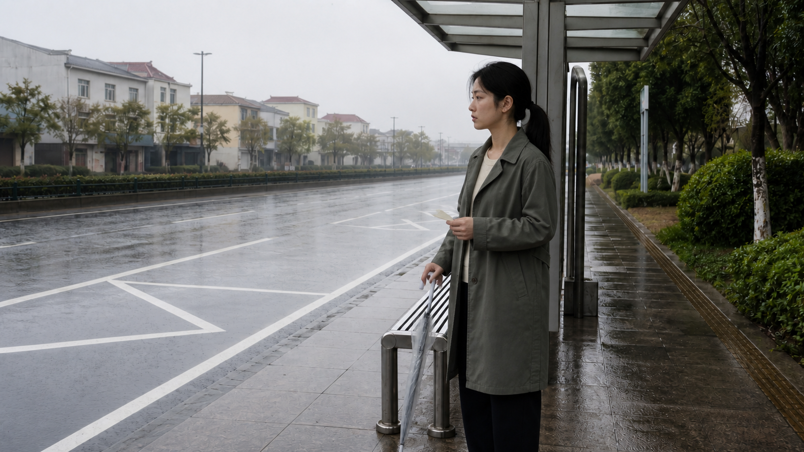

### 最终视频提示词（整段复制）

```text
[场景：暴雨中的河东站雨棚，棚外车道被雨幕遮住，立柱就在许禾身侧。角色：许禾（图中左侧的人），一手拿着透明伞，另一手攥着纸条，身体朝向车道。镜头：中景，40mm镜头，大景深，固定机位，透明伞、立柱与人物空间关系清楚。动作：许禾把透明伞靠在立柱旁腾出手，再向雨棚边缘迈一步；无对白。]
```

<details><summary>首帧生成提示词</summary>

```text
Generated as an independent 16:9 live-action narrative-film first frame using the accepted character and scene continuity references; static state: 伞柄仍在许禾手中，她身体朝向车道，尚未走出雨棚。 Scene: 河东站雨棚立柱 Framing: 中景，40mm镜头，大景深，固定机位 Constraints: natural skin and fabric, sourceable light, credible contact, no CGI/beauty retouch/readable text/watermark.
```

</details>

## S22｜02:36—02:43｜7秒

- 场景：河东站外的暴雨车道
- 出镜：许禾（图中右侧的雨棚边缘）
- 景别／镜头：过肩远景，70mm镜头，大景深，固定机位
- 首帧画面：许禾从雨棚边缘望出去，常规来车方向被水雾和空路覆盖。
- 运动提示：她把身体探出雨棚，试图看清路口。
- 对白／声音：无对白
- 声场／剪辑：
- 后期备注：无。

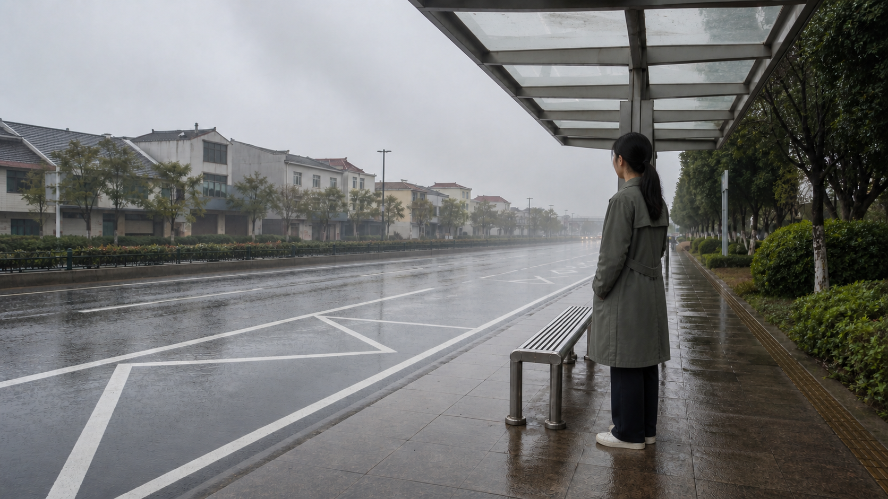

### 最终视频提示词（整段复制）

```text
[场景：暴雨中的河东站外，常规来车方向被水雾和空路覆盖，雨棚形成前景遮挡。角色：许禾（图中右侧的雨棚边缘），衣料边缘被风吹动，身体停在干湿交界。镜头：过肩远景，70mm镜头，大景深，固定机位，对焦穿过雨幕看向空路口。动作：许禾把身体探出雨棚，试图看清来车方向；无对白。]
```

<details><summary>首帧生成提示词</summary>

```text
Generated as an independent 16:9 live-action narrative-film first frame using the accepted character and scene continuity references; static state: 她站在干湿交界，前方没有公交。 Scene: 河东站外的暴雨车道 Framing: 过肩远景，70mm镜头，大景深，固定机位 Constraints: natural skin and fabric, sourceable light, credible contact, no CGI/beauty retouch/readable text/watermark.
```

</details>

## S23｜02:43—02:50｜7秒

- 场景：河东站雨棚外
- 出镜：许禾（图中中央的雨中）
- 景别／镜头：中景，50mm镜头，中等景深，轻微跟随
- 首帧画面：许禾已经走出雨棚，手心紧攥纸条，透明伞仍留在身后。
- 运动提示：她向来车方向再走两步，准备在车门开时上车。
- 对白／声音：无对白
- 声场／剪辑：
- 后期备注：不让她拿起透明伞，保持结尾道具因果。

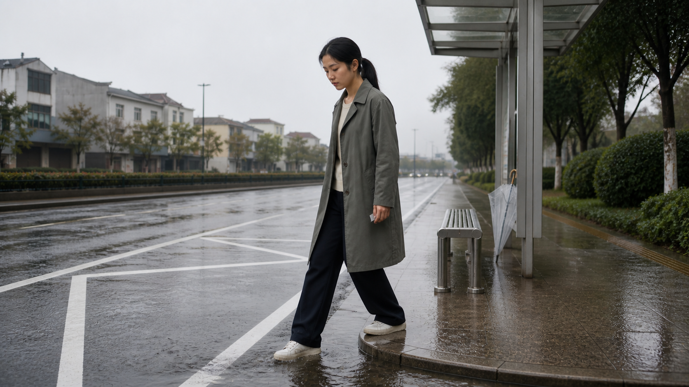

### 最终视频提示词（整段复制）

```text
[场景：暴雨中的河东站雨棚外，浅水覆盖站台边缘，透明伞留在后方立柱旁。角色：许禾（图中中央的人），一手攥着纸条，另一手自然保持平衡。镜头：中景，50mm镜头，中等景深，轻微跟随，水花和鞋底接触真实。动作：许禾向来车方向再走两步，准备在车门打开时上车；无对白。]
```

<details><summary>首帧生成提示词</summary>

```text
Generated as an independent 16:9 live-action narrative-film first frame using the accepted character and scene continuity references; static state: 她一脚踩进浅水，另一脚仍在站台边缘。 Scene: 河东站雨棚外 Framing: 中景，50mm镜头，中等景深，轻微跟随 Constraints: natural skin and fabric, sourceable light, credible contact, no CGI/beauty retouch/readable text/watermark.
```

</details>

## S24｜02:50—02:58｜8秒

- 场景：暴雨中行驶的公交驾驶位
- 出镜：沈川（图中中央的驾驶位）
- 景别／镜头：中近景，45mm镜头，中等景深，固定机位
- 首帧画面：雨刷扫过挡风玻璃，沈川减速，前方水线接近车轮。
- 运动提示：沈川踩下刹车，听向调度通话。
- 对白／声音：无对白
- 声场／剪辑：
- 后期备注：无可读仪表和导航文字。

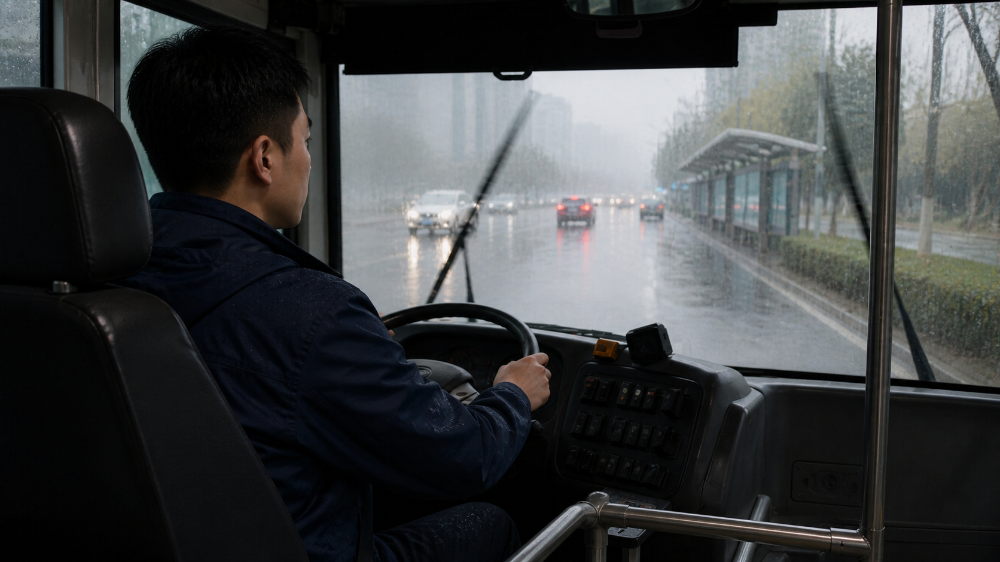

### 最终视频提示词（整段复制）

```text
[场景：暴雨中行驶的公交驾驶位，雨刷扫过挡风玻璃，前方道路被积水和水雾模糊，车内有明确顶灯反射。角色：沈川（图中中央的驾驶位），双手稳握方向盘，坐姿符合减速时的身体受力。镜头：中近景，45mm镜头，中等景深，固定机位，对焦在沈川与玻璃外的水线。动作：沈川踩下刹车，侧耳听向接通的调度通话；无对白。]
```

<details><summary>首帧生成提示词</summary>

```text
Generated as an independent 16:9 live-action narrative-film first frame using the accepted character and scene continuity references; static state: 他双手握住方向盘，前方道路因积水模糊。 Scene: 暴雨中行驶的公交驾驶位 Framing: 中近景，45mm镜头，中等景深，固定机位 Constraints: natural skin and fabric, sourceable light, credible contact, no CGI/beauty retouch/readable text/watermark.
```

</details>

## S25｜02:58—03:06｜8秒

- 场景：暴雨中行驶的公交驾驶位
- 出镜：沈川（图中中央的驾驶位）
- 景别／镜头：近景，65mm镜头，浅景深，固定机位
- 首帧画面：沈川看着前方积水，车载通话从驾驶台传出。
- 运动提示：他听完调度后点头，开始向岔路转向。
- 对白／声音：调度员画外音：前面积水，河东站方向改走北侧。
- 声场／剪辑：
- 后期备注：调度员不出镜。

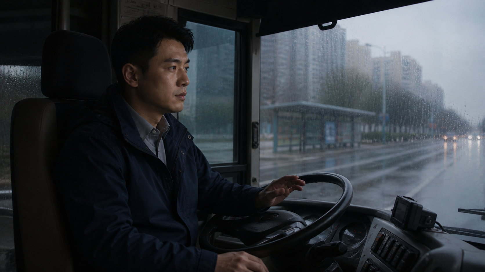

### 最终视频提示词（整段复制）

```text
[场景：暴雨中的公交驾驶位，挡风玻璃外积水形成低平反光，车载通话从驾驶台传来。角色：沈川（图中中央的驾驶位），面部有雨天驾驶的紧张感，手与方向盘接触真实。镜头：近景，65mm镜头，浅景深，固定机位，对焦在沈川的眼神和方向盘。动作：沈川听完调度员画外音“前面积水，河东站方向改走北侧”后点头，开始向岔路转向。]
```

<details><summary>首帧生成提示词</summary>

```text
Generated as an independent 16:9 live-action narrative-film first frame using the accepted character and scene continuity references; static state: 他的手停在方向盘上方，眼神在路面和后视镜间切换。 Scene: 暴雨中行驶的公交驾驶位 Framing: 近景，65mm镜头，浅景深，固定机位 Constraints: natural skin and fabric, sourceable light, credible contact, no CGI/beauty retouch/readable text/watermark.
```

</details>

## S26｜03:06—03:13｜7秒

- 场景：积水前的公交外景
- 出镜：沈川（图中左侧的驾驶位内）
- 景别／镜头：远中景，35mm镜头，大景深，固定机位
- 首帧画面：公交在无法通行的积水前减速，车头已转向北侧岔路。
- 运动提示：公交平稳调头驶向岔路。
- 对白／声音：无对白
- 声场／剪辑：
- 后期备注：水深不夸张到危险特技。

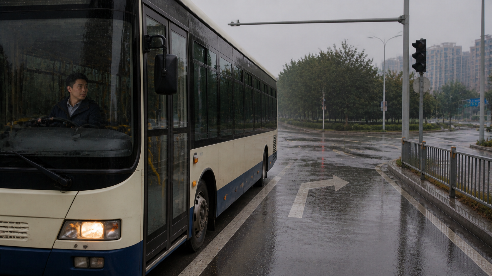

### 最终视频提示词（整段复制）

```text
[场景：暴雨中的积水路口，公交停在无法通行的水线外，北侧岔路在另一侧延伸，街道尺度真实。角色：沈川（图中左侧的驾驶位内，只见侧影）。镜头：远中景，35mm镜头，大景深，固定机位，保留真实雨幕和车辆透视。动作：公交平稳调头驶向北侧岔路，车轮压过浅水；无对白。]
```

<details><summary>首帧生成提示词</summary>

```text
Generated as an independent 16:9 live-action narrative-film first frame using the accepted character and scene continuity references; static state: 车轮停在水线外，岔路在画面另一侧打开。 Scene: 积水前的公交外景 Framing: 远中景，35mm镜头，大景深，固定机位 Constraints: natural skin and fabric, sourceable light, credible contact, no CGI/beauty retouch/readable text/watermark.
```

</details>

## S27｜03:13—03:21｜8秒

- 场景：改道中的公交车厢
- 出镜：沈川（图中前景左侧的驾驶位）
- 景别／镜头：后视镜近景，85mm镜头，浅景深，固定机位
- 首帧画面：沈川的眼睛映在后视镜边缘，车窗外的岔路不断后退。
- 运动提示：沈川短暂向原路线方向望一眼，再将车开稳。
- 对白／声音：无对白
- 声场／剪辑：
- 后期备注：车内乘客保持模糊背景，不成为新角色。

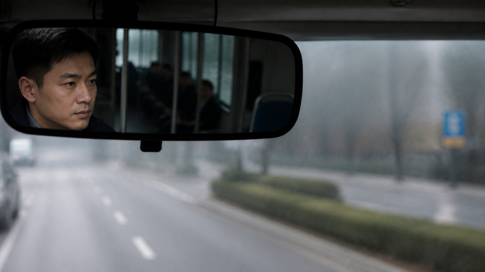

### 最终视频提示词（整段复制）

```text
[场景：改道中的公交车厢，车窗外的岔路与雨幕不断后退，前景是自然偏暗的驾驶区。角色：沈川（图中前景左侧的驾驶位），背景乘客只作模糊环境。镜头：后视镜近景，85mm镜头，浅景深，固定机位，对焦在沈川短暂偏向原路线的眼神。动作：沈川向河东站方向望一眼，再把车平稳开进岔路；无对白。]
```

<details><summary>首帧生成提示词</summary>

```text
Generated as an independent 16:9 live-action narrative-film first frame using the accepted character and scene continuity references; static state: 他已完成转弯，后视镜里没有河东站。 Scene: 改道中的公交车厢 Framing: 后视镜近景，85mm镜头，浅景深，固定机位 Constraints: natural skin and fabric, sourceable light, credible contact, no CGI/beauty retouch/readable text/watermark.
```

</details>

## S28｜03:21—03:28｜7秒

- 场景：暴雨中的河东站车道
- 出镜：许禾（图中右侧的雨棚外）
- 景别／镜头：远中景，65mm镜头，大景深，固定机位
- 首帧画面：许禾站在雨棚外，原本来车的路口依旧空着。
- 运动提示：她把纸条抬近胸前，停下继续向前走的动作。
- 对白／声音：无对白
- 声场／剪辑：
- 后期备注：无。

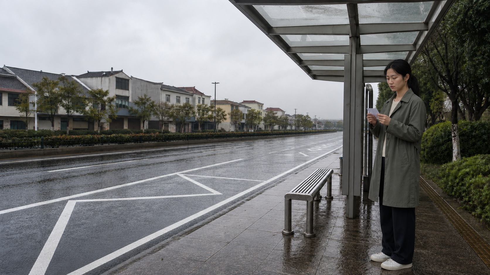

### 最终视频提示词（整段复制）

```text
[场景：暴雨中的河东站车道，原本来车的路口始终空着，浅水绕过站台边缘。角色：许禾（图中右侧的雨棚外），纸条边缘被雨打湿，衣料与鞋底受水影响自然。镜头：远中景，65mm镜头，大景深，固定机位，雨幕中保留人物清楚轮廓。动作：许禾把纸条抬近胸前，停下继续向前走的动作；无对白。]
```

<details><summary>首帧生成提示词</summary>

```text
Generated as an independent 16:9 live-action narrative-film first frame using the accepted character and scene continuity references; static state: 她手中的纸条被雨打湿边缘，脚边浅水流动。 Scene: 暴雨中的河东站车道 Framing: 远中景，65mm镜头，大景深，固定机位 Constraints: natural skin and fabric, sourceable light, credible contact, no CGI/beauty retouch/readable text/watermark.
```

</details>

## S29｜03:28—03:36｜8秒

- 场景：暴雨中的河东站雨棚
- 出镜：许禾（图中中央的雨棚下）
- 景别／镜头：近景，85mm镜头，浅景深，固定机位
- 首帧画面：许禾退回雨棚，雨水从她手腕滑到被攥住的纸条边缘。
- 运动提示：她把纸条更紧地握住，抬头等待空路。
- 对白／声音：无对白
- 声场／剪辑：
- 后期备注：不让纸条文字可读。

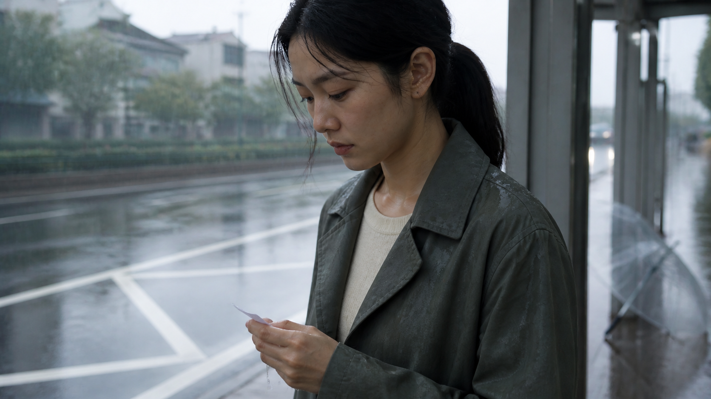

### 最终视频提示词（整段复制）

```text
[场景：暴雨中的河东站雨棚，前景雨滴虚化，透明伞在后景靠着立柱，冷光来自阴天街道。角色：许禾（图中中央的人），湿发和衣袖保持真实材质，纸条文字不可读。镜头：近景，85mm镜头，浅景深，固定机位，对焦在许禾低头后的眼神变化。动作：许禾把纸条更紧地握住，再抬头等待仍然空着的路；无对白。]
```

<details><summary>首帧生成提示词</summary>

```text
Generated as an independent 16:9 live-action narrative-film first frame using the accepted character and scene continuity references; static state: 她低头看纸条，透明伞在后景靠着立柱。 Scene: 暴雨中的河东站雨棚 Framing: 近景，85mm镜头，浅景深，固定机位 Constraints: natural skin and fabric, sourceable light, credible contact, no CGI/beauty retouch/readable text/watermark.
```

</details>

## S30｜03:36—03:43｜7秒

- 场景：暴雨日雨停后的河东站
- 出镜：许禾（图中右侧的雨棚下）
- 景别／镜头：大全景，35mm镜头，大景深，固定机位
- 首帧画面：暴雨在同一清晨终于停下，站台蓝灰色天光渐亮，许禾仍在原处。
- 运动提示：她看一眼手表位置后继续望向路口。
- 对白／声音：无对白
- 声场／剪辑：
- 后期备注：不显示可读时间；天气承接S29而非引入新的一天。

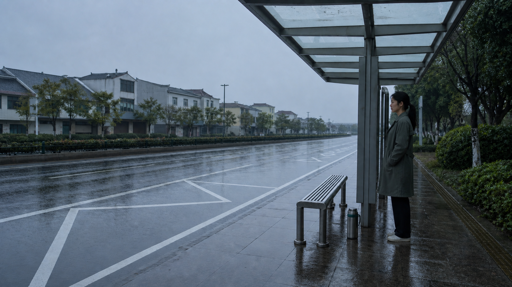

### 最终视频提示词（整段复制）

```text
[场景：暴雨日雨停后的河东站，蓝灰天光逐渐变亮，湿站台和空路口保持真实晨间环境，伞面只有残留水滴。角色：许禾（图中右侧的雨棚下），保温桶放在长椅旁，站姿疲惫但自然。镜头：大全景，35mm镜头，大景深，固定机位，保留空间留白。动作：许禾看一眼手表位置后继续望向路口；无对白。]
```

<details><summary>首帧生成提示词</summary>

```text
Generated as an independent 16:9 live-action narrative-film first frame using the accepted character and scene continuity references; static state: 她靠近立柱，保温桶仍在长椅旁，路口没有公交，伞面只有残留水滴。 Scene: 暴雨日雨停后的河东站 Framing: 大全景，35mm镜头，大景深，固定机位 Constraints: natural skin and fabric, sourceable light, credible contact, no CGI/beauty retouch/readable text/watermark.
```

</details>

## S31｜03:43—03:50｜7秒

- 场景：雨停后河东站的长椅
- 出镜：许禾（图中中央的长椅旁）
- 景别／镜头：中景，50mm镜头，中等景深，固定机位
- 首帧画面：许禾把保温桶提起，透明伞仍留在立柱旁。
- 运动提示：她整理桶盖，停下等待的姿势被路人打断。
- 对白／声音：无对白
- 声场／剪辑：
- 后期备注：为S32清洁工进入留出空间。

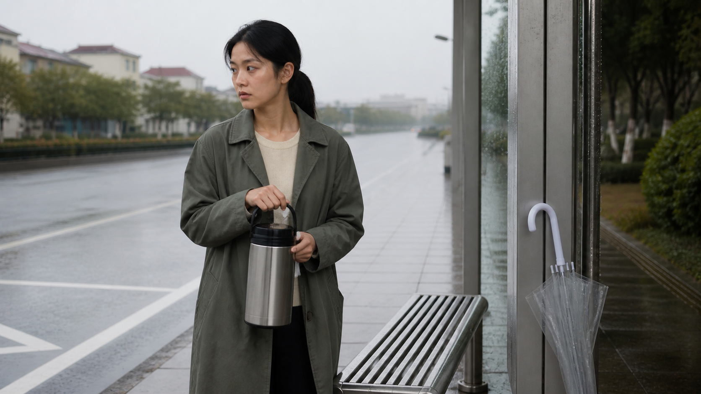

### 最终视频提示词（整段复制）

```text
[场景：雨停后渐亮的河东站，长椅和立柱被湿地面反光照亮，透明伞仍靠在立柱旁。角色：许禾（图中中央的长椅旁），一手提保温桶，一手压住纸条。镜头：中景，50mm镜头，中等景深，固定机位，对焦在她整理桶盖的手。动作：许禾整理桶盖后停下等待姿势，听见有人接近；无对白。]
```

<details><summary>首帧生成提示词</summary>

```text
Generated as an independent 16:9 live-action narrative-film first frame using the accepted character and scene continuity references; static state: 她已站到长椅旁，纸条被压在掌心。 Scene: 雨停后河东站的长椅 Framing: 中景，50mm镜头，中等景深，固定机位 Constraints: natural skin and fabric, sourceable light, credible contact, no CGI/beauty retouch/readable text/watermark.
```

</details>

## S32｜03:50—03:57｜7秒

- 场景：雨停后河东站雨棚
- 出镜：许禾（图中左侧的雨棚下）、清洁工（图中右侧的人行道）
- 景别／镜头：双人中景，40mm镜头，大景深，固定机位
- 首帧画面：清洁工推着清扫车经过，许禾转向对方询问。
- 运动提示：清洁工说明改道，许禾的肩膀慢慢放下。
- 对白／声音：清洁工：河东今天不通车，车都改道了。
- 声场／剪辑：
- 后期备注：清洁工为一次性功能角色，不进入角色设定。

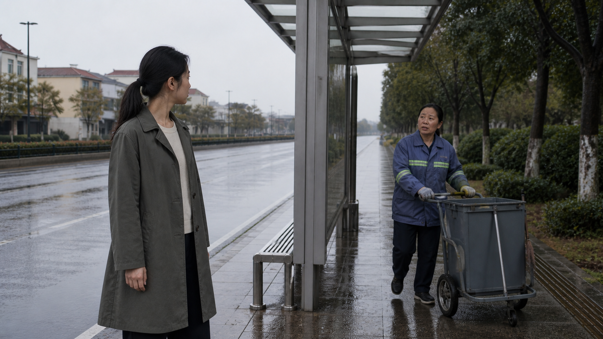

### 最终视频提示词（整段复制）

```text
[场景：雨停后河东站雨棚，湿人行道反射渐亮天光，清洁车停在棚边。角色：许禾（图中左侧的雨棚下）、清洁工（图中右侧的人行道），两人保持正常工作场景距离。镜头：双人中景，40mm镜头，大景深，固定机位，对焦覆盖两人和清扫车。动作：清洁工对许禾说“河东今天不通车，车都改道了”，许禾的肩膀慢慢放下。]
```

<details><summary>首帧生成提示词</summary>

```text
Generated as an independent 16:9 live-action narrative-film first frame using the accepted character and scene continuity references; static state: 两人隔着雨棚边缘停住，清扫车停在湿人行道上。 Scene: 雨停后河东站雨棚 Framing: 双人中景，40mm镜头，大景深，固定机位 Constraints: natural skin and fabric, sourceable light, credible contact, no CGI/beauty retouch/readable text/watermark.
```

</details>

## S33｜03:57—04:04｜7秒

- 场景：雨停后河东站立柱旁
- 出镜：许禾（图中中央的立柱旁）
- 景别／镜头：手部与近景，70mm镜头，浅景深，固定机位
- 首帧画面：许禾一手提保温桶，另一手已握住透明伞柄，折好的纸条压在掌心。
- 运动提示：许禾把伞柄扶正后松开手，选择让透明伞继续留在立柱旁。
- 对白／声音：无对白
- 声场／剪辑：
- 后期备注：号码不可读；此镜必须让“伸手取伞—停住—扶正—松开”的取舍清晰可见。

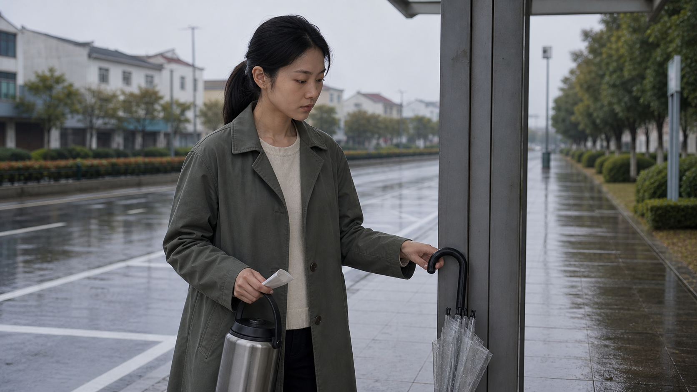

### 最终视频提示词（整段复制）

```text
[场景：雨停后的河东站立柱旁，天光从雨棚外侧照入，透明伞面只剩水滴，地面仍湿润。角色：许禾（图中中央的人），一手提保温桶，另一手握住透明伞柄，折好的纸条压在掌心。镜头：手部与近景，70mm镜头，浅景深，固定机位，对焦在伞柄、许禾松开的手和克制表情。动作：许禾把伞柄扶正后松开手，选择让透明伞继续留在立柱旁；无对白。]
```

<details><summary>首帧生成提示词</summary>

```text
Generated as an independent 16:9 live-action narrative-film first frame using the accepted character and scene continuity references; static state: 雨已停，伞面只剩水滴；她的手握着伞柄却没有提起，伞仍贴着立柱。 Scene: 雨停后河东站立柱旁 Framing: 手部与近景，70mm镜头，浅景深，固定机位 Constraints: natural skin and fabric, sourceable light, credible contact, no CGI/beauty retouch/readable text/watermark.
```

</details>

## S34｜04:04—04:11｜7秒

- 场景：雨停后河东站雨棚
- 出镜：许禾（图中背景右侧的离开背影）
- 景别／镜头：插入特写，85mm镜头，浅景深，固定机位
- 首帧画面：透明伞独自靠在湿立柱旁，许禾在背景把纸条收回口袋。
- 运动提示：许禾把纸条放进口袋，提着保温桶离开背景。
- 对白／声音：无对白
- 声场／剪辑：
- 后期备注：道具状态必须在S38一致；许禾不回头。

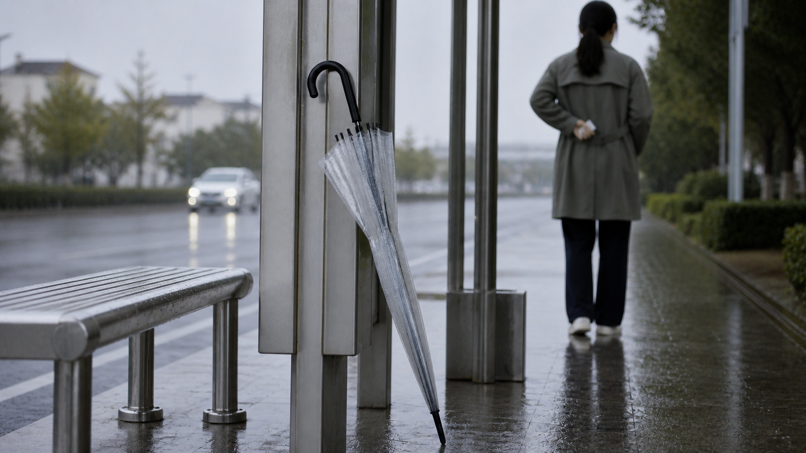

### 最终视频提示词（整段复制）

```text
[场景：雨停后河东站雨棚立柱旁，潮湿地面反射柔和天光，透明伞靠在立柱旁。角色：许禾（图中背景右侧的离开背影），手里还夹着不可读的纸条，提着保温桶。镜头：插入特写，85mm镜头，浅景深，固定机位，对焦在透明伞与背景中许禾收起纸条的动作。动作：许禾把纸条放进口袋，提着保温桶离开背景，透明伞留在原处；无对白。]
```

<details><summary>首帧生成提示词</summary>

```text
Generated as an independent 16:9 live-action narrative-film first frame using the accepted character and scene continuity references; static state: 伞柄接触地面，许禾背向站台，纸条仍在手指间。 Scene: 雨停后河东站雨棚 Framing: 插入特写，85mm镜头，浅景深，固定机位 Constraints: natural skin and fabric, sourceable light, credible contact, no CGI/beauty retouch/readable text/watermark.
```

</details>

## S35｜04:11—04:18｜7秒

- 场景：绕行中的公交驾驶位
- 出镜：沈川（图中中央的驾驶位）
- 景别／镜头：近景，65mm镜头，浅景深，固定机位
- 首帧画面：雨势已弱，沈川开在陌生岔路，车窗外天光变亮。
- 运动提示：一段报站声响起，他短暂看向河东方向。
- 对白／声音：无对白
- 声场／剪辑：
- 后期备注：报站内容不可辨认。

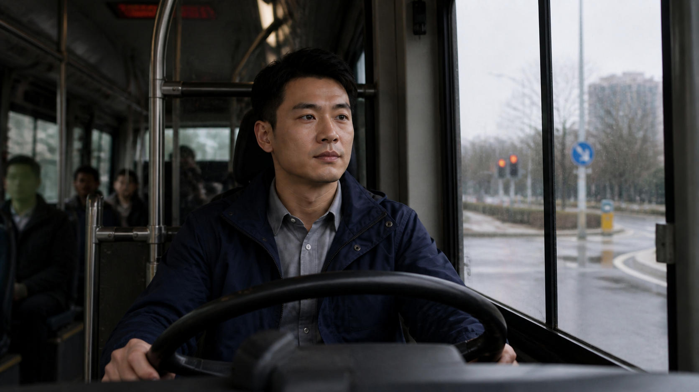

### 最终视频提示词（整段复制）

```text
[场景：雨势渐弱的改道路段，公交驾驶位外的天光变亮，车窗有残留水痕。角色：沈川（图中中央的驾驶位），正视前方，后视镜只映出后方道路。镜头：近景，65mm镜头，浅景深，固定机位，对焦在沈川听见报站后的眼神变化。动作：一段模糊报站声响起，沈川短暂看向河东方向后继续驾驶；无对白。]
```

<details><summary>首帧生成提示词</summary>

```text
Generated as an independent 16:9 live-action narrative-film first frame using the accepted character and scene continuity references; static state: 他正视前方，后视镜只映出后方道路。 Scene: 绕行中的公交驾驶位 Framing: 近景，65mm镜头，浅景深，固定机位 Constraints: natural skin and fabric, sourceable light, credible contact, no CGI/beauty retouch/readable text/watermark.
```

</details>

## S36｜04:18—04:26｜8秒

- 场景：数日后晴天的河东站
- 出镜：无出镜人物
- 景别／镜头：大全景，35mm镜头，大景深，固定机位
- 首帧画面：天晴后的河东站干燥明亮，雨棚下没有许禾，透明伞仍在立柱旁。
- 运动提示：一辆公交从画面边缘驶近。
- 对白／声音：无对白
- 声场／剪辑：
- 后期备注：与S01构图呼应但天气和缺席改变。

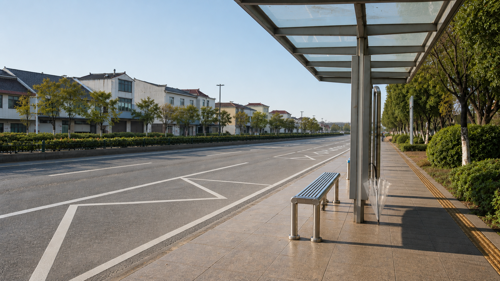

### 最终视频提示词（整段复制）

```text
[场景：数日后晴天的河东站，干燥路面被早晨自然阳光照亮，雨棚下空无一人，透明伞仍靠在立柱旁。角色：无出镜人物。镜头：大全景，35mm镜头，大景深，固定机位，与开场相近的真实站台构图。动作：一辆公交从画面边缘驶近，站台仍没有等车的人；无对白。]
```

<details><summary>首帧生成提示词</summary>

```text
Generated as an independent 16:9 live-action narrative-film first frame using the accepted character and scene continuity references; static state: 站台空着，透明伞位置未变。 Scene: 数日后晴天的河东站 Framing: 大全景，35mm镜头，大景深，固定机位 Constraints: natural skin and fabric, sourceable light, credible contact, no CGI/beauty retouch/readable text/watermark.
```

</details>

## S37｜04:26—04:35｜9秒

- 场景：晴天的公交驾驶位与河东站
- 出镜：沈川（图中左侧的驾驶位）
- 景别／镜头：过肩中景，45mm镜头，中等景深，固定机位
- 首帧画面：公交缓慢经过河东站，沈川透过挡风玻璃看见空雨棚与透明伞。
- 运动提示：他放慢车速向站台看一眼，却没有打开车门。
- 对白／声音：无对白
- 声场／剪辑：
- 后期备注：保持职责与原作“仍经过”。

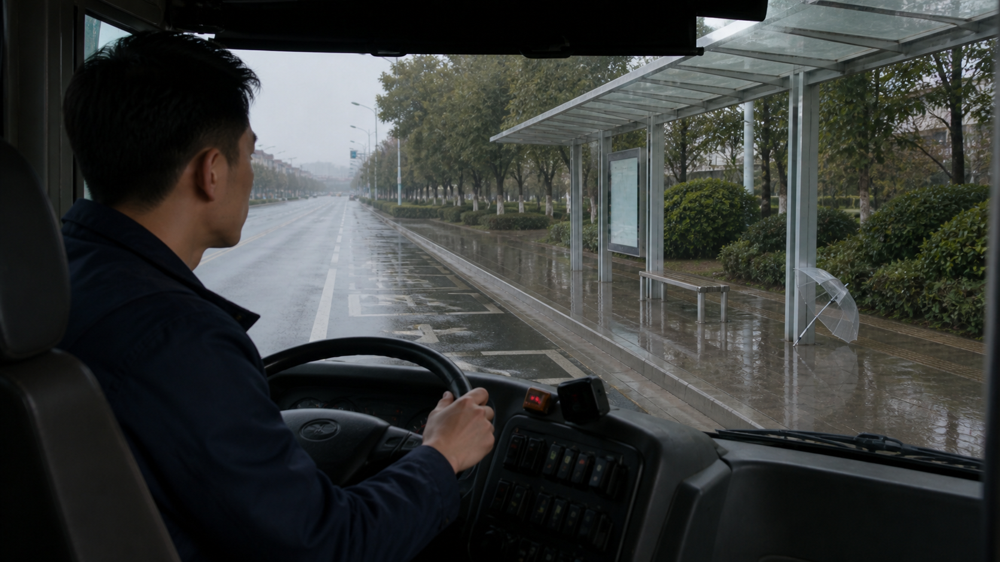

### 最终视频提示词（整段复制）

```text
[场景：晴天经过河东站的公交驾驶位，挡风玻璃外是空雨棚与靠在立柱旁的透明伞，阳光有明确方向。角色：沈川（图中左侧的驾驶位），双手仍在方向盘上，面部保留自然的停顿。镜头：过肩中景，45mm镜头，中等景深，固定机位，对焦从沈川前景延伸到站台。动作：沈川放慢车速向站台看一眼，却没有打开车门；无对白。]
```

<details><summary>首帧生成提示词</summary>

```text
Generated as an independent 16:9 live-action narrative-film first frame using the accepted character and scene continuity references; static state: 车未完全到站，沈川的手仍在方向盘上。 Scene: 晴天的公交驾驶位与河东站 Framing: 过肩中景，45mm镜头，中等景深，固定机位 Constraints: natural skin and fabric, sourceable light, credible contact, no CGI/beauty retouch/readable text/watermark.
```

</details>

## S38｜04:35—04:43｜8秒

- 场景：晴天的河东站立柱
- 出镜：无出镜人物
- 景别／镜头：插入特写，100mm镜头，浅景深，固定机位
- 首帧画面：透明伞靠着干燥立柱，伞面已无水滴，远处公交车窗掠过。
- 运动提示：公交的倒影从伞面旁滑过。
- 对白／声音：无对白
- 声场／剪辑：
- 后期备注：不新增遗失物。

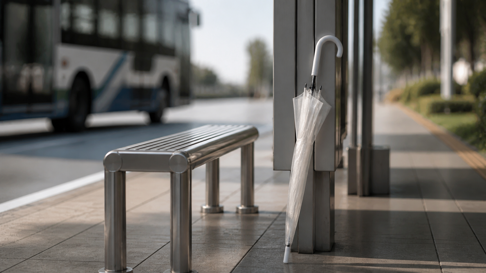

### 最终视频提示词（整段复制）

```text
[场景：晴天的河东站立柱旁，透明伞靠在干燥地面上，阳光从侧面照出真实伞面反射，远处车窗掠过。角色：无出镜人物。镜头：插入特写，100mm镜头，浅景深，固定机位，对焦在伞柄接触地面的细节。动作：公交的倒影从透明伞面旁滑过，伞始终无人认领；无对白。]
```

<details><summary>首帧生成提示词</summary>

```text
Generated as an independent 16:9 live-action narrative-film first frame using the accepted character and scene continuity references; static state: 伞柄稳贴地面，雨棚下没有人。 Scene: 晴天的河东站立柱 Framing: 插入特写，100mm镜头，浅景深，固定机位 Constraints: natural skin and fabric, sourceable light, credible contact, no CGI/beauty retouch/readable text/watermark.
```

</details>

## S39｜04:43—04:52｜9秒

- 场景：晴天的公交车厢前门
- 出镜：无出镜人物
- 景别／镜头：中近景，55mm镜头，中等景深，固定机位
- 首帧画面：前门旁的空座被晴天侧光照亮，车窗外站台后退。
- 运动提示：光线在座位靠背上缓慢移动，车站从窗外退出。
- 对白／声音：无对白
- 声场／剪辑：
- 后期备注：回收S09的空座。

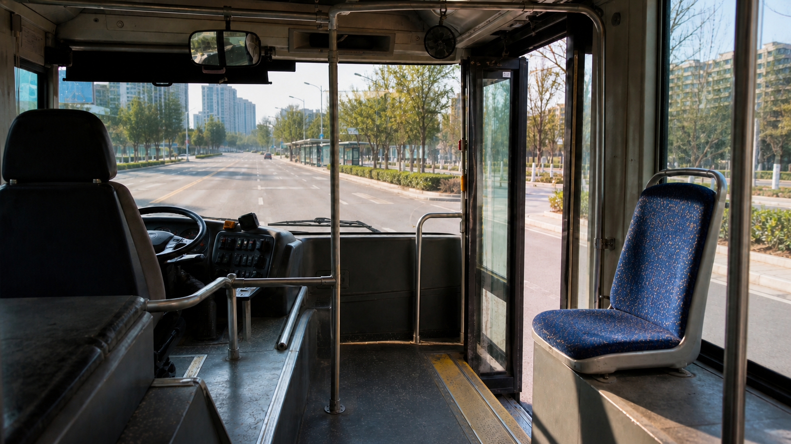

### 最终视频提示词（整段复制）

```text
[场景：晴天行驶中的公交车厢前门，靠门空座被侧窗自然光照亮，车窗外河东站缓慢后退。角色：无出镜人物。镜头：中近景，55mm镜头，中等景深，固定机位，对焦在空座与车窗反射，车内材质真实不过度锐利。动作：光线在座位靠背上缓慢移动，站台从窗外退出；无对白。]
```

<details><summary>首帧生成提示词</summary>

```text
Generated as an independent 16:9 live-action narrative-film first frame using the accepted character and scene continuity references; static state: 座位无人，车内扶手与车窗反射稳定。 Scene: 晴天的公交车厢前门 Framing: 中近景，55mm镜头，中等景深，固定机位 Constraints: natural skin and fabric, sourceable light, credible contact, no CGI/beauty retouch/readable text/watermark.
```

</details>

## S40｜04:52—05:00｜8秒

- 场景：驶离河东站的公交驾驶位
- 出镜：沈川（图中中央的驾驶位）
- 景别／镜头：近景，85mm镜头，浅景深，固定机位
- 首帧画面：沈川平静地向前开车，河东站的阳光从侧窗掠过他的脸。
- 运动提示：公交驶离画面，沈川没有回头。
- 对白／声音：无对白
- 声场／剪辑：
- 后期备注：结尾停在未被补写的遗憾。

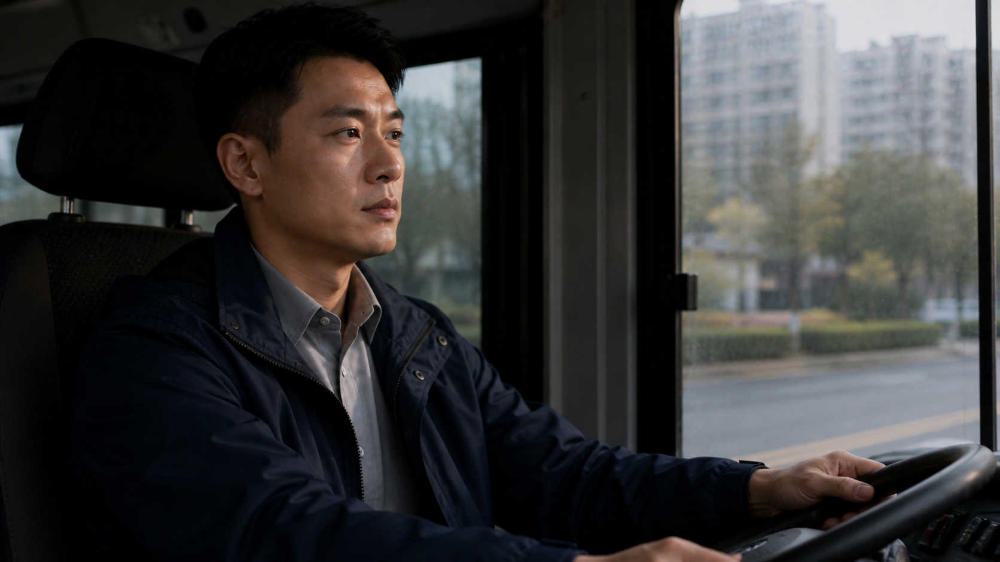

### 最终视频提示词（整段复制）

```text
[场景：晴天驶离河东站的公交驾驶位，侧窗阳光短暂掠过沈川的脸，车内外明暗有自然过渡。角色：沈川（图中中央的驾驶位），双手稳在方向盘上，表情克制且不看摄影机。镜头：近景，85mm镜头，浅景深，固定机位，对焦在沈川向前的眼神，保留真人现场摄影的自然层次。动作：公交驶离画面，沈川没有回头；无对白。]
```

<details><summary>首帧生成提示词</summary>

```text
Generated as an independent 16:9 live-action narrative-film first frame using the accepted character and scene continuity references; static state: 他的视线回到前方，双手稳在方向盘上。 Scene: 驶离河东站的公交驾驶位 Framing: 近景，85mm镜头，浅景深，固定机位 Constraints: natural skin and fabric, sourceable light, credible contact, no CGI/beauty retouch/readable text/watermark.
```

</details>
