# 《晚点的心事》AI视频分镜书

> 总时长：05:00  
> 分镜数量：40  
> 常规单镜：5—10秒  
> 画幅／首帧：16:9／1672x941

## 全片统一约束

- Only M405 source story informed this creative work.
- No visual assets, character sheets, scene anchors, samples, or frames exist at this stage.
- All video prompts remain one-line four-field Chinese prompts.
- Avoid relying on readable generated station screens or labels; exact train number is a later post-production note.
- 韩哲的关门余量必须在安全调度程序内，不表现违规操作。

## 角色设定

### 韩哲

31岁夜车调度员，短黑发向右侧分，深海军蓝冬季调度制服。

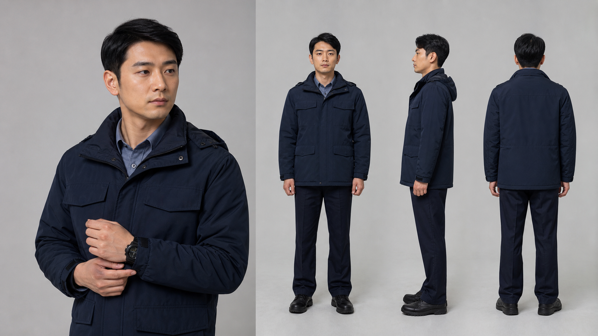

### 沈梨

29岁夜车乘务员，低束黑发、墨蓝围巾、深灰蓝乘务制服。

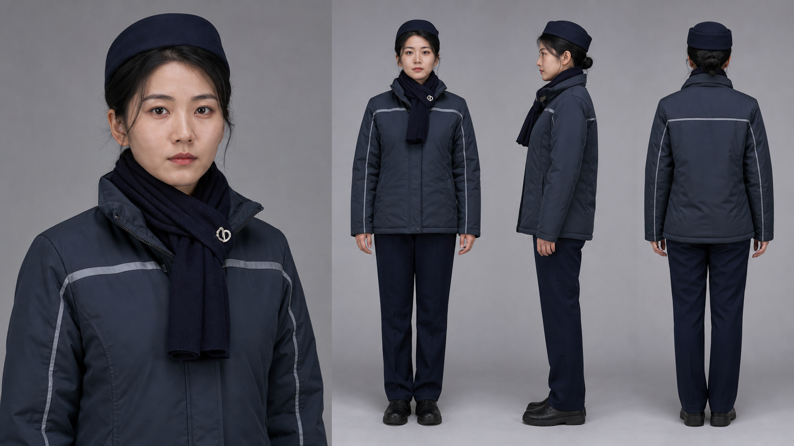

# 逐镜头分镜

## S01｜00:00—00:08｜8秒

- 场景：暴雪将至的地面通勤铁路车站入口，夜班末段
- 出镜：无出镜人物
- 景别／镜头：远景，35mm镜头，大景深，固定机位
- 首帧画面：地面车站入口外已有零星雪粒，暖色站房灯光在湿地面上反光
- 运动提示：风把雪粒斜着吹过入口，露天站台方向传来远处列车低鸣
- 对白／声音：无对白
- 声场／剪辑：
- 后期备注：不生成可读站名；入口与站台为分离机位

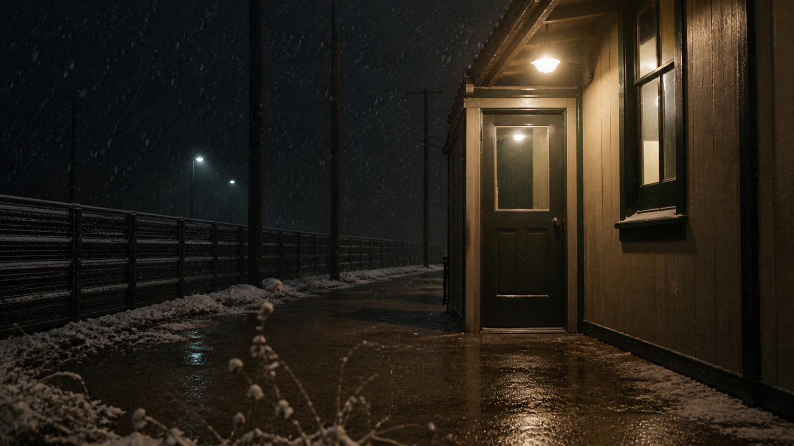

### 最终视频提示词（整段复制）

```text
[场景：暴雪将至的地面通勤铁路车站入口，夜班末段，暖色站房灯光照在潮湿地面上，零星雪粒从玻璃前掠过。角色：无出镜人物。镜头：远景，35mm镜头，大景深，固定机位，真实夜间实拍曝光与自然反光。动作：风把雪粒斜着吹过入口，露天站台方向传来夜车低鸣，无对白。]
```

## S02｜00:08—00:15｜7秒

- 场景：夜班调度室，交接刚结束
- 出镜：韩哲
- 景别／镜头：中景，50mm镜头，中等景深，机位略低于眼平
- 首帧画面：韩哲独自站在有值班灯的调度台前，摘下耳机，隔着玻璃望向站台
- 运动提示：他把耳机放回台面，视线停在沈梨负责的车门方向
- 对白／声音：无对白
- 声场／剪辑：
- 后期备注：控制台屏幕只作散焦光源

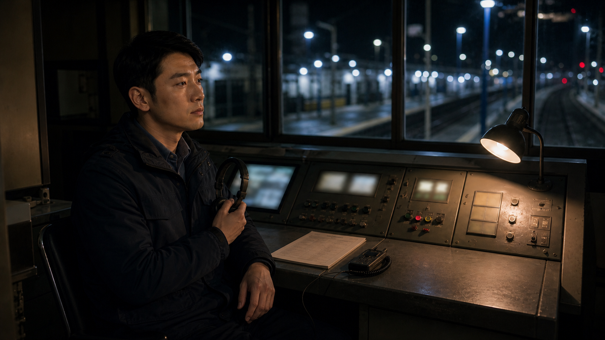

### 最终视频提示词（整段复制）

```text
[场景：夜班调度室，值班灯照亮磨旧的控制台，玻璃外站台被浅景深虚化。角色：韩哲（图中中央的人），摘下耳机后的自然疲惫神情，深色工作制服。镜头：中景，50mm镜头，中等景深，略低机位，真实室内混合光与自然肤质。动作：韩哲把耳机轻放在台面，视线停向沈梨负责的车门方向，无对白。]
```

## S03｜00:15—00:22｜7秒

- 场景：夜车停靠的站台车门边
- 出镜：韩哲（只露手部）
- 景别／镜头：插入特写，85mm镜头，浅景深，固定机位
- 首帧画面：戴工作表的手把两颗未拆封薄荷糖放在干净的车门门槛旁
- 运动提示：韩哲的手松开糖盒后停半秒，再收回画外
- 对白／声音：无对白
- 声场／剪辑：
- 后期备注：包装不出现可读品牌文字

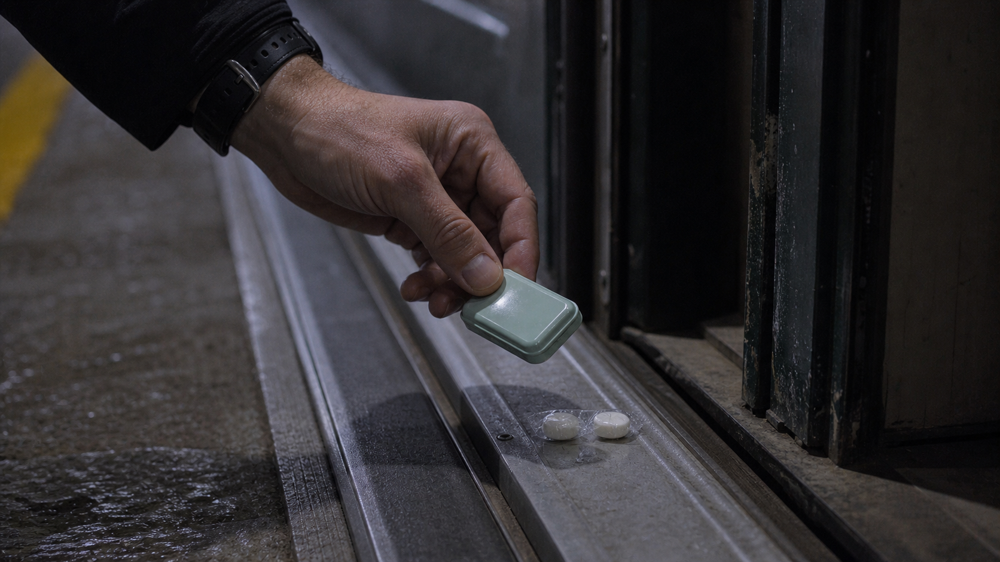

### 最终视频提示词（整段复制）

```text
[场景：夜车停靠的站台车门边，冷白站台灯落在金属门槛和未拆封薄荷糖上。角色：韩哲（图中前景只露出戴工作表的手）。镜头：插入特写，85mm镜头，浅景深，固定机位，真实金属划痕与手部皮肤纹理。动作：韩哲把两颗薄荷糖放在车门旁，手指短暂停住后收回，无对白。]
```

## S04｜00:22—00:30｜8秒

- 场景：夜车车门内侧，交接后的安静站台
- 出镜：沈梨
- 景别／镜头：近景，65mm镜头，浅景深，稳定手持
- 首帧画面：沈梨下车检查时发现薄荷糖，站在门边抬眼望向控制室玻璃
- 运动提示：她拿起糖盒，嘴角有一瞬很轻的笑意，然后抬头
- 对白／声音：沈梨隔着玻璃说“又是薄荷？”
- 声场／剪辑：
- 后期备注：对白可用后期收音

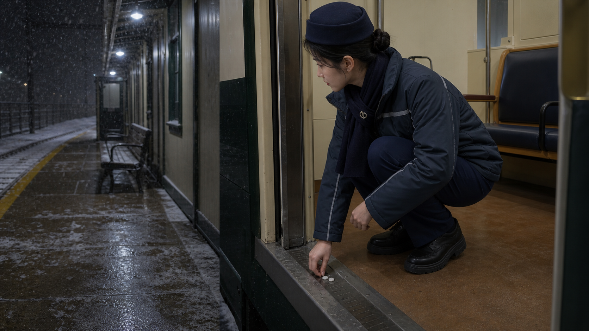

### 最终视频提示词（整段复制）

```text
[场景：夜车车门内侧，冷白站台灯从门外照入，门槛边放着两颗薄荷糖。角色：沈梨（图中右侧的人），夜车乘务制服，短发被帽檐压住，表情克制而熟悉。镜头：近景，65mm镜头，浅景深，稳定手持，真实衣料褶皱和自然肤质。动作：沈梨拿起薄荷糖，隔着玻璃朝控制室抬眼说“又是薄荷？”。]
```

## S05｜00:30—00:37｜7秒

- 场景：调度室玻璃前，站台与控制室相望
- 出镜：韩哲
- 景别／镜头：近景，75mm镜头，浅景深，过玻璃取景
- 首帧画面：韩哲在玻璃内侧看见沈梨举起糖盒，控制台指示灯在他脸侧留下微弱反光
- 运动提示：他没有走近，只抬起两根手指做出很小的回应
- 对白／声音：无对白
- 声场／剪辑：
- 后期备注：避免玻璃反射出现重复人物

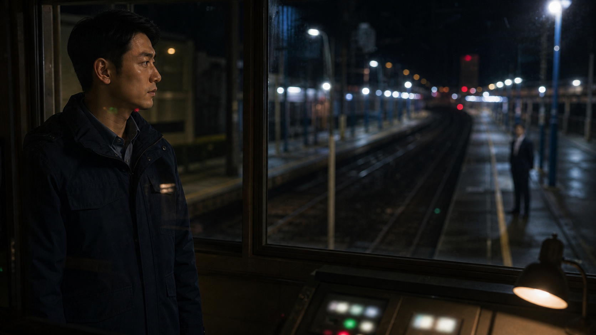

### 最终视频提示词（整段复制）

```text
[场景：调度室玻璃前，控制台的微弱指示光映在韩哲脸侧，站台上的沈梨是玻璃外的虚化身影。角色：韩哲（图中左侧的人），深色工作制服，目光望向右侧玻璃外的沈梨。镜头：近景，75mm镜头，浅景深，隔玻璃取景，真实反射与低照度成像。动作：韩哲只抬起两根手指作出很小的回应，无对白。]
```

## S06｜00:37—00:45｜8秒

- 场景：夜车车门旁的站台
- 出镜：沈梨
- 景别／镜头：中近景，50mm镜头，中等景深，固定机位
- 首帧画面：沈梨把薄荷糖放进制服口袋，背后车厢灯光平静
- 运动提示：她朝玻璃方向点头，说完后继续例行检查
- 对白／声音：沈梨说“夜班提神？”
- 声场／剪辑：
- 后期备注：动作结束后切到工作状态

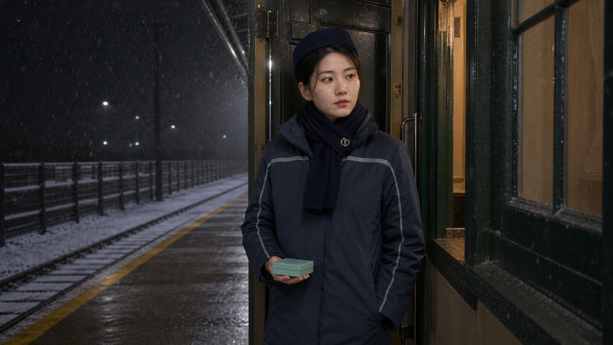

### 最终视频提示词（整段复制）

```text
[场景：夜车车门旁的站台，车厢暖光与站台冷光交接，地面留有潮湿鞋印。角色：沈梨（图中中央的人），夜车乘务制服，薄荷糖在右手掌心。镜头：中近景，50mm镜头，中等景深，固定机位，真实冷暖混合光和自然站姿。动作：沈梨把薄荷糖放进口袋，朝控制室点头说“夜班提神？”，随后转回例行检查。]
```

## S07｜00:45—00:52｜7秒

- 场景：调度室内，平稳运行的夜班
- 出镜：韩哲
- 景别／镜头：中景，40mm镜头，大景深，固定机位
- 首帧画面：韩哲坐回调度台，前景是规整的纸质班表与对讲机，玻璃外沈梨继续走向车厢
- 运动提示：他按下通话键，用正常工作语气完成确认
- 对白／声音：韩哲说“末班检查完毕，按流程待命。”
- 声场／剪辑：
- 后期备注：不展示可读屏幕数据

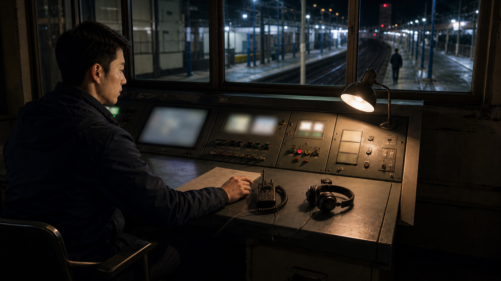

### 最终视频提示词（整段复制）

```text
[场景：调度室内，规整班表和对讲机摆在台前，玻璃外的沈梨正走向车厢。角色：韩哲（图中中央的人），深色工作制服，坐姿端正。镜头：中景，40mm镜头，大景深，固定机位，真实低照度室内摄影与控制台反光。动作：韩哲按下通话键，以正常工作语气说“末班检查完毕，按流程待命。”。]
```

## S08｜00:52—01:00｜8秒

- 场景：调度室控制台下方，夜班末段
- 出镜：韩哲（只露手部）
- 景别／镜头：插入特写，90mm镜头，浅景深，固定机位
- 首帧画面：韩哲从外套内袋摸出一个素净戒指盒，盒盖没有打开
- 运动提示：他用拇指摩挲盒角，听见报警提示后立刻把它放回口袋
- 对白／声音：无对白
- 声场／剪辑：
- 后期备注：戒指不露出品牌或刻字

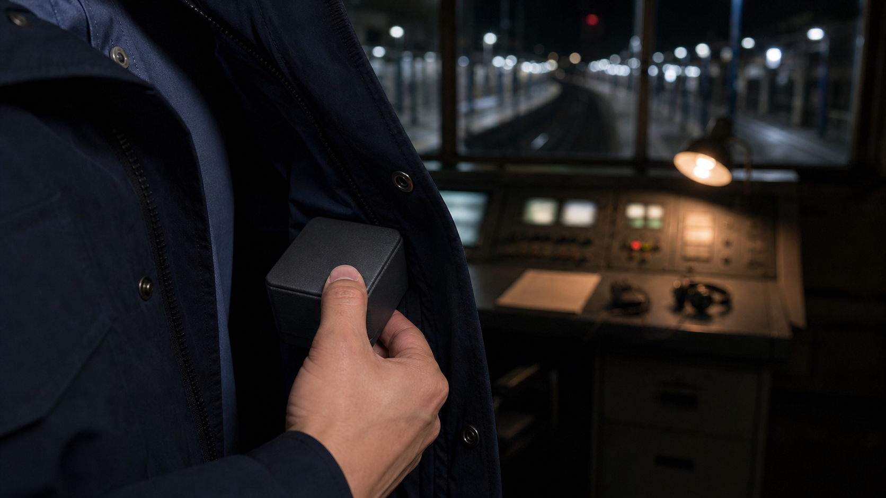

### 最终视频提示词（整段复制）

```text
[场景：调度室控制台下方，设备指示光在韩哲外套内袋边缘轻微反射。角色：韩哲（图中前景只露出手部和制服下摆），手中是未打开的素净戒指盒。镜头：插入特写，90mm镜头，浅景深，固定机位，真实手部细节与布料受力。动作：韩哲用拇指摩挲戒指盒一角，听见提示音后立刻把它收回口袋，无对白。]
```

## S09｜01:00—01:08｜8秒

- 场景：地面通勤铁路车站的露天站台端部，暴雪突然加重
- 出镜：无出镜人物
- 景别／镜头：远景，28mm镜头，大景深，固定机位
- 首帧画面：密集雪线扫过露天站台端部，金属栏杆和地面脚印迅速积雪
- 运动提示：风势增强，雪从轨道侧横向掠过站台
- 对白／声音：无对白
- 声场／剪辑：
- 后期备注：用环境转场，明确为露天站台

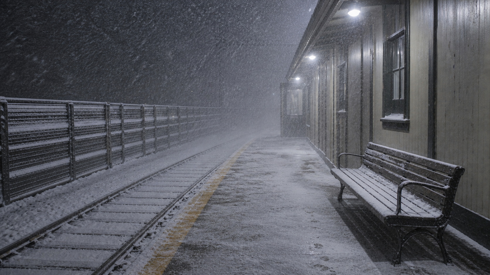

### 最终视频提示词（整段复制）

```text
[场景：地面通勤铁路车站的露天站台端部，暴雪忽然加重，雪落在金属栏杆和潮湿地面上。角色：无出镜人物。镜头：远景，28mm镜头，大景深，固定机位，真实雪夜曝光与风雪遮挡。动作：风势增强，雪从轨道侧横向掠过站台，地面的脚印逐渐被覆盖，无对白。]
```

## S10｜01:08—01:15｜7秒

- 场景：调度室，暴雪导致夜车待命
- 出镜：韩哲
- 景别／镜头：中近景，50mm镜头，中等景深，轻微推近
- 首帧画面：韩哲戴回耳机，面前模糊的线路灯由稳定转为等待状态
- 运动提示：他抬头听取汇报，迅速在纸质班表上标记新的等待段
- 对白／声音：无对白
- 声场／剪辑：
- 后期备注：屏幕全部失焦不可读

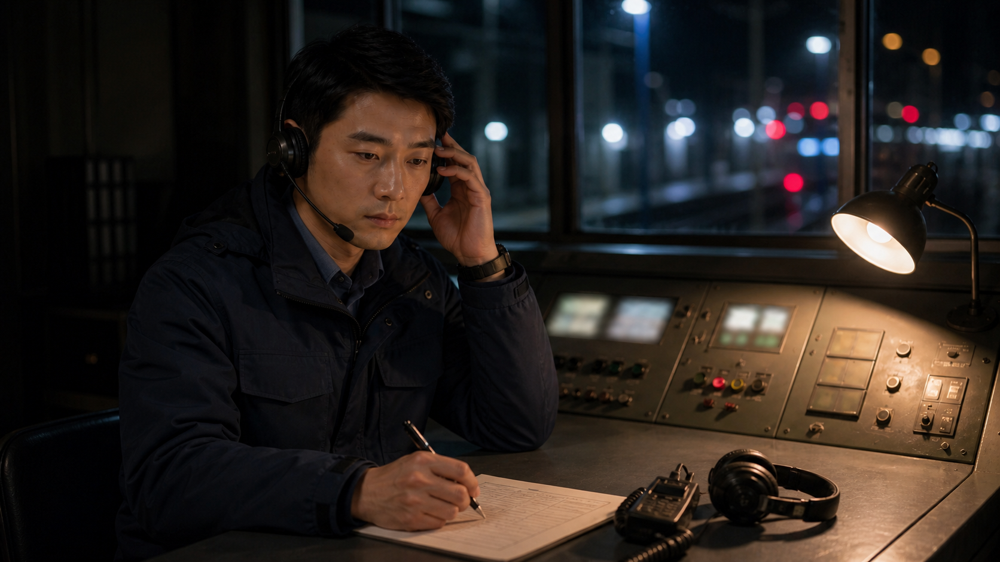

### 最终视频提示词（整段复制）

```text
[场景：调度室，暴雪使夜车进入等待，失焦的线路指示光映在韩哲前方。角色：韩哲（图中中央的人），重新戴上耳机，深色工作制服。镜头：中近景，50mm镜头，中等景深，轻微推近，真实控制室低光成像。动作：韩哲听取对讲机汇报，在纸质班表上标记等待段，无对白。]
```

## S11｜01:15—01:22｜7秒

- 场景：空下来的露天夜车站台，雪从轨道侧斜扫
- 出镜：沈梨
- 景别／镜头：全景，35mm镜头，大景深，固定机位
- 首帧画面：沈梨独自站在安全线内，车厢已暂离，她望着空轨道等重新进站通知
- 运动提示：她把衣领压紧，转向轨道侧的风雪方向
- 对白／声音：无对白
- 声场／剪辑：
- 后期备注：明确站在安全线内

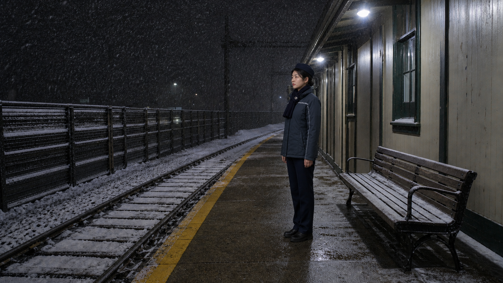

### 最终视频提示词（整段复制）

```text
[场景：空下来的露天夜车站台，雪从轨道侧斜扫，沈梨站在黄色安全线内侧，轨道暂时空着。角色：沈梨（图中右侧的人），夜车乘务制服，衣领被风吹起。镜头：全景，35mm镜头，大景深，固定机位，真实站台尺度与冷白光。动作：沈梨把衣领压紧，转向轨道侧的风雪方向等待通知，无对白。]
```

## S12｜01:22—01:30｜8秒

- 场景：调度室门口，工作电话刚结束
- 出镜：韩哲
- 景别／镜头：近景，65mm镜头，浅景深，固定机位
- 首帧画面：韩哲挂断电话后停在门口，口袋里的戒指盒在外套轮廓下微微凸起
- 运动提示：他看向站台，再看一眼正在响的对讲机，迟疑后拿起保温杯
- 对白／声音：无对白
- 声场／剪辑：
- 后期备注：只表现职责与私人意图的拉扯

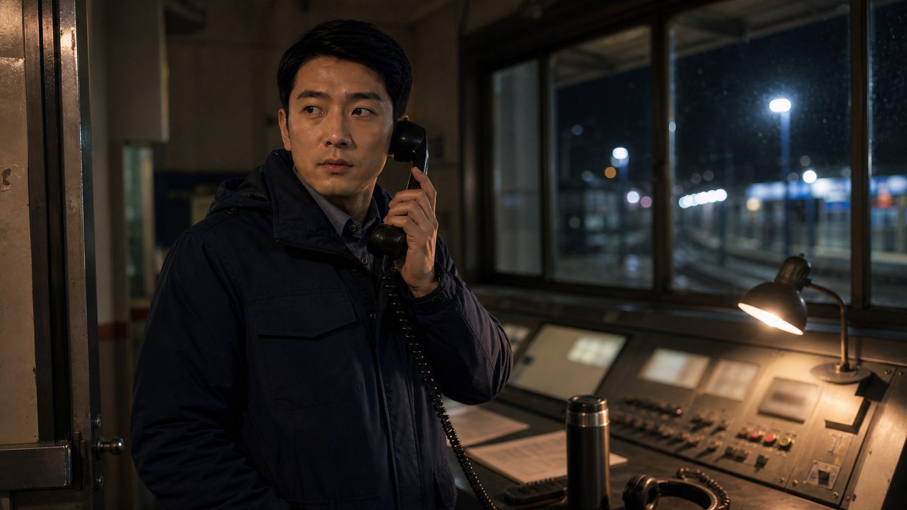

### 最终视频提示词（整段复制）

```text
[场景：调度室门口，电话刚挂断，对讲机仍在低声呼叫，桌边放着保温杯。角色：韩哲（图中左侧的人），外套口袋有戒指盒的轻微轮廓，神情克制。镜头：近景，65mm镜头，浅景深，固定机位，真实室内侧光和自然停顿。动作：韩哲望向站台又看向对讲机，迟疑后拿起保温杯，无对白。]
```

## S13｜01:30—01:37｜7秒

- 场景：从调度室通向站台的走廊
- 出镜：韩哲
- 景别／镜头：跟拍中景，40mm镜头，中等景深，缓慢后移
- 首帧画面：韩哲提着保温杯走过空走廊，墙面灯光一盏盏掠过他的肩
- 运动提示：他放慢脚步，把准备说的话压回呼吸里
- 对白／声音：无对白
- 声场／剪辑：
- 后期备注：不用内心旁白

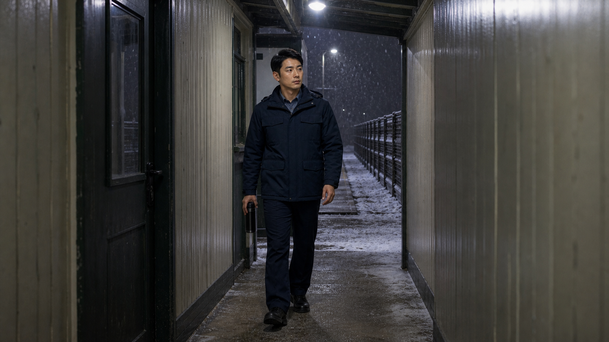

### 最终视频提示词（整段复制）

```text
[场景：从调度室通向站台的空走廊，顶部灯光在旧墙面上形成连续明暗。角色：韩哲（图中中央的人），提着保温杯，深色工作制服。镜头：跟拍中景，40mm镜头，中等景深，缓慢后移，真实走廊透视和脚步节奏。动作：韩哲放慢脚步，压住想开口的呼吸继续走向站台，无对白。]
```

## S14｜01:37—01:45｜8秒

- 场景：站房通向露天站台的半封闭员工通道
- 出镜：韩哲、沈梨
- 景别／镜头：双人中景，45mm镜头，大景深，固定机位
- 首帧画面：韩哲停在员工通道出口，沈梨在数米外的安全线内，二人之间留有一段露天站台
- 运动提示：沈梨先看见他，抬手示意他不用急着过来
- 对白／声音：沈梨说“车还要等一会儿。”
- 声场／剪辑：
- 后期备注：保持两人距离与轴线；通道与公共出口不同

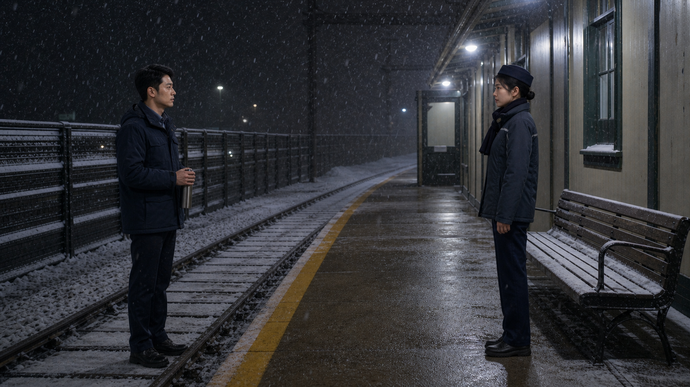

### 最终视频提示词（整段复制）

```text
[场景：站房通向露天站台的半封闭员工通道，韩哲与沈梨之间隔着数米站台，沈梨站在安全线内。角色：韩哲（图中左侧的人，提着保温杯）、沈梨（图中右侧的人，夜车乘务制服）。镜头：双人中景，45mm镜头，大景深，固定机位，真实站台空间与有来源冷光。动作：沈梨先看见韩哲，抬手示意他说“车还要等一会儿。”。]
```

## S15｜01:45—01:52｜7秒

- 场景：站台候车区长椅旁
- 出镜：韩哲、沈梨
- 景别／镜头：双人中景，50mm镜头，中等景深，固定机位
- 首帧画面：韩哲把保温杯放到长椅一端，沈梨没有坐下，只把手靠近杯口取暖
- 运动提示：韩哲把杯盖拧松后退半步，给她留出空间
- 对白／声音：韩哲说“那我陪你等通知。”
- 声场／剪辑：
- 后期备注：不制造亲密肢体接触

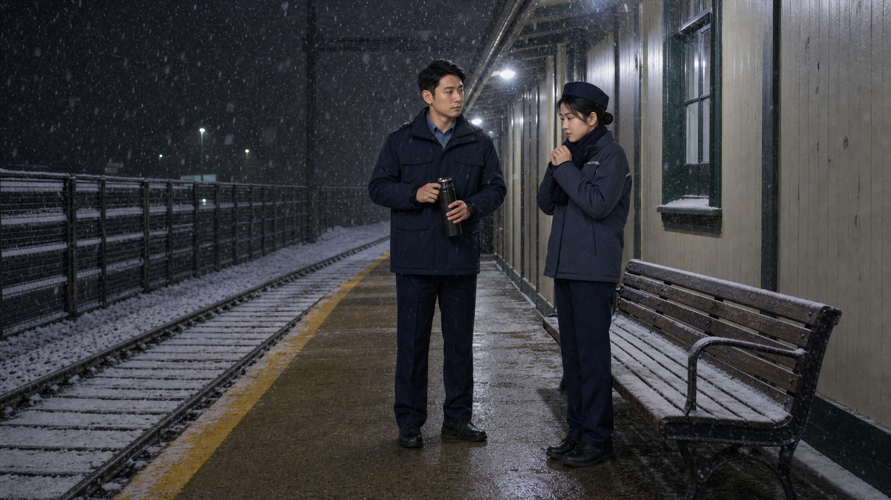

### 最终视频提示词（整段复制）

```text
[场景：站台候车区长椅旁，冷风从通道吹来，保温杯冒出很淡的热气。角色：韩哲（图中左侧的人）、沈梨（图中右侧的人，双手靠近杯口取暖）。镜头：双人中景，50mm镜头，中等景深，固定机位，真实衣料受风和自然人物距离。动作：韩哲把杯盖拧松后退半步，对沈梨说“那我陪你等通知。”。]
```

## S16｜01:52—02:00｜8秒

- 场景：站台候车区，暴雪延误的间隙
- 出镜：韩哲、沈梨
- 景别／镜头：过肩中近景，60mm镜头，浅景深，固定机位
- 首帧画面：从韩哲肩后看沈梨望着空轨道，薄荷糖盒从她口袋露出一角
- 运动提示：沈梨望向轨道，平静地说出自己愿意继续等车
- 对白／声音：沈梨说“那我就在这儿等它。”
- 声场／剪辑：
- 后期备注：为婚讯前的平静停顿

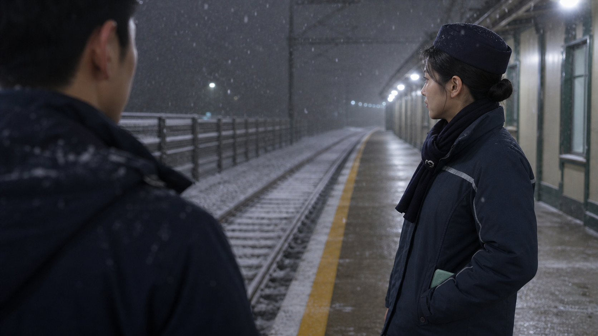

### 最终视频提示词（整段复制）

```text
[场景：站台候车区，暴雪延误的间隙，空轨道在沈梨视线尽头，薄荷糖盒从她制服口袋露出一角。角色：韩哲（图中左前景只露出肩部）、沈梨（图中右侧的人，侧脸望向轨道）。镜头：过肩中近景，60mm镜头，浅景深，固定机位，真实低温环境下的自然肤色。动作：沈梨望着空轨道，平静地说“那我就在这儿等它。”。]
```

## S17｜02:00—02:08｜8秒

- 场景：站台候车区，风雪声短暂停下
- 出镜：韩哲、沈梨
- 景别／镜头：双人近景，55mm镜头，浅景深，固定机位
- 首帧画面：两人隔着保温杯站着，韩哲的手在外套口袋边停住，沈梨转过身面对他
- 运动提示：沈梨像想到一件要交代的事，先深吸一口气
- 对白／声音：无对白
- 声场／剪辑：
- 后期备注：给信息转折留出呼吸

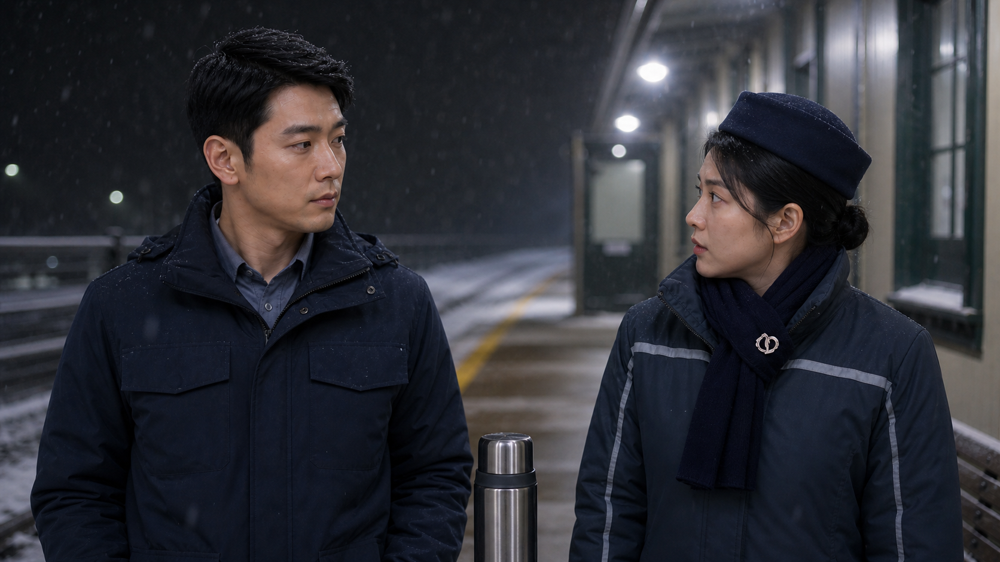

### 最终视频提示词（整段复制）

```text
[场景：站台候车区，冷白灯下的保温杯放在两人之间，风雪声暂时减弱。角色：韩哲（图中左侧的人，手停在外套口袋边）、沈梨（图中右侧的人，刚转身面对他）。镜头：双人近景，55mm镜头，浅景深，固定机位，真实人物呼吸和自然站姿。动作：沈梨像想到一件需要交代的事，先深吸一口气，无对白。]
```

## S18｜02:08—02:15｜7秒

- 场景：露天站台候车区，站房出口位于画外另一端
- 出镜：沈梨
- 景别／镜头：近景，75mm镜头，浅景深，固定机位
- 首帧画面：沈梨在说话前下意识整理无名指上的细戒，背景只有失焦的站台灯和空轨道
- 运动提示：她抬眼看向韩哲，语气平常地开口
- 对白／声音：无对白
- 声场／剪辑：
- 后期备注：戒指可见但不强调品牌；出口不在此镜画面内

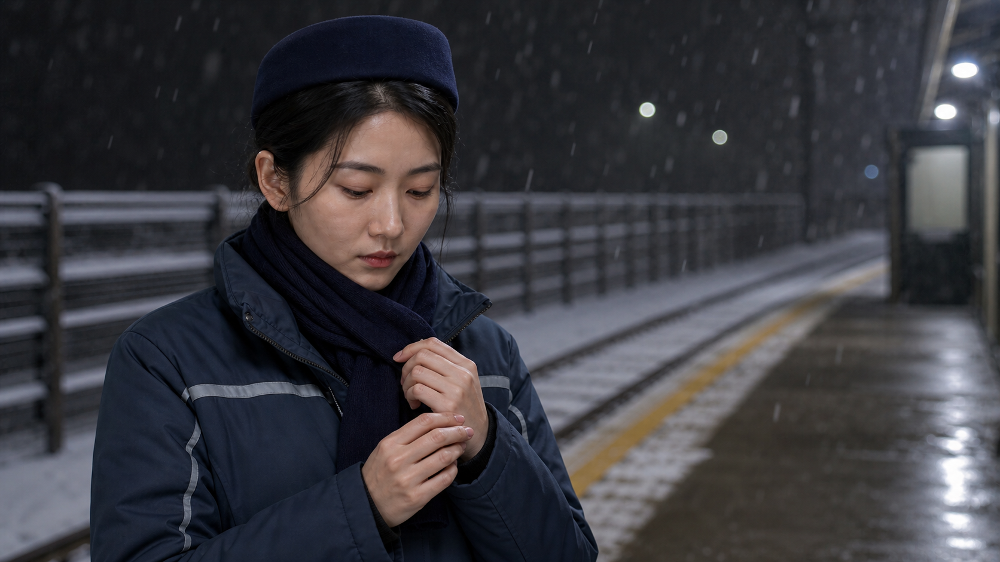

### 最终视频提示词（整段复制）

```text
[场景：露天站台候车区，站房出口位于画外另一端，冷白灯照着沈梨的手和身后的空轨道。角色：沈梨（图中中央的人），指尖停在无名指的细戒上，夜车乘务制服。镜头：近景，75mm镜头，浅景深，固定机位，真实手部细节与低照度对焦。动作：沈梨整理无名指细戒后抬眼看向韩哲，准备开口，无对白。]
```

## S19｜02:15—02:22｜7秒

- 场景：站台候车区，暴雪夜
- 出镜：沈梨、韩哲
- 景别／镜头：过肩近景，65mm镜头，浅景深，固定机位
- 首帧画面：从韩哲肩后看沈梨，她的目光稳定，保温杯在画面下方
- 运动提示：沈梨轻声告诉他下个月要结婚
- 对白／声音：沈梨对韩哲说“下个月我结婚。”
- 声场／剪辑：
- 后期备注：韩哲反应留到下一镜

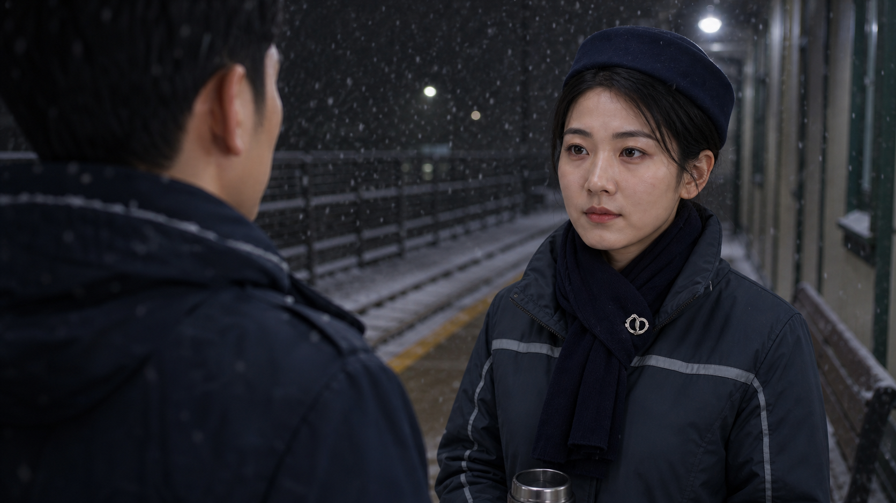

### 最终视频提示词（整段复制）

```text
[场景：暴雪夜的露天站台候车区，保温杯在画面下方，背景只有失焦站台灯与空轨道。角色：韩哲（图中左前景只露出肩部）、沈梨（图中右侧的人，目光稳定）。镜头：过肩近景，65mm镜头，浅景深，固定机位，真实低照度人物对焦。动作：沈梨看着韩哲，轻声对他说“下个月我结婚。”。]
```

## S20｜02:22—02:30｜8秒

- 场景：站台候车区，韩哲听见婚讯
- 出镜：韩哲
- 景别／镜头：近景，85mm镜头，浅景深，固定机位
- 首帧画面：韩哲没有立刻回答，嘴角想要扬起又停住，左手仍按在口袋外
- 运动提示：他吸气，先把保温杯往沈梨那边推近一点
- 对白／声音：无对白
- 声场／剪辑：
- 后期备注：避免哭泣或夸张表演

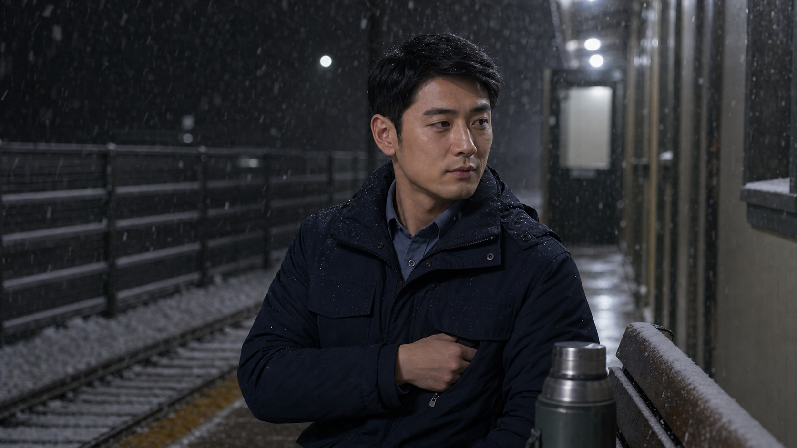

### 最终视频提示词（整段复制）

```text
[场景：暴雪夜的站台候车区，保温杯放在韩哲与沈梨之间，背景站台灯失焦。角色：韩哲（图中中央的人），左手按在外套口袋外，神情短暂失措但克制。镜头：近景，85mm镜头，浅景深，固定机位，真实皮肤细节和自然微表情。动作：韩哲吸一口气，把保温杯往沈梨方向轻推，无对白。]
```

## S21｜02:30—02:37｜7秒

- 场景：站台候车区，韩哲回应婚讯
- 出镜：韩哲、沈梨
- 景别／镜头：双人中近景，50mm镜头，中等景深，固定机位
- 首帧画面：韩哲与沈梨面对面，二人之间仍隔着保温杯和一小段距离
- 运动提示：韩哲点头，压住情绪后说出祝福
- 对白／声音：韩哲对沈梨说“恭喜。”
- 声场／剪辑：
- 后期备注：不加解释性台词

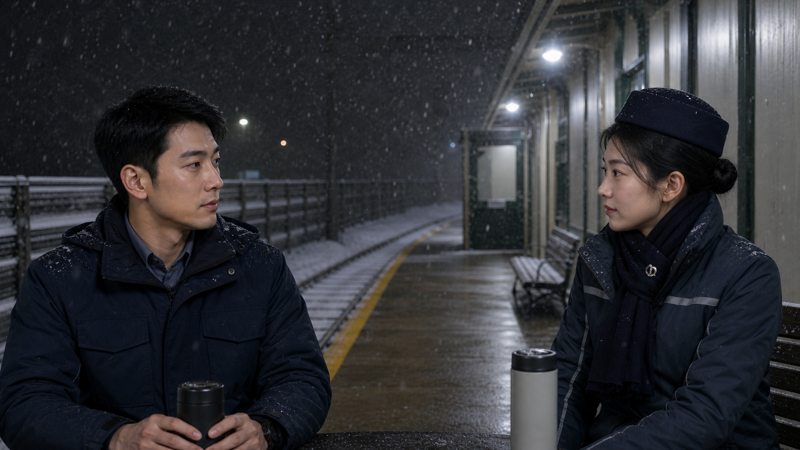

### 最终视频提示词（整段复制）

```text
[场景：暴雪夜的站台候车区，保温杯放在两人之间，远处轨道传来列车制动的低鸣。角色：韩哲（图中左侧的人）、沈梨（图中右侧的人），二人保持一小段自然距离。镜头：双人中近景，50mm镜头，中等景深，固定机位，真实站台冷光和克制表演。动作：韩哲点头压住情绪，对沈梨说“恭喜。”。]
```

## S22｜02:37—02:45｜8秒

- 场景：露天站台候车区，通往站房出口的门在画外另一端
- 出镜：沈梨
- 景别／镜头：中近景，55mm镜头，中等景深，缓慢横移
- 首帧画面：沈梨顺着站房方向看去，背景仍是站台栏杆与风雪，出口不入画
- 运动提示：她带着不好意思的笑意补充未婚夫正在出口等她
- 对白／声音：沈梨说“他在出口等我。”
- 声场／剪辑：
- 后期备注：未婚夫不需正面出场；出口与列车不并置

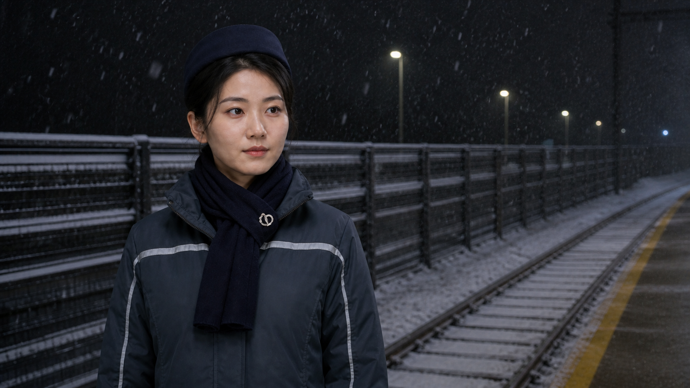

### 最终视频提示词（整段复制）

```text
[场景：暴雪夜的露天站台候车区，通往站房出口的门在画外另一端，背景是风雪中的栏杆与站台灯。角色：沈梨（图中右侧的人），侧身望向站房方向。镜头：中近景，55mm镜头，中等景深，缓慢横移，真实风雪景深与玻璃反射。动作：沈梨带着平静笑意望向站房方向，对韩哲说“他在出口等我。”。]
```

## S23｜02:45—02:52｜7秒

- 场景：调度室通往站台的玻璃门边
- 出镜：韩哲
- 景别／镜头：插入中近景，70mm镜头，浅景深，固定机位
- 首帧画面：韩哲转身取对讲机时，口袋里的戒指盒被他的手压住，没有拿出来
- 运动提示：他按住盒子，按下对讲机请求确认进站状态
- 对白／声音：韩哲说“确认夜车进站。”
- 声场／剪辑：
- 后期备注：工作行动重新接管情绪

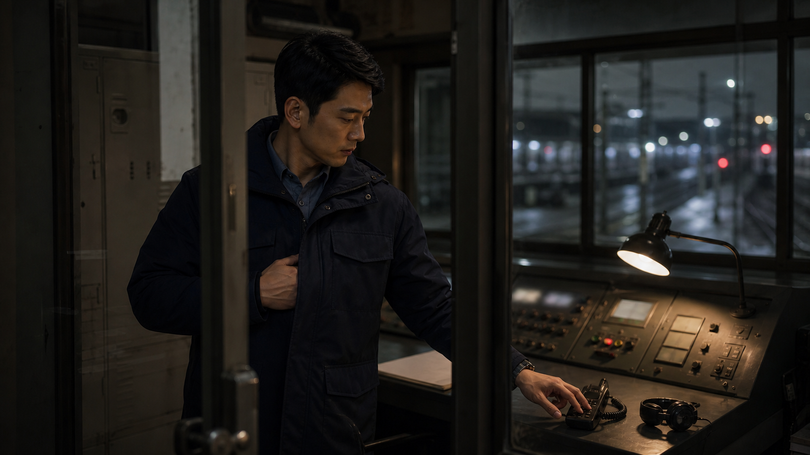

### 最终视频提示词（整段复制）

```text
[场景：调度室通往站台的玻璃门边，轨道低鸣渐重，对讲机放在台面上。角色：韩哲（图中中央的人），一只手压住外套口袋里的戒指盒，另一只手伸向对讲机。镜头：中近景，70mm镜头，浅景深，固定机位，真实手部受力和室内低光。动作：韩哲按住戒指盒，按下对讲机说“确认夜车进站。”。]
```

## S24｜02:52—03:00｜8秒

- 场景：站台尽头，车灯穿过风雪
- 出镜：韩哲、沈梨
- 景别／镜头：双人全景，32mm镜头，大景深，固定机位
- 首帧画面：韩哲与沈梨各站在安全线内两侧，远处夜车前灯从风雪里出现
- 运动提示：二人同时回头看向来车，谈话自然中断
- 对白／声音：无对白
- 声场／剪辑：
- 后期备注：转入选择段

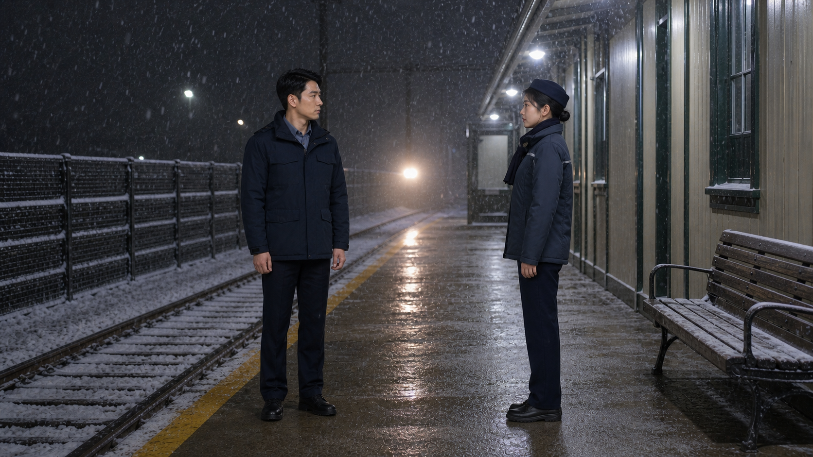

### 最终视频提示词（整段复制）

```text
[场景：暴雪夜的站台尽头，夜车前灯刚穿过风雪，韩哲与沈梨都站在安全线内。角色：韩哲（图中左侧的人）、沈梨（图中右侧的人）。镜头：双人全景，32mm镜头，大景深，固定机位，真实雪夜站台尺度和车灯曝光。动作：列车进站声响起，韩哲与沈梨同时回头望向来车，谈话自然中断，无对白。]
```

## S25｜03:00—03:08｜8秒

- 场景：夜车将进站的站台，风从轨道方向卷起
- 出镜：沈梨
- 景别／镜头：近景，65mm镜头，浅景深，稳定手持
- 首帧画面：风吹散沈梨颈边围巾的一角，她抬手按住却没按稳
- 运动提示：围巾边缘再次被风掀起，沈梨侧过脸避风
- 对白／声音：无对白
- 声场／剪辑：
- 后期备注：为围巾动作建立明确因果

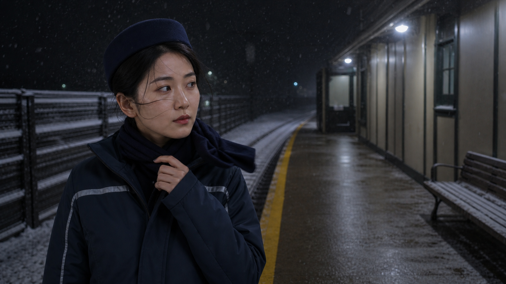

### 最终视频提示词（整段复制）

```text
[场景：夜车将进站的站台，轨道方向的风卷起，冷白灯照着沈梨颈边围巾。角色：沈梨（图中中央的人），夜车乘务制服，手刚抬向围巾。镜头：近景，65mm镜头，浅景深，稳定手持，真实风压下的发丝和衣料运动。动作：风把沈梨的围巾边缘掀起，她侧过脸抬手按住，无对白。]
```

## S26｜03:08—03:15｜7秒

- 场景：站台风口，韩哲靠近沈梨前
- 出镜：韩哲（只露手部）
- 景别／镜头：插入特写，85mm镜头，浅景深，固定机位
- 首帧画面：韩哲的手伸向沈梨松开的围巾边，另一只手在口袋处停住
- 运动提示：他收回按向口袋的手，只留下伸向围巾的手势
- 对白／声音：无对白
- 声场／剪辑：
- 后期备注：戒指不需露出

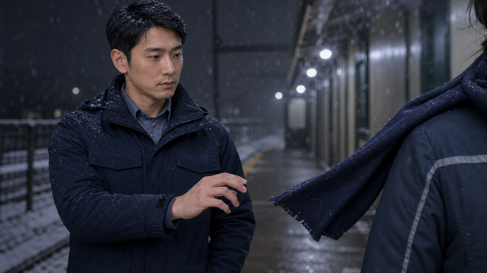

### 最终视频提示词（整段复制）

```text
[场景：夜车将进站的站台风口，沈梨的围巾被风吹松，列车金属震动从轨道传来。角色：韩哲（图中前景只露出双手）、沈梨（图中右侧只露出围巾和肩部）。镜头：插入特写，85mm镜头，浅景深，固定机位，真实手部距离与衣料受风。动作：韩哲收回按向口袋的手，只留下伸向沈梨围巾的手势，无对白。]
```

## S27｜03:15—03:22｜7秒

- 场景：站台风口，夜车灯光渐亮
- 出镜：韩哲、沈梨
- 景别／镜头：双人近景，60mm镜头，浅景深，固定机位
- 首帧画面：韩哲在征得沈梨目光允许后，替她把松开的围巾别回领口
- 运动提示：他完成别好围巾的动作立即收手，二人短暂相视
- 对白／声音：无对白
- 声场／剪辑：
- 后期备注：触碰短暂、有明确动机

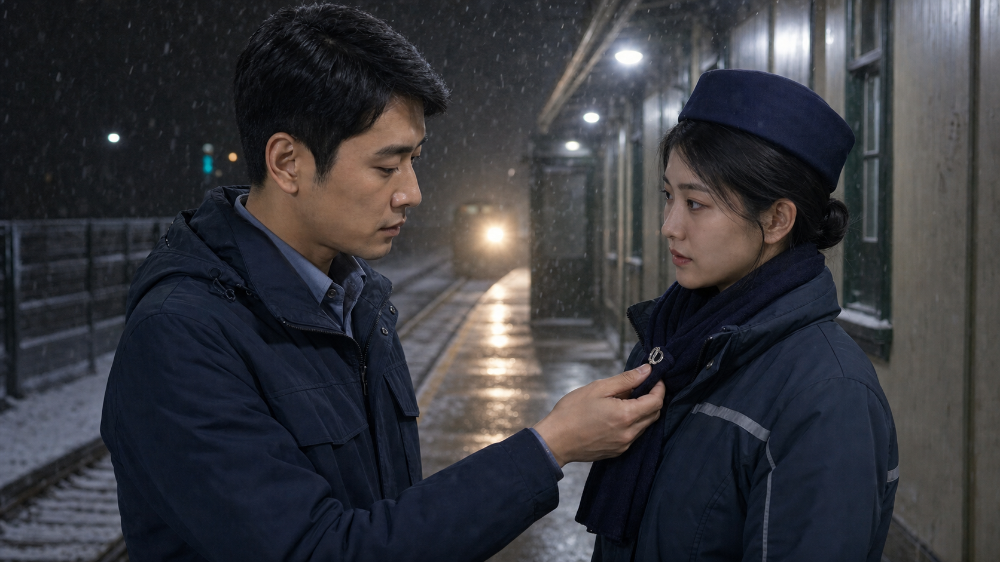

### 最终视频提示词（整段复制）

```text
[场景：夜车进站前的站台风口，车灯渐亮，沈梨领口的围巾被风吹松。角色：韩哲（图中左侧的人）、沈梨（图中右侧的人，目光看向韩哲）。镜头：双人近景，60mm镜头，浅景深，固定机位，真实短暂接触、自然肤质与衣料褶皱。动作：韩哲在沈梨默许的目光下替她把围巾别回领口，完成后立刻收手，无对白。]
```

## S28｜03:22—03:30｜8秒

- 场景：站台风口，夜车到站前的等待
- 出镜：沈梨、韩哲
- 景别／镜头：过肩中近景，55mm镜头，中等景深，固定机位
- 首帧画面：从韩哲肩后看沈梨已经整理好的围巾，她把手从领口放下
- 运动提示：沈梨带着真诚的感谢提起韩哲总让车门晚一点关
- 对白／声音：沈梨对韩哲说“谢谢你总让我的车晚一点关门。”
- 声场／剪辑：
- 后期备注：感谢限定为工作体贴

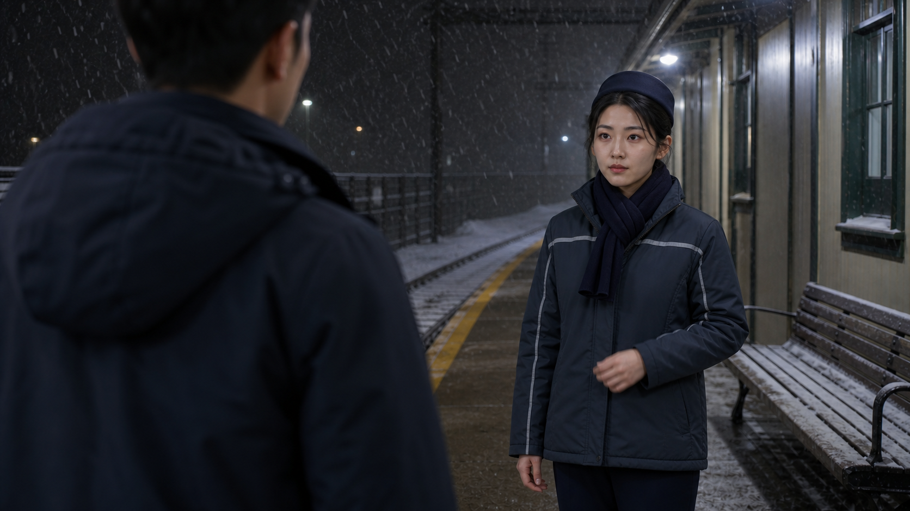

### 最终视频提示词（整段复制）

```text
[场景：夜车到站前的站台风口，沈梨的围巾已经别好，进站提示音从上方传来。角色：韩哲（图中左前景只露出肩部）、沈梨（图中右侧的人，手停在领口）。镜头：过肩中近景，55mm镜头，中等景深，固定机位，真实站台冷光和自然表演。动作：沈梨放下手，真诚地对韩哲说“谢谢你总让我的车晚一点关门。”。]
```

## S29｜03:30—03:37｜7秒

- 场景：夜车车门旁，列车已停稳
- 出镜：韩哲、沈梨
- 景别／镜头：双人中景，45mm镜头，大景深，固定机位
- 首帧画面：车门打开且通道已清空，韩哲站在门外规定位置，沈梨侧身准备回到岗位
- 运动提示：韩哲让出门口，示意沈梨回岗后按正常程序完成确认
- 对白／声音：韩哲说“按流程，确认你上岗再关门。”
- 声场／剪辑：
- 后期备注：正常安全流程：通道清空、沈梨回岗、对讲确认后关门；不表现私人延迟

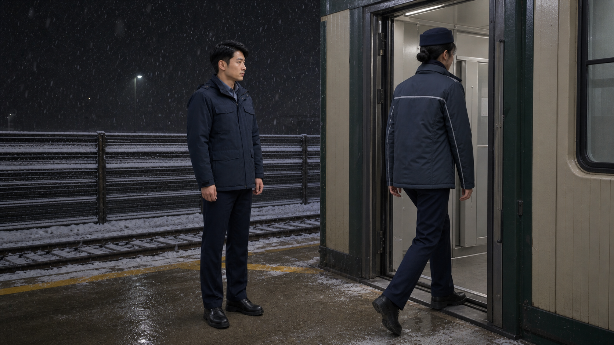

### 最终视频提示词（整段复制）

```text
[场景：夜车车门旁，车门刚打开且通道已清空，站台安全线清晰可见，冷白灯照在金属地面。角色：韩哲（图中左侧的人，站在规定位置）、沈梨（图中右侧的人，侧身准备回到岗位）。镜头：双人中景，45mm镜头，大景深，固定机位，真实车门气压与站台尺度。动作：韩哲让出门口，平静地对沈梨说“按流程，确认你上岗再关门。”。]
```

## S30｜03:37—03:45｜8秒

- 场景：夜车门边，沈梨回到岗位前
- 出镜：沈梨、韩哲
- 景别／镜头：近景，70mm镜头，浅景深，固定机位
- 首帧画面：通道无人，沈梨跨上车门踏板回到岗位位置，韩哲留在门外，二人被车门框出不同空间
- 运动提示：沈梨轻轻点头，把薄荷糖握在掌心并转向岗位
- 对白／声音：无对白
- 声场／剪辑：
- 后期备注：以门框表现边界；岗位确认是关门前提

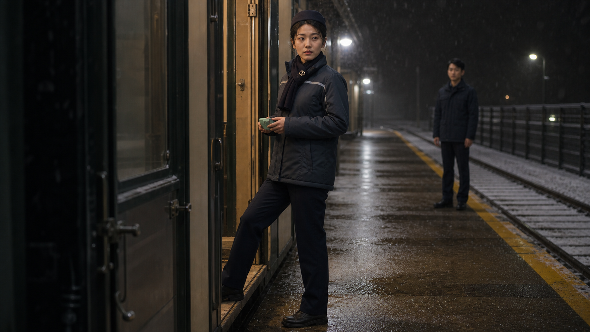

### 最终视频提示词（整段复制）

```text
[场景：夜车门边，车厢暖光与站台冷光被门框分开，沈梨已踏上踏板。角色：沈梨（图中右侧的人，掌心握着薄荷糖）、韩哲（图中左侧门外的虚化身影）。镜头：近景，70mm镜头，浅景深，固定机位，真实门框遮挡与冷暖光层次。动作：沈梨回头看韩哲，轻轻点头，把薄荷糖握紧，无对白。]
```

## S31｜03:45—03:52｜7秒

- 场景：夜车车门外，最终安全确认
- 出镜：韩哲
- 景别／镜头：中近景，50mm镜头，中等景深，固定机位
- 首帧画面：韩哲站在车门外确认通道无乘客，耳中听见沈梨已回岗位的对讲确认，脸上恢复为专业平静
- 运动提示：他完成目视确认后退到规定位置，车门按程序开始关闭
- 对白／声音：无对白
- 声场／剪辑：
- 后期备注：不表现人为拖延或私人放行

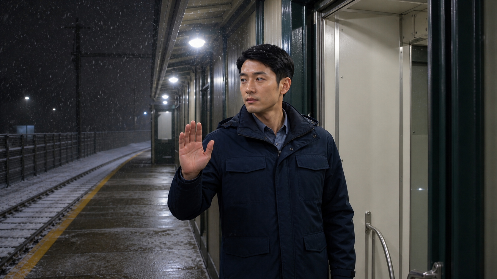

### 最终视频提示词（整段复制）

```text
[场景：夜车车门外，安全线和门边指示灯清晰可见，暴雪夜的冷光落在韩哲制服上，通道无人。角色：韩哲（图中中央的人），站在规定位置，神情恢复为专业平静。镜头：中近景，50mm镜头，中等景深，固定机位，真实站台照明和自然站姿。动作：韩哲听见沈梨回岗的对讲确认，完成目视确认后退到规定位置，车门按程序开始关闭，无对白。]
```

## S32｜03:52—04:00｜8秒

- 场景：露天站台车门边，站房出口位于画外另一端
- 出镜：韩哲、沈梨
- 景别／镜头：远中景，35mm镜头，大景深，固定机位
- 首帧画面：车门即将合拢，沈梨在车内岗位一侧，韩哲在站台规定位置，站房墙面隔开出口方向
- 运动提示：沈梨转回车内岗位，韩哲目送后把视线移开
- 对白／声音：无对白
- 声场／剪辑：
- 后期备注：出口不入画；以车门边界收束

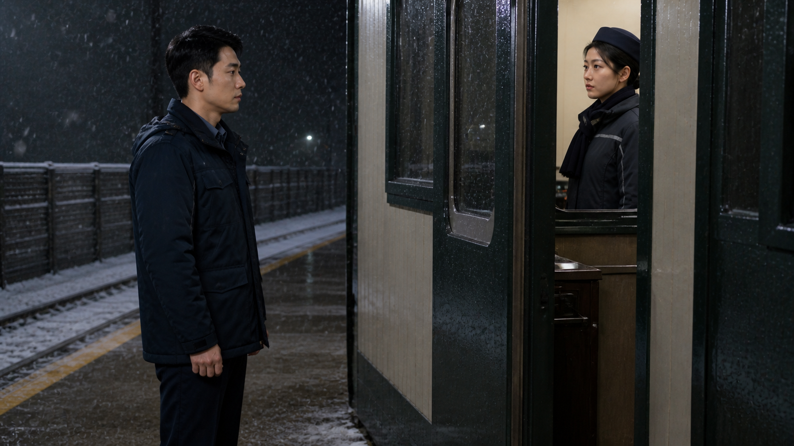

### 最终视频提示词（整段复制）

```text
[场景：暴雪夜的露天站台车门边，站房墙面隔开画外另一端的出口，夜车车门仍留窄缝。角色：韩哲（图中左侧站台的人）、沈梨（图中右侧车内岗位的人）。镜头：远中景，35mm镜头，大景深，固定机位，真实雪夜空间与车门玻璃反射。动作：沈梨转回车内岗位，韩哲目送后把视线移开，无对白。]
```

## S33｜04:00—04:08｜8秒

- 场景：夜车车门内，关门前一刻
- 出镜：沈梨
- 景别／镜头：近景，75mm镜头，浅景深，固定机位
- 首帧画面：沈梨站在门内，手里是薄荷糖，围巾已整理好，门外韩哲被玻璃虚化
- 运动提示：她隔着玻璃对韩哲轻声道别
- 对白／声音：沈梨对韩哲说“再见，韩哲。”
- 声场／剪辑：
- 后期备注：玻璃外人物不抢焦点

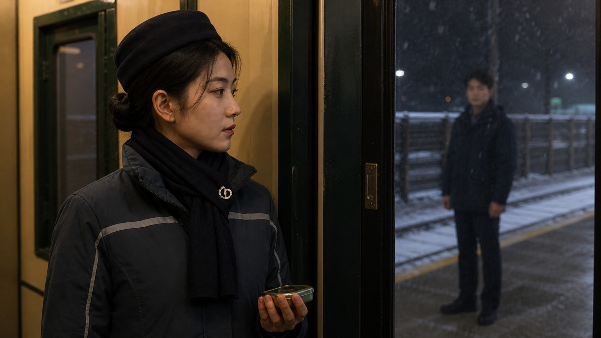

### 最终视频提示词（整段复制）

```text
[场景：夜车车门内，车厢暖光照着沈梨整理好的围巾和掌心薄荷糖，门外的韩哲隔玻璃虚化。角色：沈梨（图中中央的人）、韩哲（图中门外背景的虚化身影）。镜头：近景，75mm镜头，浅景深，固定机位，真实玻璃反射和自然肤质。动作：沈梨隔着玻璃看向韩哲，轻声对他说“再见，韩哲。”。]
```

## S34｜04:08—04:15｜7秒

- 场景：夜车车门外，关门前一刻
- 出镜：韩哲
- 景别／镜头：近景，85mm镜头，浅景深，固定机位
- 首帧画面：韩哲站在关闭中的车门外，玻璃上有雪水痕迹，他的手停在身侧
- 运动提示：他没有靠近车门，只对沈梨说出最后一句关照
- 对白／声音：韩哲对沈梨说“路上小心。”
- 声场／剪辑：
- 后期备注：声音可跨车门延续

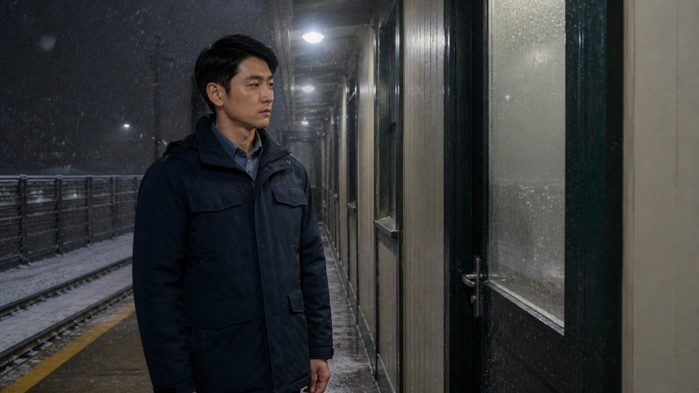

### 最终视频提示词（整段复制）

```text
[场景：夜车车门外，玻璃上有雪水痕迹，车门仍留一线缝隙，站台冷光落在韩哲脸侧。角色：韩哲（图中中央的人），双手垂在身侧，神情平静。镜头：近景，85mm镜头，浅景深，固定机位，真实玻璃水痕和低光人物成像。动作：韩哲没有靠近车门，只对沈梨说“路上小心。”。]
```

## S35｜04:15—04:22｜7秒

- 场景：关闭后的夜车车窗外，站台开始后退
- 出镜：韩哲、沈梨
- 景别／镜头：隔窗中景，55mm镜头，中等景深，跟随列车轻移
- 首帧画面：沈梨站在车厢内的门边，韩哲留在窗外，二人的倒影被车窗和雪水切开
- 运动提示：列车缓慢起步，韩哲的身影从沈梨视野中后移
- 对白／声音：无对白
- 声场／剪辑：
- 后期备注：避免夸张追车动作

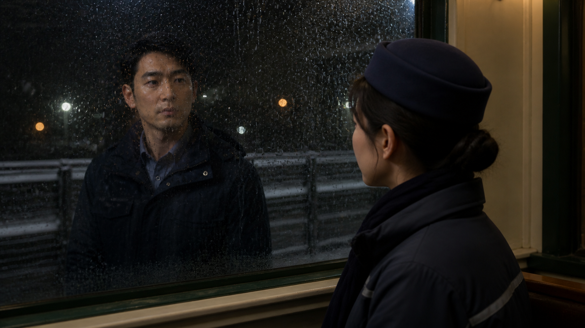

### 最终视频提示词（整段复制）

```text
[场景：关闭后的夜车车窗外，雪水沿玻璃留下细痕，站台冷光与车厢暖光交叠。角色：沈梨（图中车内右侧的人）、韩哲（图中窗外左侧的人）。镜头：隔窗中景，55mm镜头，中等景深，跟随列车轻移，真实车窗反射和起步震动。动作：列车缓慢起步，韩哲的身影从沈梨视野中后移，无对白。]
```

## S36｜04:22—04:30｜8秒

- 场景：站房公共出口内侧，暴雪中的雨棚在磨砂玻璃外
- 出镜：无出镜人物
- 景别／镜头：远景，50mm镜头，大景深，固定机位
- 首帧画面：公共出口内侧无人停留，磨砂玻璃外只有一把无法辨识主人的深色伞轮廓，列车不入画
- 运动提示：雪粒在玻璃外持续掠过，远处列车尾音渐远
- 对白／声音：无对白
- 声场／剪辑：
- 后期备注：压缩未婚夫重复出场；只保留出口等待的环境信息

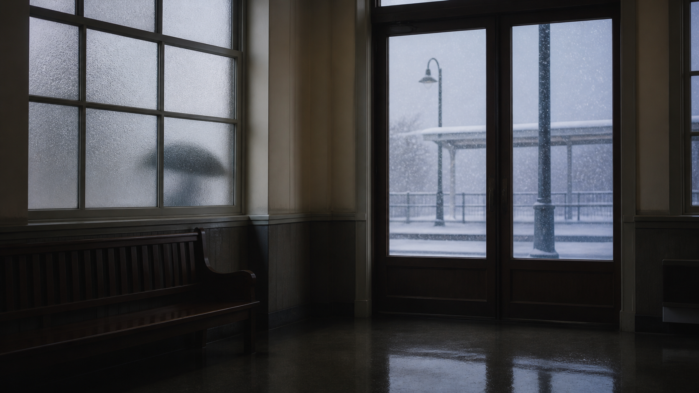

### 最终视频提示词（整段复制）

```text
[场景：暴雪中的站房公共出口内侧，磨砂玻璃外有一把无法辨识主人的深色伞轮廓，列车不入画。角色：无出镜人物。镜头：远景，50mm镜头，大景深，固定机位，真实雪夜玻璃漫反射与站房室内外光差。动作：雪粒在玻璃外持续掠过，远处列车尾音渐远，无对白。]
```

## S37｜04:30—04:37｜7秒

- 场景：空下来的站台，夜车驶离后
- 出镜：韩哲
- 景别／镜头：全景，32mm镜头，大景深，固定机位
- 首帧画面：列车尾灯消失在隧道，韩哲独自站在安全线内，脚边有被雪水打湿的薄荷糖包装纸
- 运动提示：他等列车完全离开后转身走向调度室
- 对白／声音：无对白
- 声场／剪辑：
- 后期备注：不让韩哲停留过久

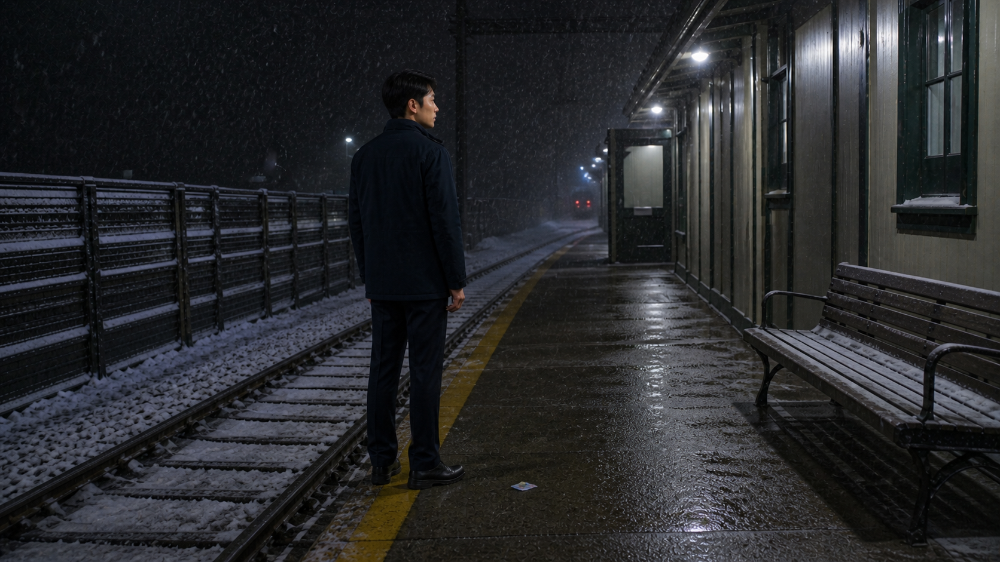

### 最终视频提示词（整段复制）

```text
[场景：夜车驶离后的空站台，隧道里只剩远去的尾灯，雪水打湿的薄荷糖包装纸在韩哲脚边。角色：韩哲（图中中央的人），独自站在安全线内。镜头：全景，32mm镜头，大景深，固定机位，真实空站台尺度与尾灯低光。动作：韩哲等尾灯消失后转身走向调度室，无对白。]
```

## S38｜04:37—04:45｜8秒

- 场景：夜班结束的调度室
- 出镜：韩哲
- 景别／镜头：中景，40mm镜头，大景深，固定机位
- 首帧画面：韩哲回到空调度室，值班灯仍亮着，桌面只剩耳机、班表和一张空失物标签
- 运动提示：他摘下工作表，把戒指盒从内袋取出放到台面
- 对白／声音：无对白
- 声场／剪辑：
- 后期备注：空间回到开场构图但人物更孤单

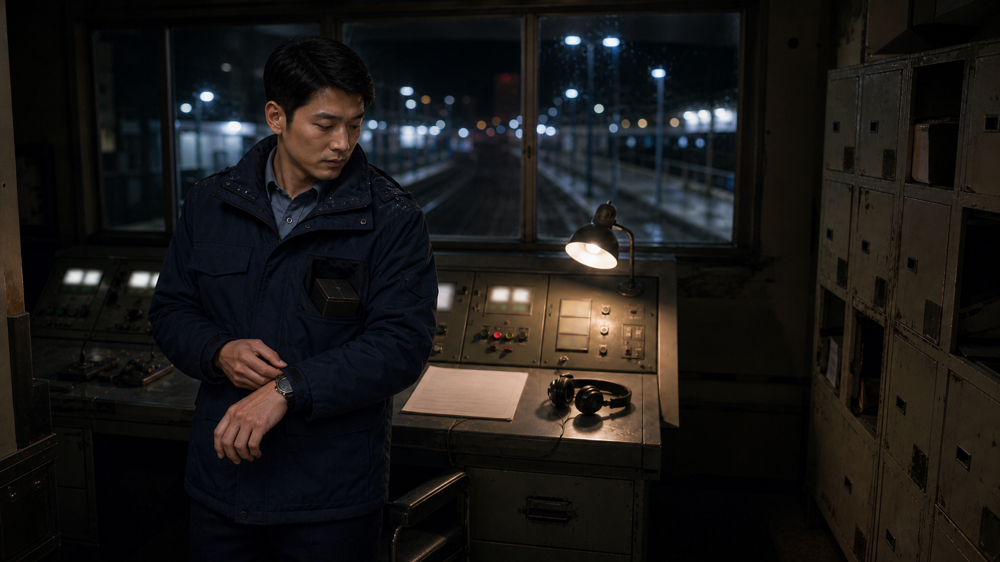

### 最终视频提示词（整段复制）

```text
[场景：夜班结束的调度室，值班灯仍亮着，桌面只剩耳机、班表和一张空失物标签。角色：韩哲（图中中央的人），刚回到室内，深色工作制服略带雪水痕迹。镜头：中景，40mm镜头，大景深，固定机位，真实室内低光与旧控制台材质。动作：韩哲摘下工作表，把戒指盒从内袋取出放到台面，无对白。]
```

## S39｜04:45—04:52｜7秒

- 场景：调度室一侧的内部暂存格（原作称失物柜）
- 出镜：韩哲（只露手部）
- 景别／镜头：插入特写，80mm镜头，浅景深，固定机位
- 首帧画面：一只磨旧的金属内部暂存格打开，韩哲把未送出的戒指盒放进空格，再把私人无字标签压进卡槽
- 运动提示：他推入盒子，私人标签停在卡槽里，柜门尚未合上
- 对白／声音：无对白
- 声场／剪辑：
- 后期备注：原作的失物柜在本片设为内部暂存格；车次仅作私人未登记定位，由后期添加，不生成可读文字

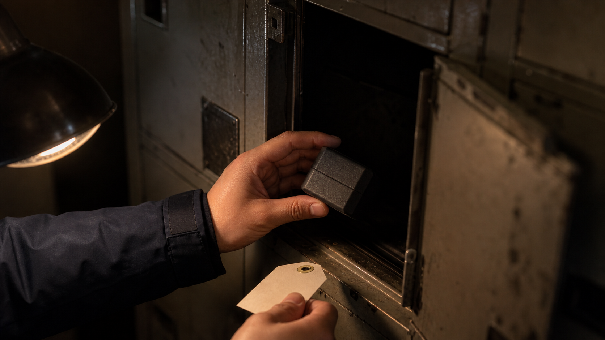

### 最终视频提示词（整段复制）

```text
[场景：夜班调度室一侧的磨旧金属内部暂存格，原作称失物柜，暖色值班灯照出柜门划痕和空格深处。角色：韩哲（图中前景只露出手部），手中是未送出的素净戒指盒和私人无字标签。镜头：插入特写，80mm镜头，浅景深，固定机位，真实金属铰链、手部皮肤与接触阴影。动作：韩哲把戒指盒放进内部暂存格，再把私人无字标签压进卡槽，无对白。]
```

## S40｜04:52—05:00｜8秒

- 场景：关灯前的调度室与内部暂存格
- 出镜：韩哲
- 景别／镜头：中远景，50mm镜头，大景深，缓慢拉远
- 首帧画面：内部暂存格门合上，韩哲站在灯下，桌角有一颗没有拿走的薄荷糖
- 运动提示：他关掉值班灯，在黑下来的房间里停一秒后离开画面
- 对白／声音：无对白
- 声场／剪辑：
- 后期备注：结尾不追加片尾时长

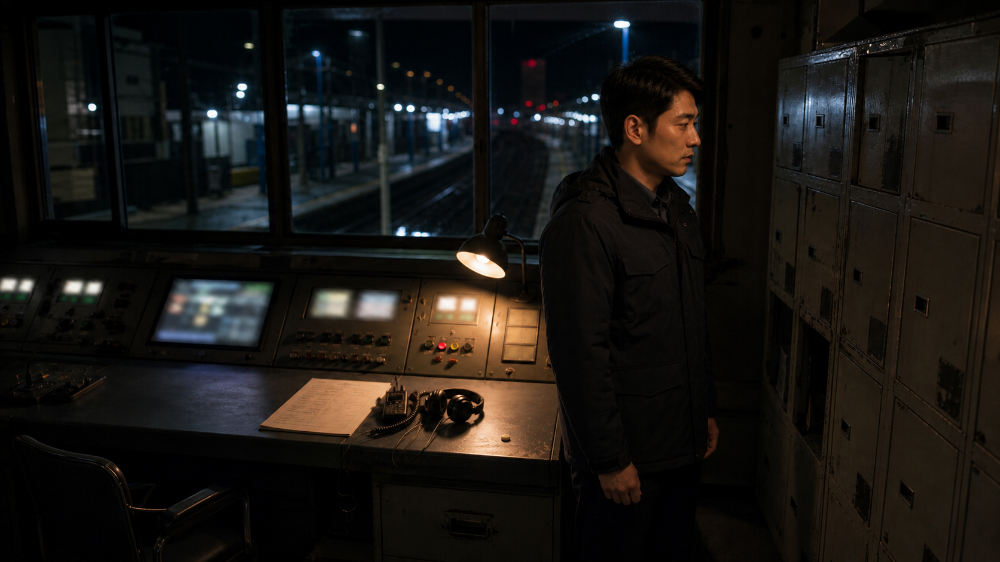

### 最终视频提示词（整段复制）

```text
[场景：关灯前的夜班调度室，内部暂存格门刚合上，桌角留着一颗没有拿走的薄荷糖，值班灯是唯一暖光。角色：韩哲（图中中央的人），面向内部暂存格站立。镜头：中远景，50mm镜头，大景深，缓慢拉远，真实低照度暗部与自然室内材质。动作：韩哲关掉值班灯，在黑下来的房间里停一秒后离开画面，无对白。]
```
