# 《你走后我才开口》AI视频分镜书

> 总时长：05:00  
> 分镜数量：38  
> 常规单镜：5—10秒  
> 画幅／首帧：16:9／1672x941 PNG

## 全片统一约束

- AI生成的真人叙事电影前期首帧，不声称实拍；正式图统一1672×941 PNG。
- 程青、韩泽、剧团助理的身份、服装、后门和空舞台结构遵循continuity-bible.md。
- 助理只留在后台；韩泽机场车只在S25—S27作为同一辆远去车辆的红色尾灯；程青沿同一后门追出。
- S32—S38程青的身体与目光只朝韩泽曾站过的舞台中央空光圈，观众席只作无听众背景。
- 信、台词本和剧场信息不要求可读文字，留给后期。

## 角色设定

### 程青

29岁小剧场化妆师，低束黑发、煤灰针织开衫和黑色工作裤；雨后湿发与湿信状态连续。

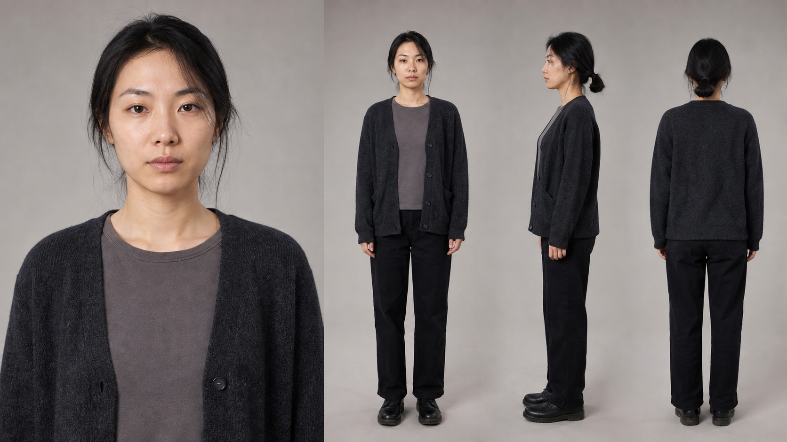

### 韩泽

33岁男演员，右偏分短黑发、深墨蓝长戏服；S18后已从后门乘机场车离开。

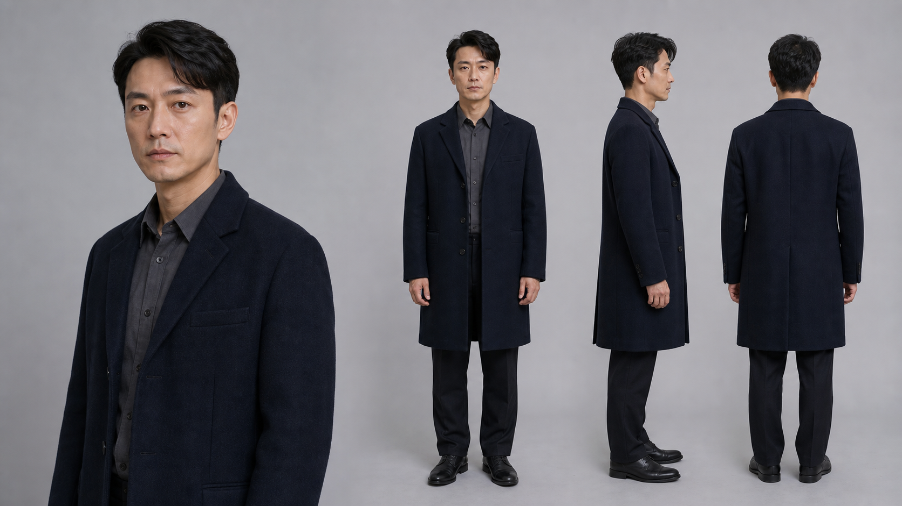

### 剧团助理

25岁左右后台助理，暗绿连帽工作夹克；只在后台交回戏服。

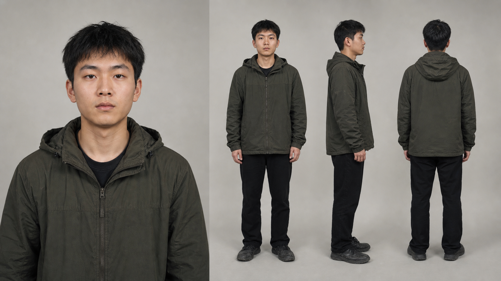

# 逐镜头分镜

## S01｜00:00—00:08｜8秒

- 场景：演出前的小剧场化妆间，暖灯照着镜前工作台
- 出镜：程青、韩泽
- 景别／镜头：双人中景，50mm，中等景深，镜面侧方固定机位
- 首帧画面：程青站在韩泽身后，眉笔停在他眉骨前，韩泽闭眼坐在镜前。
- 运动提示：程青轻轻为他描出眉尾，韩泽保持不动。
- 对白／声音：无对白；化妆刷轻响。
- 声场／剪辑：
- 后期备注：信件、台词本及剧场文字均不生成可读内容；保持已审定空间与人物因果。

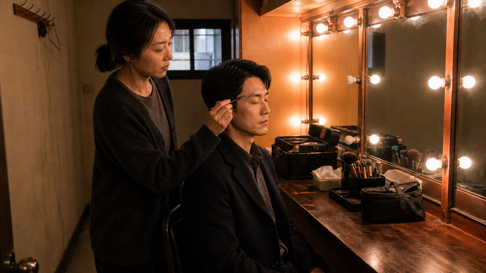

### 最终视频提示词（整段复制）

```text
[场景：演出前的小剧场化妆间，镜前暖灯照亮真实工作台与镜面暗角。角色：程青（图中左后方站着的人）、韩泽（图中右侧坐着的人），保持自然肤质和后台工作服。镜头：双人中景，50mm镜头，中等景深，镜面侧方固定机位。动作：程青轻轻为韩泽描出眉尾，韩泽闭眼不动；眉笔与皮肤接触自然，无对白。]
```

<details><summary>首帧生成提示词</summary>

```text
生成一张16:9横版真人叙事电影单帧 S01，不是插画或三维渲染。场景：演出前的小剧场化妆间，暖灯照着镜前工作台。画面：眉笔尚未碰到皮肤，镜面只反射两人自然工作姿态。 程青站在韩泽身后，眉笔停在他眉骨前，韩泽闭眼坐在镜前。。镜头：双人中景，50mm，中等景深，镜面侧方固定机位。保留连续性圣经中的人物身份、服装、空间结构、来源明确的灯光和真实物理接触；自然肤质与衣料，不望向摄影机，不出现可读文字、标志、水印、CG、塑料皮肤或摆拍。
```

</details>

## S02｜00:08—00:16｜8秒

- 场景：同一化妆镜前
- 出镜：程青、韩泽
- 景别／镜头：镜面近景，85mm，浅景深，程青肩后机位
- 首帧画面：镜中韩泽睁眼看台词本，程青的目光停在他的眉骨。
- 运动提示：程青发现镜中视线接近后低头去拿粉盒。
- 对白／声音：无对白。
- 声场／剪辑：
- 后期备注：信件、台词本及剧场文字均不生成可读内容；保持已审定空间与人物因果。

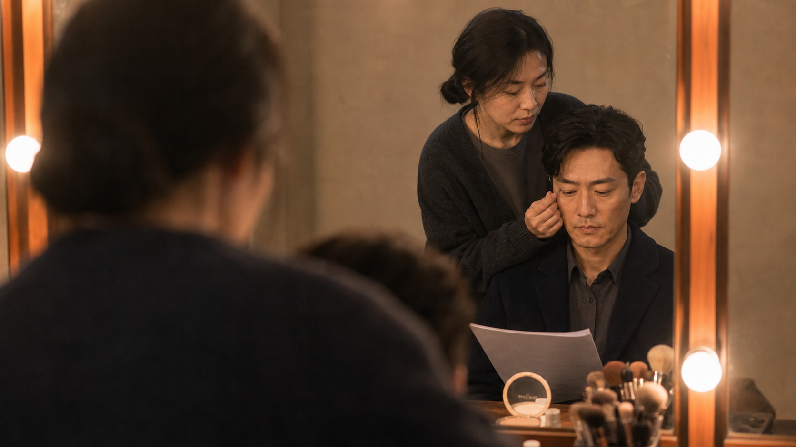

### 最终视频提示词（整段复制）

```text
[场景：化妆镜前，暖灯从镜侧照亮韩泽和程青，镜面有真实反射。角色：韩泽（图中镜面中央的人）、程青（图中左侧镜后的人）。镜头：镜面近景，85mm镜头，浅景深，程青肩后固定机位。动作：程青察觉镜中视线将相遇后低头去拿粉盒，韩泽继续看台词本；无对白。]
```

<details><summary>首帧生成提示词</summary>

```text
生成一张16:9横版真人叙事电影单帧 S02，不是插画或三维渲染。场景：同一化妆镜前。画面：两人都未看镜头，粉盒仍在桌上。 镜中韩泽睁眼看台词本，程青的目光停在他的眉骨。。镜头：镜面近景，85mm，浅景深，程青肩后机位。保留连续性圣经中的人物身份、服装、空间结构、来源明确的灯光和真实物理接触；自然肤质与衣料，不望向摄影机，不出现可读文字、标志、水印、CG、塑料皮肤或摆拍。
```

</details>

## S03｜00:16—00:24｜8秒

- 场景：化妆间工作台
- 出镜：韩泽
- 景别／镜头：手部近景，65mm，浅景深，桌面机位
- 首帧画面：韩泽的台词本摊在粉盒旁，手指压住一页。
- 运动提示：他无声地用口型预演离别台词，手指轻敲纸边。
- 对白／声音：无可听清对白。
- 声场／剪辑：
- 后期备注：信件、台词本及剧场文字均不生成可读内容；保持已审定空间与人物因果。


### 最终视频提示词（整段复制）

```text
[场景：化妆间工作台，镜前暖灯照亮粉盒、台词本与手指投下的短阴影，文字不可读。角色：韩泽（图中只露手与下颌的人）。镜头：手部近景，65mm镜头，浅景深，桌面固定机位。动作：韩泽无声预演离别台词，手指轻敲台词本纸边；无可听清对白。]
```

<details><summary>首帧生成提示词</summary>

```text
生成一张16:9横版真人叙事电影单帧 S03，不是插画或三维渲染。场景：化妆间工作台。画面：纸面文字不可读，手指尚未敲下。 韩泽的台词本摊在粉盒旁，手指压住一页。。镜头：手部近景，65mm，浅景深，桌面机位。保留连续性圣经中的人物身份、服装、空间结构、来源明确的灯光和真实物理接触；自然肤质与衣料，不望向摄影机，不出现可读文字、标志、水印、CG、塑料皮肤或摆拍。
```

</details>

## S04｜00:24—00:32｜8秒

- 场景：化妆镜前
- 出镜：韩泽、程青
- 景别／镜头：双人近景，55mm，中等景深，眼平机位
- 首帧画面：韩泽看着镜中的眉妆，程青收起眉笔。
- 运动提示：韩泽说“今天最后一场，别把我画得太像告别”。
- 对白／声音：韩泽：“今天最后一场，别把我画得太像告别。”
- 声场／剪辑：
- 后期备注：信件、台词本及剧场文字均不生成可读内容；保持已审定空间与人物因果。

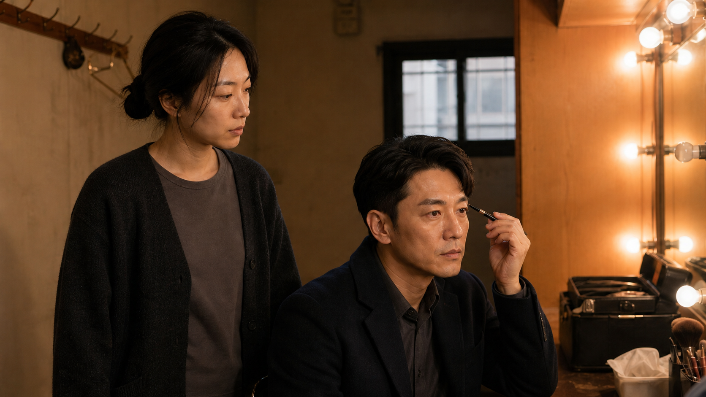

### 最终视频提示词（整段复制）

```text
[场景：后台化妆镜前，暖灯照亮两人的侧脸与真实化妆工具。角色：程青（图中左侧站着的人）、韩泽（图中右侧坐着的人）。镜头：双人近景，55mm镜头，中等景深，眼平固定机位。动作：韩泽看着镜中的眉妆，对程青说“今天最后一场，别把我画得太像告别”，程青收起眉笔。]
```

<details><summary>首帧生成提示词</summary>

```text
生成一张16:9横版真人叙事电影单帧 S04，不是插画或三维渲染。场景：化妆镜前。画面：程青的眉笔刚离开韩泽眉尾，韩泽目光留在镜中。 韩泽看着镜中的眉妆，程青收起眉笔。。镜头：双人近景，55mm，中等景深，眼平机位。保留连续性圣经中的人物身份、服装、空间结构、来源明确的灯光和真实物理接触；自然肤质与衣料，不望向摄影机，不出现可读文字、标志、水印、CG、塑料皮肤或摆拍。
```

</details>

## S05｜00:32—00:40｜8秒

- 场景：化妆镜前的程青
- 出镜：程青
- 景别／镜头：近景，85mm，浅景深，镜侧反打
- 首帧画面：程青把眉笔放回盒中，韩泽在镜中虚化。
- 运动提示：她说“那你别一直念告别”，随后避开镜面。
- 对白／声音：程青：“那你别一直念告别。”
- 声场／剪辑：
- 后期备注：信件、台词本及剧场文字均不生成可读内容；保持已审定空间与人物因果。

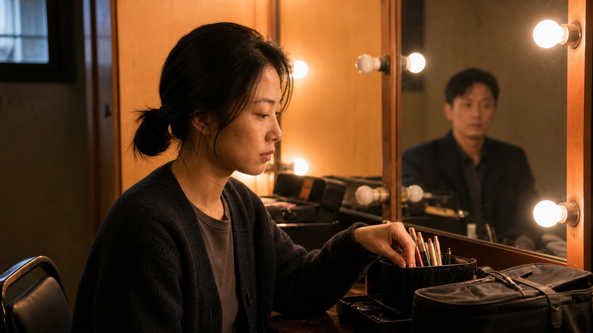

### 最终视频提示词（整段复制）

```text
[场景：化妆镜侧，暖灯照亮程青的手和侧脸，韩泽在镜中自然虚化。角色：程青（图中中央的人）、韩泽（图中镜面背景的人）。镜头：近景，85mm镜头，浅景深，镜侧反打固定机位。动作：程青把眉笔放回盒中，对韩泽说“那你别一直念告别”，随后避开镜面。]
```

<details><summary>首帧生成提示词</summary>

```text
生成一张16:9横版真人叙事电影单帧 S05，不是插画或三维渲染。场景：化妆镜前的程青。画面：程青尚未笑开，手还停在眉笔上方。 程青把眉笔放回盒中，韩泽在镜中虚化。。镜头：近景，85mm，浅景深，镜侧反打。保留连续性圣经中的人物身份、服装、空间结构、来源明确的灯光和真实物理接触；自然肤质与衣料，不望向摄影机，不出现可读文字、标志、水印、CG、塑料皮肤或摆拍。
```

</details>

## S06｜00:40—00:48｜8秒

- 场景：后台走廊口
- 出镜：韩泽、程青
- 景别／镜头：中景，40mm，大景深，跟拍机位
- 首帧画面：韩泽起身走向走廊，程青留在化妆台旁整理工具。
- 运动提示：韩泽回头轻点一下头，程青也点头却没追上去。
- 对白／声音：无对白。
- 声场／剪辑：
- 后期备注：信件、台词本及剧场文字均不生成可读内容；保持已审定空间与人物因果。

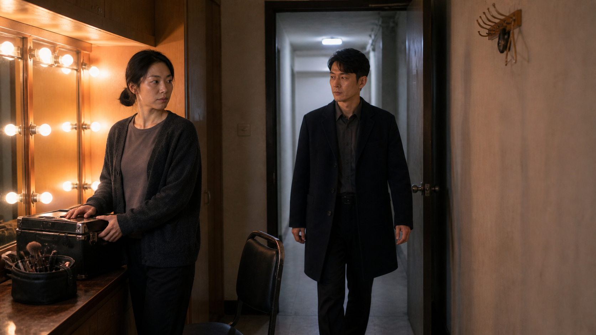

### 最终视频提示词（整段复制）

```text
[场景：演出前的后台走廊口，化妆间暖光与走廊冷光有明确来源。角色：韩泽（图中右侧走向走廊的人）、程青（图中左侧留在工作台旁的人）。镜头：中景，40mm镜头，大景深，缓慢跟拍机位。动作：韩泽回头轻点一下头，程青也点头却没有追上去；无对白。]
```

<details><summary>首帧生成提示词</summary>

```text
生成一张16:9横版真人叙事电影单帧 S06，不是插画或三维渲染。场景：后台走廊口。画面：韩泽刚离开椅子，程青双手仍在工具盒上。 韩泽起身走向走廊，程青留在化妆台旁整理工具。。镜头：中景，40mm，大景深，跟拍机位。保留连续性圣经中的人物身份、服装、空间结构、来源明确的灯光和真实物理接触；自然肤质与衣料，不望向摄影机，不出现可读文字、标志、水印、CG、塑料皮肤或摆拍。
```

</details>

## S07｜00:48—00:56｜8秒

- 场景：后台走廊服装架旁
- 出镜：韩泽、程青
- 景别／镜头：中景，45mm，大景深，固定机位
- 首帧画面：韩泽面对几位虚化团员，程青在服装架后整理深色戏服。
- 运动提示：韩泽抬手示意安静，准备说话。
- 对白／声音：无对白。
- 声场／剪辑：
- 后期备注：信件、台词本及剧场文字均不生成可读内容；保持已审定空间与人物因果。

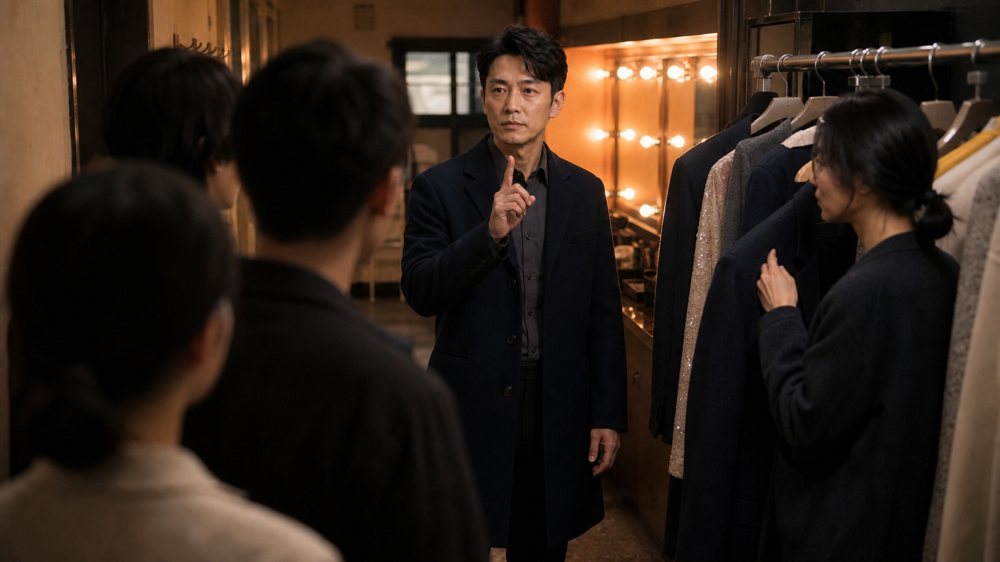

### 最终视频提示词（整段复制）

```text
[场景：小剧场后台走廊，顶灯照亮服装架和旧墙面，远处团员只作自然虚化背景。角色：韩泽（图中中央的人）、程青（图中右侧服装架旁的人）。镜头：中景，45mm镜头，大景深，固定机位。动作：韩泽抬手示意大家安静，程青的手停在深色戏服衣领旁；无对白。]
```

<details><summary>首帧生成提示词</summary>

```text
生成一张16:9横版真人叙事电影单帧 S07，不是插画或三维渲染。场景：后台走廊服装架旁。画面：团员只作背景轮廓，程青的手停在戏服衣领旁。 韩泽面对几位虚化团员，程青在服装架后整理深色戏服。。镜头：中景，45mm，大景深，固定机位。保留连续性圣经中的人物身份、服装、空间结构、来源明确的灯光和真实物理接触；自然肤质与衣料，不望向摄影机，不出现可读文字、标志、水印、CG、塑料皮肤或摆拍。
```

</details>

## S08｜00:56—01:04｜8秒

- 场景：后台走廊
- 出镜：韩泽
- 景别／镜头：中近景，55mm，中等景深，正面略侧机位
- 首帧画面：韩泽站在走廊灯下，背后是通往舞台的黑门。
- 运动提示：他对团员说“这场后我就走，赶今晚的航班”。
- 对白／声音：韩泽：“这场后我就走，赶今晚的航班。”
- 声场／剪辑：
- 后期备注：信件、台词本及剧场文字均不生成可读内容；保持已审定空间与人物因果。

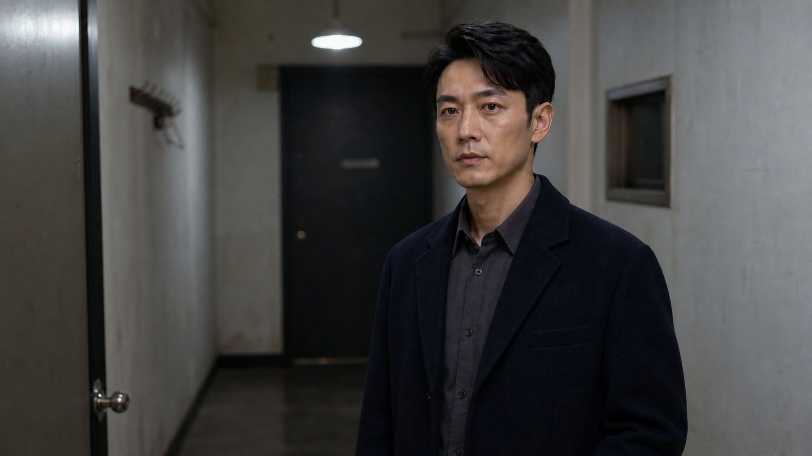

### 最终视频提示词（整段复制）

```text
[场景：小剧场后台走廊，顶灯照亮通往舞台的黑门和韩泽的自然侧脸。角色：韩泽（图中中央的人），保持真实戏服内搭和自然肤质。镜头：中近景，55mm镜头，中等景深，正面略侧固定机位。动作：韩泽对团员说“这场后我就走，赶今晚的航班”，程青在画外听见。]
```

<details><summary>首帧生成提示词</summary>

```text
生成一张16:9横版真人叙事电影单帧 S08，不是插画或三维渲染。场景：后台走廊。画面：韩泽尚未开口，手自然垂在身侧。 韩泽站在走廊灯下，背后是通往舞台的黑门。。镜头：中近景，55mm，中等景深，正面略侧机位。保留连续性圣经中的人物身份、服装、空间结构、来源明确的灯光和真实物理接触；自然肤质与衣料，不望向摄影机，不出现可读文字、标志、水印、CG、塑料皮肤或摆拍。
```

</details>

## S09｜01:04—01:12｜8秒

- 场景：服装架后的程青
- 出镜：程青
- 景别／镜头：近景，85mm，浅景深，侧面机位
- 首帧画面：程青隔着挂起的深色戏服听完，手里的别针停住。
- 运动提示：她把别针收进掌心，转身快步回化妆间。
- 对白／声音：无对白。
- 声场／剪辑：
- 后期备注：信件、台词本及剧场文字均不生成可读内容；保持已审定空间与人物因果。

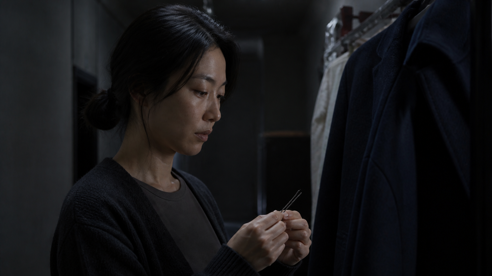

### 最终视频提示词（整段复制）

```text
[场景：后台服装架后，顶灯穿过深色戏服形成真实阴影，衣架轻微摇晃。角色：程青（图中左侧的人），自然肤质和化妆师工作服。镜头：近景，85mm镜头，浅景深，侧面固定机位。动作：程青听见韩泽赶航班后把别针收进掌心，转身快步回化妆间；无对白。]
```

<details><summary>首帧生成提示词</summary>

```text
生成一张16:9横版真人叙事电影单帧 S09，不是插画或三维渲染。场景：服装架后的程青。画面：别针尚未合拢，戏服布料自然垂下。 程青隔着挂起的深色戏服听完，手里的别针停住。。镜头：近景，85mm，浅景深，侧面机位。保留连续性圣经中的人物身份、服装、空间结构、来源明确的灯光和真实物理接触；自然肤质与衣料，不望向摄影机，不出现可读文字、标志、水印、CG、塑料皮肤或摆拍。
```

</details>

## S10｜01:12—01:20｜8秒

- 场景：化妆间工作台抽屉
- 出镜：程青
- 景别／镜头：手部特写，85mm，浅景深，俯拍机位
- 首帧画面：程青拉开抽屉，一封封好的信夹在粉盒下。
- 运动提示：她取出信又停住，指腹压平信封一角。
- 对白／声音：无对白。
- 声场／剪辑：
- 后期备注：信件、台词本及剧场文字均不生成可读内容；保持已审定空间与人物因果。


### 最终视频提示词（整段复制）

```text
[场景：后台化妆间工作台，镜前暖灯照亮抽屉、粉盒和封好的信，信封文字不可读。角色：程青（图中只露手的人）。镜头：手部特写，85mm镜头，浅景深，俯拍固定机位。动作：程青取出信又停住，指腹压平信封一角；无对白。]
```

<details><summary>首帧生成提示词</summary>

```text
生成一张16:9横版真人叙事电影单帧 S10，不是插画或三维渲染。场景：化妆间工作台抽屉。画面：信封仍在抽屉内，纸面文字不可读。 程青拉开抽屉，一封封好的信夹在粉盒下。。镜头：手部特写，85mm，浅景深，俯拍机位。保留连续性圣经中的人物身份、服装、空间结构、来源明确的灯光和真实物理接触；自然肤质与衣料，不望向摄影机，不出现可读文字、标志、水印、CG、塑料皮肤或摆拍。
```

</details>

## S11｜01:20—01:28｜8秒

- 场景：服装架前，开场前最后催场
- 出镜：程青、韩泽
- 景别／镜头：过肩中景，50mm，中等景深，程青肩后机位
- 首帧画面：程青把信塞进韩泽深色戏服内袋，韩泽从画外走近。
- 运动提示：程青迅速放下衣襟，转身面对韩泽。
- 对白／声音：无对白；舞监画外音催场。
- 声场／剪辑：
- 后期备注：信件、台词本及剧场文字均不生成可读内容；保持已审定空间与人物因果。

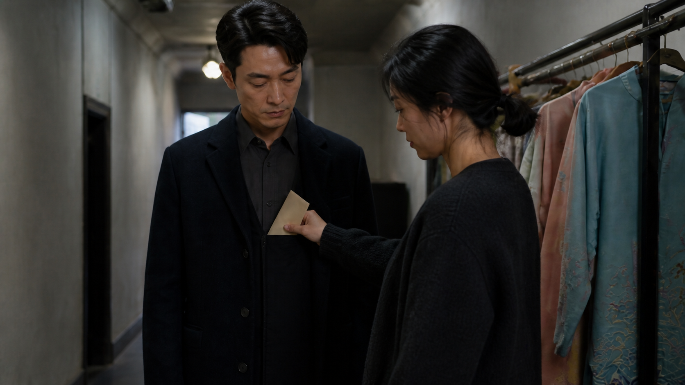

### 最终视频提示词（整段复制）

```text
[场景：开场前的后台服装架，顶灯照亮深色戏服内袋和程青的手，布料褶皱真实。角色：程青（图中前景的人）、韩泽（图中背景刚走近的人）。镜头：过肩中景，50mm镜头，中等景深，程青肩后固定机位。动作：程青把信塞进韩泽戏服内袋后迅速放下衣襟，舞监画外音说“两分钟”。]
```

<details><summary>首帧生成提示词</summary>

```text
生成一张16:9横版真人叙事电影单帧 S11，不是插画或三维渲染。场景：服装架前，开场前最后催场。画面：信刚露出内袋边缘，程青的手还未离开衣料。 程青把信塞进韩泽深色戏服内袋，韩泽从画外走近。。镜头：过肩中景，50mm，中等景深，程青肩后机位。保留连续性圣经中的人物身份、服装、空间结构、来源明确的灯光和真实物理接触；自然肤质与衣料，不望向摄影机，不出现可读文字、标志、水印、CG、塑料皮肤或摆拍。
```

</details>

## S12｜01:28—01:36｜8秒

- 场景：服装架与舞台门之间
- 出镜：韩泽、程青
- 景别／镜头：双人中景，40mm，大景深，眼平机位
- 首帧画面：韩泽已穿好戏服，程青站在他面前却没看内袋。
- 运动提示：韩泽说“程青，辛苦了”，程青答“上场吧”。
- 对白／声音：韩泽：“程青，辛苦了。” 程青：“上场吧。”
- 声场／剪辑：
- 后期备注：信件、台词本及剧场文字均不生成可读内容；保持已审定空间与人物因果。

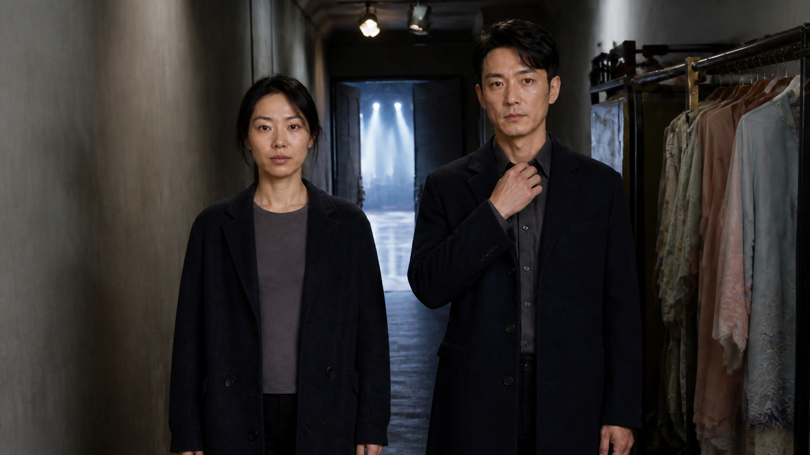

### 最终视频提示词（整段复制）

```text
[场景：后台通往舞台的门前，门内舞台光从远处透来，戏服和墙面保留真实材质。角色：程青（图中左侧的人）、韩泽（图中右侧穿深色戏服的人）。镜头：双人中景，40mm镜头，大景深，眼平固定机位。动作：韩泽对程青说“程青，辛苦了”，程青答“上场吧”，两人都没有提起那封信。]
```

<details><summary>首帧生成提示词</summary>

```text
生成一张16:9横版真人叙事电影单帧 S12，不是插画或三维渲染。场景：服装架与舞台门之间。画面：韩泽一手扶衣领，程青双手自然垂下。 韩泽已穿好戏服，程青站在他面前却没看内袋。。镜头：双人中景，40mm，大景深，眼平机位。保留连续性圣经中的人物身份、服装、空间结构、来源明确的灯光和真实物理接触；自然肤质与衣料，不望向摄影机，不出现可读文字、标志、水印、CG、塑料皮肤或摆拍。
```

</details>

## S13｜01:36—01:44｜8秒

- 场景：舞台侧幕，演出开始
- 出镜：程青、韩泽
- 景别／镜头：侧幕中景，70mm，中等景深，程青身后机位
- 首帧画面：程青站在侧幕暗处，韩泽走向舞台中央聚光灯。
- 运动提示：程青向前半步又停在幕布阴影里。
- 对白／声音：无对白；开场音乐进入。
- 声场／剪辑：
- 后期备注：信件、台词本及剧场文字均不生成可读内容；保持已审定空间与人物因果。

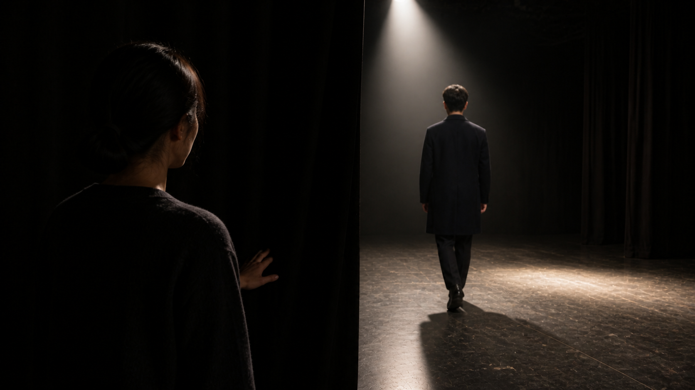

### 最终视频提示词（整段复制）

```text
[场景：演出中的舞台侧幕，侧幕暗处与中央聚光灯形成明确光比，舞台地面真实。角色：程青（图中前景暗处的人）、韩泽（图中远处走向光圈的人）。镜头：侧幕中景，70mm镜头，中等景深，程青身后固定机位。动作：程青向前半步又停在幕布阴影里，韩泽走向舞台中央；无对白。]
```

<details><summary>首帧生成提示词</summary>

```text
生成一张16:9横版真人叙事电影单帧 S13，不是插画或三维渲染。场景：舞台侧幕，演出开始。画面：程青手扶侧幕，韩泽尚未进入光圈。 程青站在侧幕暗处，韩泽走向舞台中央聚光灯。。镜头：侧幕中景，70mm，中等景深，程青身后机位。保留连续性圣经中的人物身份、服装、空间结构、来源明确的灯光和真实物理接触；自然肤质与衣料，不望向摄影机，不出现可读文字、标志、水印、CG、塑料皮肤或摆拍。
```

</details>

## S14｜01:44—01:52｜8秒

- 场景：舞台离别戏，聚光灯中央
- 出镜：韩泽
- 景别／镜头：中景，50mm，中等景深，观众席方向机位
- 首帧画面：韩泽站在聚光灯中央，手中没有道具，侧脸朝向舞台另一端。
- 运动提示：他向画外的戏中对手伸出手又慢慢收回。
- 对白／声音：无对白。
- 声场／剪辑：
- 后期备注：信件、台词本及剧场文字均不生成可读内容；保持已审定空间与人物因果。

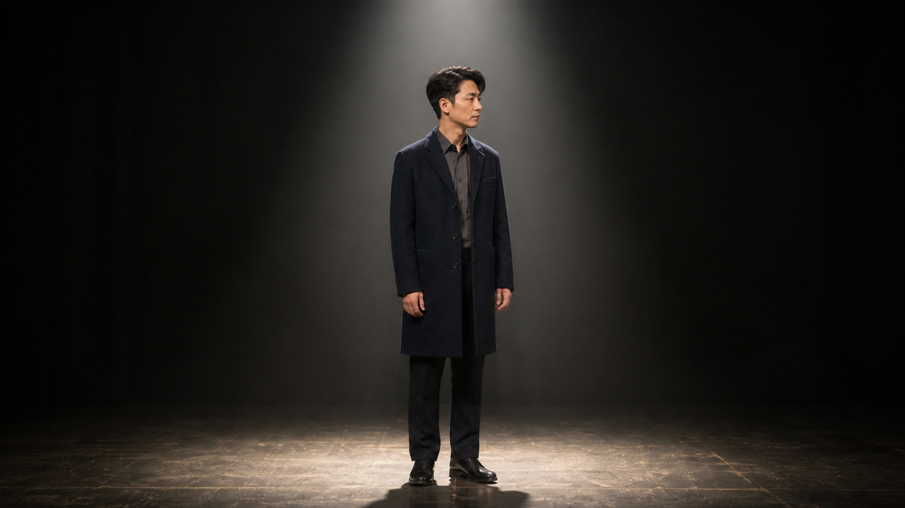

### 最终视频提示词（整段复制）

```text
[场景：小剧场舞台中央，单一聚光灯照亮韩泽，舞台边缘自然沉入黑暗。角色：韩泽（图中中央穿深色戏服的人）。镜头：中景，50mm镜头，中等景深，观众席方向固定机位。动作：韩泽向画外的戏中对手伸出手又慢慢收回；无对白，舞台音乐压低。]
```

<details><summary>首帧生成提示词</summary>

```text
生成一张16:9横版真人叙事电影单帧 S14，不是插画或三维渲染。场景：舞台离别戏，聚光灯中央。画面：韩泽的手尚未抬起，舞台外保持黑暗。 韩泽站在聚光灯中央，手中没有道具，侧脸朝向舞台另一端。。镜头：中景，50mm，中等景深，观众席方向机位。保留连续性圣经中的人物身份、服装、空间结构、来源明确的灯光和真实物理接触；自然肤质与衣料，不望向摄影机，不出现可读文字、标志、水印、CG、塑料皮肤或摆拍。
```

</details>

## S15｜01:52—02:00｜8秒

- 场景：侧幕暗处的程青
- 出镜：程青
- 景别／镜头：近景，85mm，浅景深，侧面机位
- 首帧画面：程青透过幕布缝隙看舞台，手里攥着后台钥匙扣。
- 运动提示：她的拇指摩挲钥匙扣，视线落在韩泽胸前内袋位置。
- 对白／声音：无对白。
- 声场／剪辑：
- 后期备注：信件、台词本及剧场文字均不生成可读内容；保持已审定空间与人物因果。

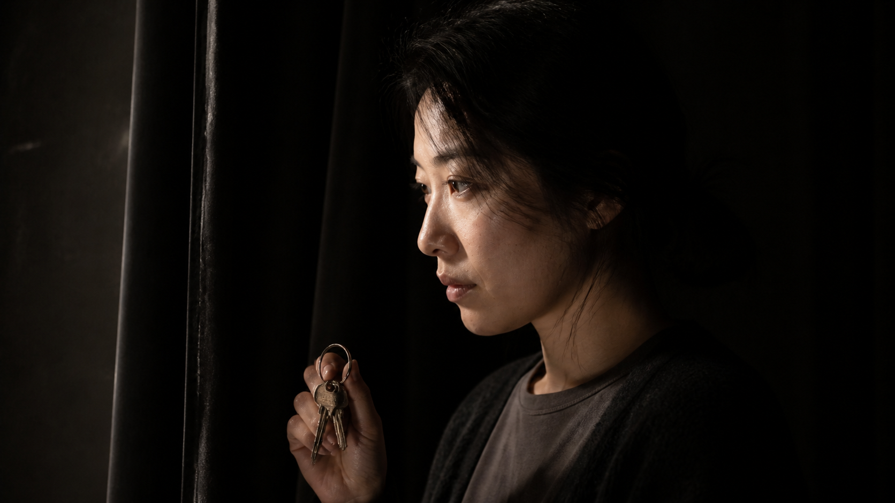

### 最终视频提示词（整段复制）

```text
[场景：舞台侧幕暗处，一道聚光灯从幕布缝隙落在程青侧脸和手中的钥匙扣上。角色：程青（图中中央的人），自然肤质和克制的呼吸。镜头：近景，85mm镜头，浅景深，侧面固定机位。动作：程青摩挲钥匙扣，视线落在韩泽胸前内袋的位置；舞台台词模糊传来。]
```

<details><summary>首帧生成提示词</summary>

```text
生成一张16:9横版真人叙事电影单帧 S15，不是插画或三维渲染。场景：侧幕暗处的程青。画面：钥匙扣被握在手心，侧幕缝隙只有一道光。 程青透过幕布缝隙看舞台，手里攥着后台钥匙扣。。镜头：近景，85mm，浅景深，侧面机位。保留连续性圣经中的人物身份、服装、空间结构、来源明确的灯光和真实物理接触；自然肤质与衣料，不望向摄影机，不出现可读文字、标志、水印、CG、塑料皮肤或摆拍。
```

</details>

## S16｜02:00—02:08｜8秒

- 场景：舞台离别戏末段
- 出镜：韩泽
- 景别／镜头：近景，85mm，浅景深，舞台侧前方机位
- 首帧画面：韩泽在聚光灯下停住，眼睛看向戏中对手所在方向。
- 运动提示：他清楚地说“再见”，灯光开始缓慢收窄。
- 对白／声音：韩泽：“再见。”
- 声场／剪辑：
- 后期备注：信件、台词本及剧场文字均不生成可读内容；保持已审定空间与人物因果。

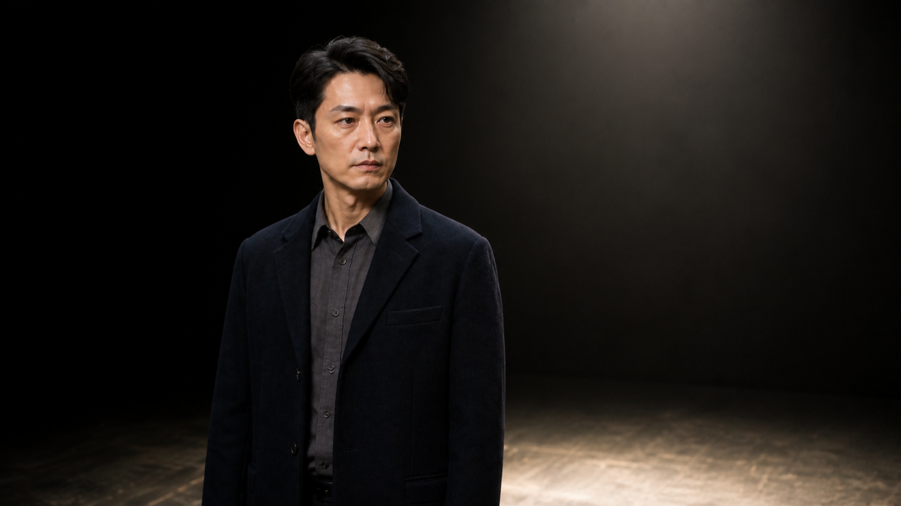

### 最终视频提示词（整段复制）

```text
[场景：小剧场舞台离别戏末段，聚光灯有来源地照亮韩泽，背景舞台自然失焦。角色：韩泽（图中中央的人）。镜头：近景，85mm镜头，浅景深，舞台侧前方固定机位。动作：韩泽对戏中对手所在方向清楚地说“再见”，聚光灯开始缓慢收窄。]
```

<details><summary>首帧生成提示词</summary>

```text
生成一张16:9横版真人叙事电影单帧 S16，不是插画或三维渲染。场景：舞台离别戏末段。画面：韩泽嘴唇未张开，聚光灯仍完整覆盖他。 韩泽在聚光灯下停住，眼睛看向戏中对手所在方向。。镜头：近景，85mm，浅景深，舞台侧前方机位。保留连续性圣经中的人物身份、服装、空间结构、来源明确的灯光和真实物理接触；自然肤质与衣料，不望向摄影机，不出现可读文字、标志、水印、CG、塑料皮肤或摆拍。
```

</details>

## S17｜02:08—02:16｜8秒

- 场景：侧幕后方
- 出镜：程青
- 景别／镜头：近景，65mm，浅景深，反打机位
- 首帧画面：程青听见“再见”后闭了一下眼，侧幕光在她脸上掠过。
- 运动提示：她睁眼后转身快步走向后台。
- 对白／声音：无对白。
- 声场／剪辑：
- 后期备注：信件、台词本及剧场文字均不生成可读内容；保持已审定空间与人物因果。

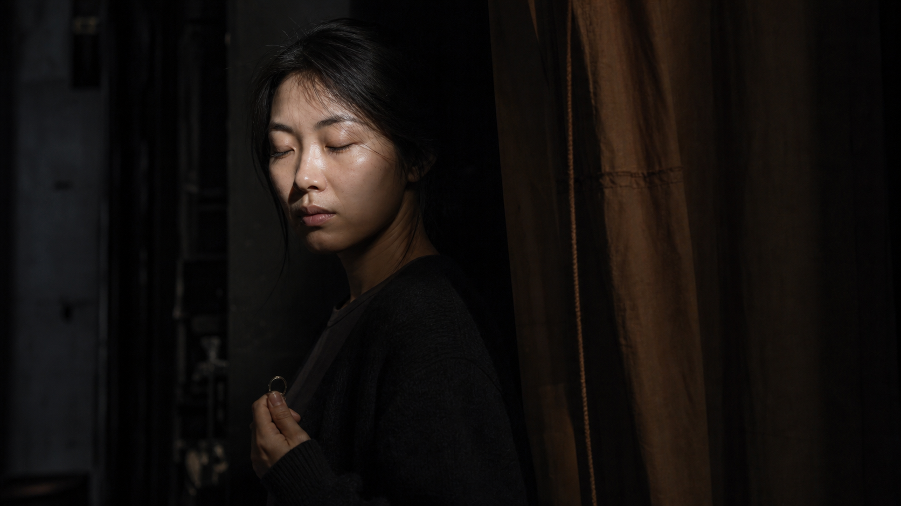

### 最终视频提示词（整段复制）

```text
[场景：舞台侧幕后方，聚光灯余光从侧面掠过程青的脸，后台保持真实暗部。角色：程青（图中中央的人）。镜头：近景，65mm镜头，浅景深，反打固定机位。动作：程青听见舞台上的“再见”后闭一下眼，再转身快步走向后台；掌声开始进入。]
```

<details><summary>首帧生成提示词</summary>

```text
生成一张16:9横版真人叙事电影单帧 S17，不是插画或三维渲染。场景：侧幕后方。画面：程青尚未转身，手仍握钥匙扣。 程青听见“再见”后闭了一下眼，侧幕光在她脸上掠过。。镜头：近景，65mm，浅景深，反打机位。保留连续性圣经中的人物身份、服装、空间结构、来源明确的灯光和真实物理接触；自然肤质与衣料，不望向摄影机，不出现可读文字、标志、水印、CG、塑料皮肤或摆拍。
```

</details>

## S18｜02:16—02:24｜8秒

- 场景：散场后的化妆间外
- 出镜：程青
- 景别／镜头：中景，40mm，大景深，固定机位
- 首帧画面：程青在仍亮着的化妆镜前等候，韩泽的空椅子朝向镜面。
- 运动提示：她把工具一件件排齐，却不离开椅子附近。
- 对白／声音：无对白。
- 声场／剪辑：
- 后期备注：信件、台词本及剧场文字均不生成可读内容；保持已审定空间与人物因果。

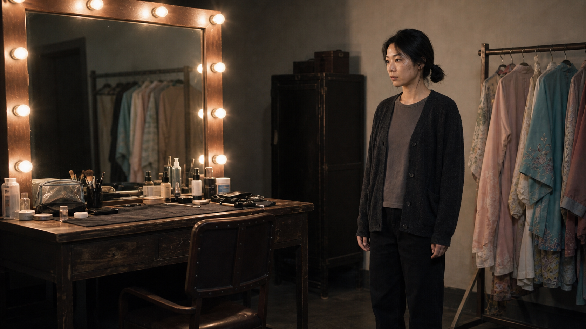

### 最终视频提示词（整段复制）

```text
[场景：散场后的后台化妆间，化妆镜暖灯仍亮着，韩泽的空椅子与真实工作台清晰可见。角色：程青（图中右侧的人）。镜头：中景，40mm镜头，大景深，固定机位。动作：程青把化妆工具一件件排齐，却始终不离开韩泽的空椅子；无对白，掌声渐弱。]
```

<details><summary>首帧生成提示词</summary>

```text
生成一张16:9横版真人叙事电影单帧 S18，不是插画或三维渲染。场景：散场后的化妆间外。画面：工具散在台面，空椅子没有人坐。 程青在仍亮着的化妆镜前等候，韩泽的空椅子朝向镜面。。镜头：中景，40mm，大景深，固定机位。保留连续性圣经中的人物身份、服装、空间结构、来源明确的灯光和真实物理接触；自然肤质与衣料，不望向摄影机，不出现可读文字、标志、水印、CG、塑料皮肤或摆拍。
```

</details>

## S19｜02:24—02:32｜8秒

- 场景：后台走廊，舞台灯逐盏熄灭
- 出镜：程青
- 景别／镜头：大全景，35mm，大景深，固定机位
- 首帧画面：程青站在走廊尽头，灯光从远到近熄灭，服装架空了一角。
- 运动提示：她听见脚步回声，转头望向后门方向。
- 对白／声音：无对白。
- 声场／剪辑：
- 后期备注：信件、台词本及剧场文字均不生成可读内容；保持已审定空间与人物因果。

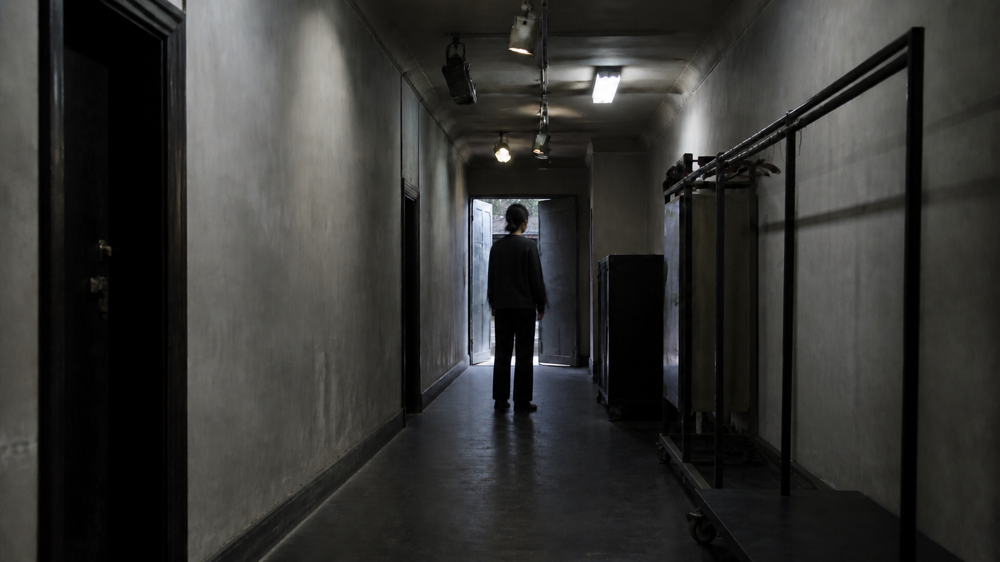

### 最终视频提示词（整段复制）

```text
[场景：散场后的剧场后台走廊，顶灯从远处逐盏熄灭，旧墙面和服装架材质可信。角色：程青（图中中央背对镜头的人）。镜头：大全景，35mm镜头，大景深，固定机位。动作：程青听见脚步回声后转头望向后门方向；无对白。]
```

<details><summary>首帧生成提示词</summary>

```text
生成一张16:9横版真人叙事电影单帧 S19，不是插画或三维渲染。场景：后台走廊，舞台灯逐盏熄灭。画面：走廊仍有三盏灯亮着，程青背对镜头。 程青站在走廊尽头，灯光从远到近熄灭，服装架空了一角。。镜头：大全景，35mm，大景深，固定机位。保留连续性圣经中的人物身份、服装、空间结构、来源明确的灯光和真实物理接触；自然肤质与衣料，不望向摄影机，不出现可读文字、标志、水印、CG、塑料皮肤或摆拍。
```

</details>

## S20｜02:32—02:40｜8秒

- 场景：后台走廊转角，助理从后门方向独自返回
- 出镜：剧团助理、程青
- 景别／镜头：中景，50mm，中等景深，侧面机位
- 首帧画面：剧团助理独自抱着韩泽换下的深色戏服走来，程青迎上去。
- 运动提示：助理把戏服递向程青，说明韩泽刚坐后门外的车去机场。
- 对白／声音：助理：“韩泽刚坐车去机场了。”
- 声场／剪辑：
- 后期备注：信件、台词本及剧场文字均不生成可读内容；保持已审定空间与人物因果。

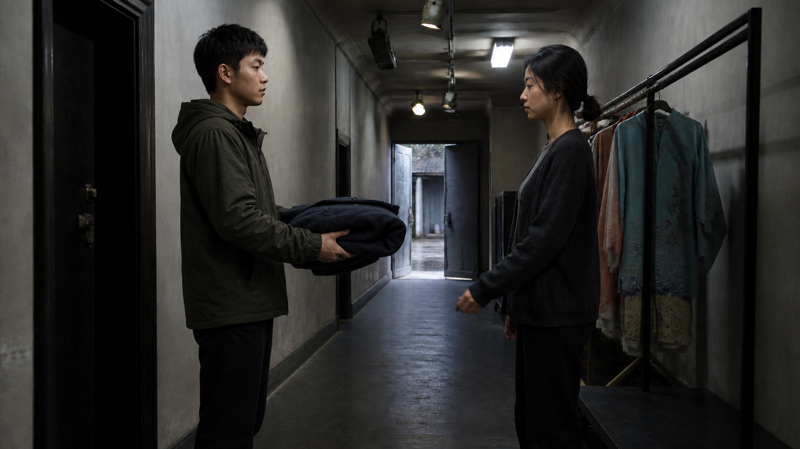

### 最终视频提示词（整段复制）

```text
[场景：散场后的剧场后台走廊，顶灯照亮剧团助理怀中的深色戏服，远处传来后门外的雨声。角色：剧团助理（图中左侧独自返回的人）、程青（图中右侧迎上来的人）。镜头：中景，50mm镜头，中等景深，侧面固定机位。动作：助理把戏服递向程青，对她说“韩泽刚坐车去机场了”；助理留在后台，程青伸手去接。]
```

<details><summary>首帧生成提示词</summary>

```text
生成一张16:9横版真人叙事电影单帧 S20，不是插画或三维渲染。场景：后台走廊转角，助理从后门方向独自返回。画面：戏服仍在助理手臂上，程青的手尚未接住，助理身后没有车辆。 剧团助理独自抱着韩泽换下的深色戏服走来，程青迎上去。。镜头：中景，50mm，中等景深，侧面机位。保留连续性圣经中的人物身份、服装、空间结构、来源明确的灯光和真实物理接触；自然肤质与衣料，不望向摄影机，不出现可读文字、标志、水印、CG、塑料皮肤或摆拍。
```

</details>

## S21｜02:40—02:48｜8秒

- 场景：后台走廊的戏服与双手
- 出镜：程青、剧团助理
- 景别／镜头：手部近景，85mm，浅景深，俯拍机位
- 首帧画面：程青接住戏服，内袋在衣料折叠中朝下。
- 运动提示：一封信从内袋滑出，落到她鞋尖前。
- 对白／声音：无对白。
- 声场／剪辑：
- 后期备注：信件、台词本及剧场文字均不生成可读内容；保持已审定空间与人物因果。


### 最终视频提示词（整段复制）

```text
[场景：后台走廊，顶灯照亮深色戏服、程青的手和地面短阴影，信封文字不可读。角色：程青（图中右侧只露手的人）、剧团助理（图中左侧只露手的人）。镜头：手部近景，85mm镜头，浅景深，俯拍固定机位。动作：程青接住戏服时，一封信从内袋滑出落到她鞋尖前；纸张与地面接触真实。]
```

<details><summary>首帧生成提示词</summary>

```text
生成一张16:9横版真人叙事电影单帧 S21，不是插画或三维渲染。场景：后台走廊的戏服与双手。画面：信封露在内袋边缘，尚未落下，文字不可读。 程青接住戏服，内袋在衣料折叠中朝下。。镜头：手部近景，85mm，浅景深，俯拍机位。保留连续性圣经中的人物身份、服装、空间结构、来源明确的灯光和真实物理接触；自然肤质与衣料，不望向摄影机，不出现可读文字、标志、水印、CG、塑料皮肤或摆拍。
```

</details>

## S22｜02:48—02:56｜8秒

- 场景：后台走廊地面
- 出镜：程青
- 景别／镜头：近景，65mm，浅景深，低机位
- 首帧画面：程青蹲在未拆封的信前，戏服堆在她手臂上。
- 运动提示：她捡起信，发现封口完整，呼吸停住。
- 对白／声音：无对白。
- 声场／剪辑：
- 后期备注：信件、台词本及剧场文字均不生成可读内容；保持已审定空间与人物因果。

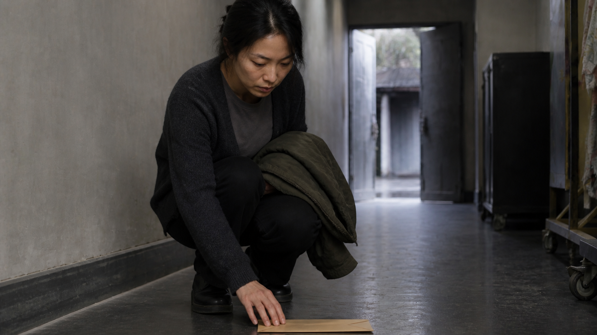

### 最终视频提示词（整段复制）

```text
[场景：散场后台走廊，顶灯照亮地面的未拆封信与深色戏服，雨声从后门方向传来。角色：程青（图中中央蹲着的人）。镜头：近景，65mm镜头，浅景深，低机位。动作：程青捡起未拆封的信，发现封口完整后呼吸停住；无对白。]
```

<details><summary>首帧生成提示词</summary>

```text
生成一张16:9横版真人叙事电影单帧 S22，不是插画或三维渲染。场景：后台走廊地面。画面：信平放在地面，程青的指尖停在纸边。 程青蹲在未拆封的信前，戏服堆在她手臂上。。镜头：近景，65mm，浅景深，低机位。保留连续性圣经中的人物身份、服装、空间结构、来源明确的灯光和真实物理接触；自然肤质与衣料，不望向摄影机，不出现可读文字、标志、水印、CG、塑料皮肤或摆拍。
```

</details>

## S23｜02:56—03:04｜8秒

- 场景：后台走廊与同一扇后门之间
- 出镜：程青、剧团助理
- 景别／镜头：中景，40mm，大景深，手持跟机
- 首帧画面：程青抱着信转向同一扇后门，助理留在走廊内抱着戏服站在原地。
- 运动提示：程青问“车刚走吗”，助理点头，程青立刻沿走廊跑向后门。
- 对白／声音：程青：“车刚走吗？”
- 声场／剪辑：
- 后期备注：信件、台词本及剧场文字均不生成可读内容；保持已审定空间与人物因果。

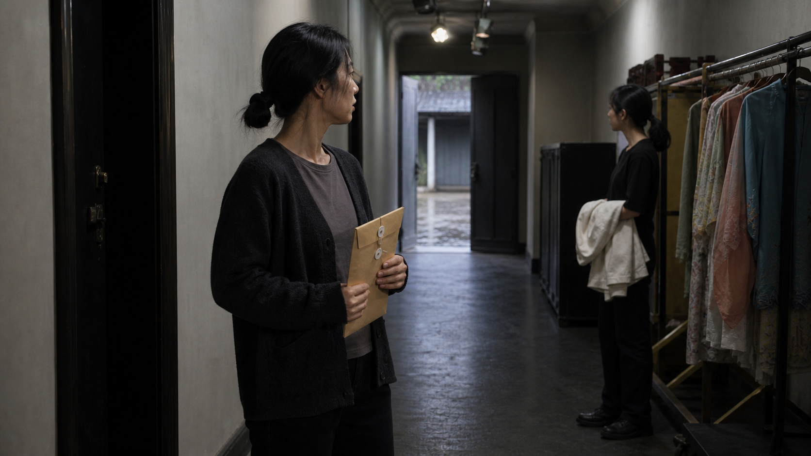

### 最终视频提示词（整段复制）

```text
[场景：剧场后台通往同一扇后门的走廊，冷顶灯与门外雨夜反光形成真实光线。角色：程青（图中前景转身的人）、剧团助理（图中后方留在后台的人）。镜头：中景，40mm镜头，大景深，轻微手持跟机。动作：程青问“车刚走吗”，助理点头，程青抱着信沿走廊立刻跑向后门；助理没有跟随。]
```

<details><summary>首帧生成提示词</summary>

```text
生成一张16:9横版真人叙事电影单帧 S23，不是插画或三维渲染。场景：后台走廊与同一扇后门之间。画面：程青身体已前倾，后门外只有雨夜反光，助理没有跟随。 程青抱着信转向同一扇后门，助理留在走廊内抱着戏服站在原地。。镜头：中景，40mm，大景深，手持跟机。保留连续性圣经中的人物身份、服装、空间结构、来源明确的灯光和真实物理接触；自然肤质与衣料，不望向摄影机，不出现可读文字、标志、水印、CG、塑料皮肤或摆拍。
```

</details>

## S24｜03:04—03:12｜8秒

- 场景：剧场后门内侧
- 出镜：程青
- 景别／镜头：中景，35mm，大景深，侧后方机位
- 首帧画面：程青一手按住信，一手抓着后门把手，雨水反光从门缝涌入。
- 运动提示：她推开后门冲进雨声。
- 对白／声音：无对白。
- 声场／剪辑：
- 后期备注：信件、台词本及剧场文字均不生成可读内容；保持已审定空间与人物因果。

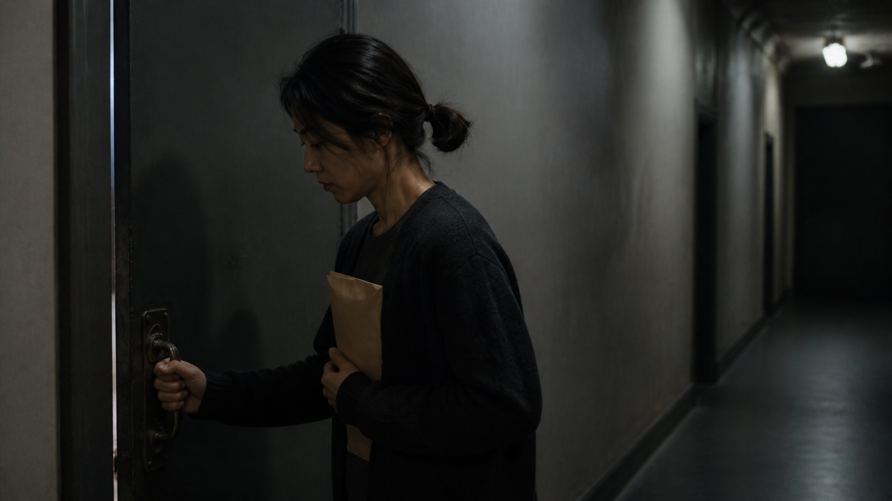

### 最终视频提示词（整段复制）

```text
[场景：剧场后门内侧，冷雨夜反光从门缝照入，旧门把和地面水迹真实。角色：程青（图中中央的人），手里护着信。镜头：中景，35mm镜头，大景深，侧后方固定机位。动作：程青一手按住信一手推开后门，冲进雨声；门锁和衣料受力自然。]
```

<details><summary>首帧生成提示词</summary>

```text
生成一张16:9横版真人叙事电影单帧 S24，不是插画或三维渲染。场景：剧场后门内侧。画面：门仍关着，程青重心压向前方，信贴在胸前。 程青一手按住信，一手抓着后门把手，雨水反光从门缝涌入。。镜头：中景，35mm，大景深，侧后方机位。保留连续性圣经中的人物身份、服装、空间结构、来源明确的灯光和真实物理接触；自然肤质与衣料，不望向摄影机，不出现可读文字、标志、水印、CG、塑料皮肤或摆拍。
```

</details>

## S25｜03:12—03:20｜8秒

- 场景：同一剧场后门外的雨巷
- 出镜：程青
- 景别／镜头：大全景，35mm，大景深，后门内向外机位
- 首帧画面：程青站在屋檐边，韩泽刚乘走的机场车红尾灯已在湿路尽头。
- 运动提示：她跨出屋檐追两步，抬手却停住。
- 对白／声音：无对白。
- 声场／剪辑：
- 后期备注：信件、台词本及剧场文字均不生成可读内容；保持已审定空间与人物因果。

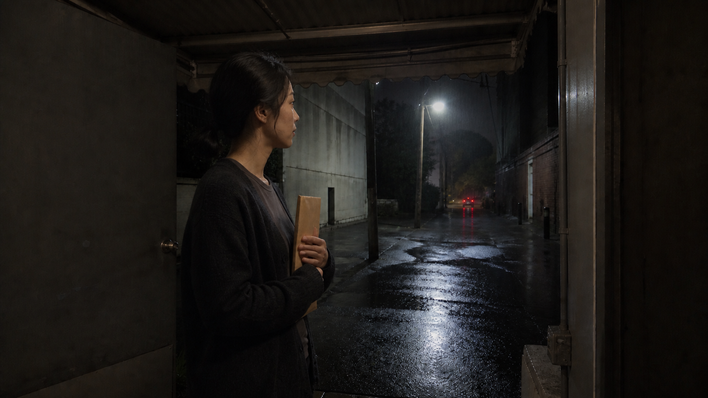

### 最终视频提示词（整段复制）

```text
[场景：同一扇剧场后门外的雨夜巷道，屋檐、湿路和韩泽机场车的远处红尾灯有真实反射，雨水来源明确。角色：程青（图中前景屋檐下的人）。镜头：大全景，35mm镜头，大景深，从后门内向外固定机位。动作：程青跨出屋檐追两步，向韩泽远去的机场车抬手却停住；无对白。]
```

<details><summary>首帧生成提示词</summary>

```text
生成一张16:9横版真人叙事电影单帧 S25，不是插画或三维渲染。场景：同一剧场后门外的雨巷。画面：程青尚未离开屋檐，韩泽机场车的红尾灯在远处湿路反射中。 程青站在屋檐边，韩泽刚乘走的机场车红尾灯已在湿路尽头。。镜头：大全景，35mm，大景深，后门内向外机位。保留连续性圣经中的人物身份、服装、空间结构、来源明确的灯光和真实物理接触；自然肤质与衣料，不望向摄影机，不出现可读文字、标志、水印、CG、塑料皮肤或摆拍。
```

</details>

## S26｜03:20—03:28｜8秒

- 场景：雨巷路边
- 出镜：程青
- 景别／镜头：中近景，65mm，浅景深，侧面机位
- 首帧画面：程青站在雨里，信的一角被打湿，红尾灯正在转弯处消失。
- 运动提示：她把湿信护回胸前，放下抬起的手。
- 对白／声音：无对白。
- 声场／剪辑：
- 后期备注：信件、台词本及剧场文字均不生成可读内容；保持已审定空间与人物因果。

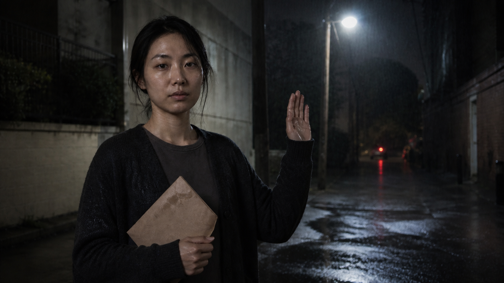

### 最终视频提示词（整段复制）

```text
[场景：雨夜剧场外路边，路灯照亮程青、湿信角和积水，远处尾灯正在消失。角色：程青（图中中央的人），雨水落在普通工作服上但不夸张。镜头：中近景，65mm镜头，浅景深，侧面固定机位。动作：程青把被雨打湿一角的信护回胸前，放下原本抬起的手；无对白。]
```

<details><summary>首帧生成提示词</summary>

```text
生成一张16:9横版真人叙事电影单帧 S26，不是插画或三维渲染。场景：雨巷路边。画面：程青的手仍抬在半空，信封边缘微湿。 程青站在雨里，信的一角被打湿，红尾灯正在转弯处消失。。镜头：中近景，65mm，浅景深，侧面机位。保留连续性圣经中的人物身份、服装、空间结构、来源明确的灯光和真实物理接触；自然肤质与衣料，不望向摄影机，不出现可读文字、标志、水印、CG、塑料皮肤或摆拍。
```

</details>

## S27｜03:28—03:36｜8秒

- 场景：韩泽机场车驶离的雨巷尽头
- 出镜：无出镜人物
- 景别／镜头：长焦远景，85mm，中等景深，静止机位
- 首帧画面：韩泽机场车的红色尾灯在雨幕和路面反光中消失，空巷只剩雨线。
- 运动提示：尾灯转过街角完全看不见。
- 对白／声音：无出镜人物，无对白。
- 声场／剪辑：
- 后期备注：信件、台词本及剧场文字均不生成可读内容；保持已审定空间与人物因果。

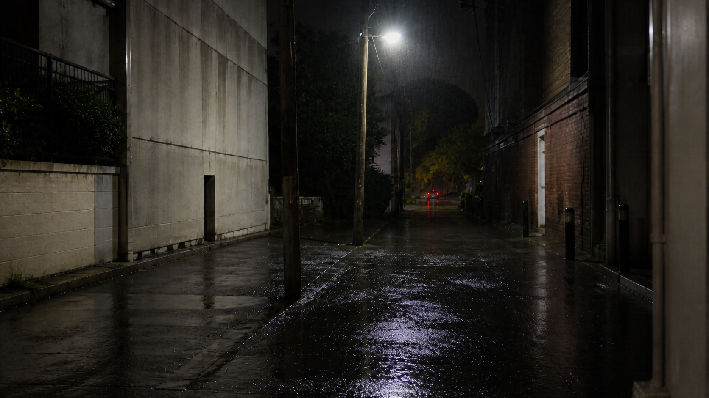

### 最终视频提示词（整段复制）

```text
[场景：剧场同一后门外的雨夜空巷，路灯照亮湿路和雨线，韩泽机场车的红色尾灯在远处反射中将要转弯消失。角色：无出镜人物。镜头：长焦远景，85mm镜头，中等景深，静止机位。动作：韩泽机场车的红色尾灯转过街角完全看不见，空巷只剩雨声和远处飞机掠过声。]
```

<details><summary>首帧生成提示词</summary>

```text
生成一张16:9横版真人叙事电影单帧 S27，不是插画或三维渲染。场景：韩泽机场车驶离的雨巷尽头。画面：韩泽机场车的尾灯尚在画面最远处，路面水流向下水口。 韩泽机场车的红色尾灯在雨幕和路面反光中消失，空巷只剩雨线。。镜头：长焦远景，85mm，中等景深，静止机位。保留连续性圣经中的人物身份、服装、空间结构、来源明确的灯光和真实物理接触；自然肤质与衣料，不望向摄影机，不出现可读文字、标志、水印、CG、塑料皮肤或摆拍。
```

</details>

## S28｜03:36—03:44｜8秒

- 场景：剧场后门内侧
- 出镜：程青
- 景别／镜头：近景，50mm，浅景深，正面机位
- 首帧画面：程青回到门内，雨水从发梢滴下，信被她夹在掌心。
- 运动提示：她关上后门，靠在门板上缓慢吐气。
- 对白／声音：无对白。
- 声场／剪辑：
- 后期备注：信件、台词本及剧场文字均不生成可读内容；保持已审定空间与人物因果。

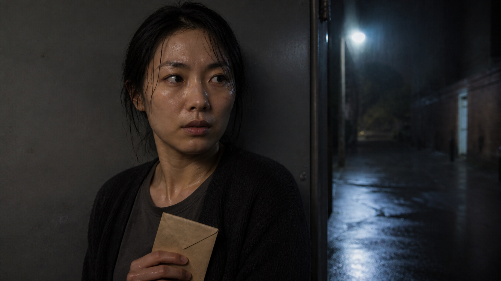

### 最终视频提示词（整段复制）

```text
[场景：剧场后门内侧，门外雨夜冷光和门内走廊顶灯照亮程青湿发与手中的信。角色：程青（图中中央的人）。镜头：近景，50mm镜头，浅景深，正面固定机位。动作：程青关上后门，靠在门板上缓慢吐气；信始终没有被放下，无对白。]
```

<details><summary>首帧生成提示词</summary>

```text
生成一张16:9横版真人叙事电影单帧 S28，不是插画或三维渲染。场景：剧场后门内侧。画面：门仍半开，程青肩膀紧绷，信没有被打开。 程青回到门内，雨水从发梢滴下，信被她夹在掌心。。镜头：近景，50mm，浅景深，正面机位。保留连续性圣经中的人物身份、服装、空间结构、来源明确的灯光和真实物理接触；自然肤质与衣料，不望向摄影机，不出现可读文字、标志、水印、CG、塑料皮肤或摆拍。
```

</details>

## S29｜03:44—03:52｜8秒

- 场景：从后台通往空舞台的侧幕
- 出镜：程青
- 景别／镜头：中景，40mm，大景深，后方跟拍机位
- 首帧画面：程青穿过已熄灯的后台，前方舞台门留一道微光。
- 运动提示：她握紧信，朝舞台门走去。
- 对白／声音：无对白。
- 声场／剪辑：
- 后期备注：信件、台词本及剧场文字均不生成可读内容；保持已审定空间与人物因果。

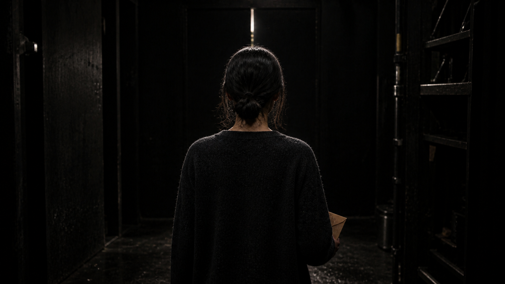

### 最终视频提示词（整段复制）

```text
[场景：散场后通往空舞台的后台走廊，顶灯已经熄灭，舞台门边有一条微光。角色：程青（图中中央背对镜头的人），湿发和工作服状态连续。镜头：中景，40mm镜头，大景深，后方固定机位。动作：程青握紧信，朝舞台门走去；无对白，脚步在空走廊回响。]
```

<details><summary>首帧生成提示词</summary>

```text
生成一张16:9横版真人叙事电影单帧 S29，不是插画或三维渲染。场景：从后台通往空舞台的侧幕。画面：程青站在暗走廊中央，舞台门仍关闭。 程青穿过已熄灯的后台，前方舞台门留一道微光。。镜头：中景，40mm，大景深，后方跟拍机位。保留连续性圣经中的人物身份、服装、空间结构、来源明确的灯光和真实物理接触；自然肤质与衣料，不望向摄影机，不出现可读文字、标志、水印、CG、塑料皮肤或摆拍。
```

</details>

## S30｜03:52—04:00｜8秒

- 场景：散场后的空舞台侧幕
- 出镜：程青
- 景别／镜头：大全景，35mm，大景深，侧幕后机位
- 首帧画面：空舞台没有观众，韩泽曾站过的位置仍在黑暗中央。
- 运动提示：程青走到光控台旁，停在开关前。
- 对白／声音：无对白。
- 声场／剪辑：
- 后期备注：信件、台词本及剧场文字均不生成可读内容；保持已审定空间与人物因果。

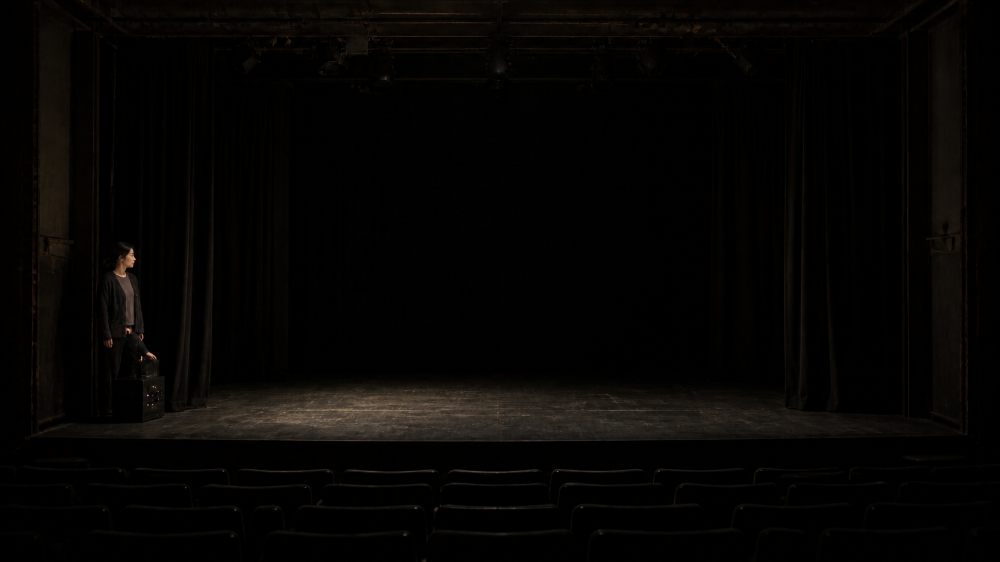

### 最终视频提示词（整段复制）

```text
[场景：散场后的空舞台，观众席全暗，侧幕旁的光控台和舞台地板有真实旧剧场质感。角色：程青（图中左侧的人）。镜头：大全景，35mm镜头，大景深，侧幕后固定机位。动作：程青走到光控台旁，停在开关前，望向韩泽曾站过的黑暗位置；无对白。]
```

<details><summary>首帧生成提示词</summary>

```text
生成一张16:9横版真人叙事电影单帧 S30，不是插画或三维渲染。场景：散场后的空舞台侧幕。画面：程青手离开关半寸，舞台没有灯亮。 空舞台没有观众，韩泽曾站过的位置仍在黑暗中央。。镜头：大全景，35mm，大景深，侧幕后机位。保留连续性圣经中的人物身份、服装、空间结构、来源明确的灯光和真实物理接触；自然肤质与衣料，不望向摄影机，不出现可读文字、标志、水印、CG、塑料皮肤或摆拍。
```

</details>

## S31｜04:00—04:08｜8秒

- 场景：空舞台的光控台
- 出镜：程青
- 景别／镜头：手部近景，65mm，浅景深，侧面机位
- 首帧画面：程青的手停在一盏聚光灯开关前，另一手握着信。
- 运动提示：她按下开关，聚光灯在舞台中央亮起。
- 对白／声音：无对白。
- 声场／剪辑：
- 后期备注：信件、台词本及剧场文字均不生成可读内容；保持已审定空间与人物因果。

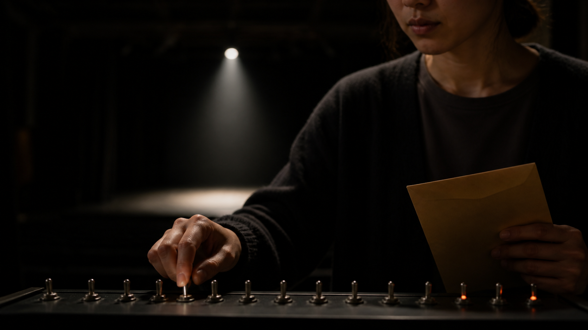

### 最终视频提示词（整段复制）

```text
[场景：空舞台侧幕的光控台，后台微光照亮程青的手、开关和带湿痕的信。角色：程青（图中只露手的人）。镜头：手部近景，65mm镜头，浅景深，侧面固定机位。动作：程青按下聚光灯开关，舞台中央亮起一束光；开关与手指接触真实，无对白。]
```

<details><summary>首帧生成提示词</summary>

```text
生成一张16:9横版真人叙事电影单帧 S31，不是插画或三维渲染。场景：空舞台的光控台。画面：开关尚未按下，舞台中心仍黑，信封有湿痕。 程青的手停在一盏聚光灯开关前，另一手握着信。。镜头：手部近景，65mm，浅景深，侧面机位。保留连续性圣经中的人物身份、服装、空间结构、来源明确的灯光和真实物理接触；自然肤质与衣料，不望向摄影机，不出现可读文字、标志、水印、CG、塑料皮肤或摆拍。
```

</details>

## S32｜04:08—04:16｜8秒

- 场景：空舞台中央的聚光灯边缘
- 出镜：程青
- 景别／镜头：中景，50mm，中等景深，观众席方向机位
- 首帧画面：程青站在聚光灯边缘，身体朝向韩泽原先站过的中心位置。
- 运动提示：她展开信，朝那片空光读“我记得你每次描眉时闭眼的安静”。
- 对白／声音：程青：“我记得你每次描眉时闭眼的安静。”
- 声场／剪辑：
- 后期备注：信件、台词本及剧场文字均不生成可读内容；保持已审定空间与人物因果。

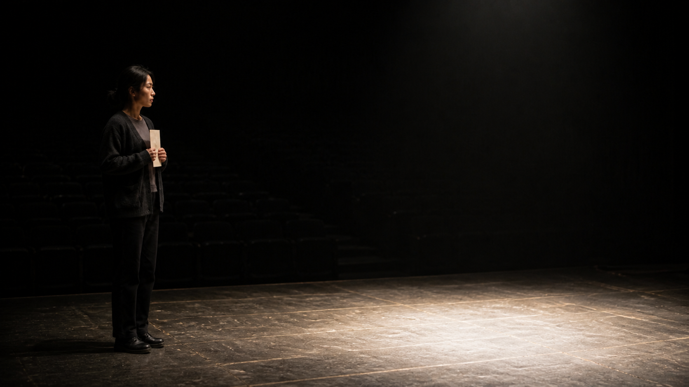

### 最终视频提示词（整段复制）

```text
[场景：空舞台中央，单一聚光灯照亮程青与韩泽曾站过的空光圈，观众席完全空着。角色：程青（图中左侧的人）。镜头：中景，50mm镜头，中等景深，观众席方向固定机位。动作：程青展开信，朝韩泽曾站过的空光圈读“我记得你每次描眉时闭眼的安静”；信中文字不可读。]
```

<details><summary>首帧生成提示词</summary>

```text
生成一张16:9横版真人叙事电影单帧 S32，不是插画或三维渲染。场景：空舞台中央的聚光灯边缘。画面：信仍折叠在程青手中，聚光灯中心无人，程青目光朝向中心。 程青站在聚光灯边缘，身体朝向韩泽原先站过的中心位置。。镜头：中景，50mm，中等景深，观众席方向机位。保留连续性圣经中的人物身份、服装、空间结构、来源明确的灯光和真实物理接触；自然肤质与衣料，不望向摄影机，不出现可读文字、标志、水印、CG、塑料皮肤或摆拍。
```

</details>

## S33｜04:16—04:23｜7秒

- 场景：聚光灯下的程青侧脸
- 出镜：程青
- 景别／镜头：近景，85mm，浅景深，侧面机位
- 首帧画面：程青的目光越过信纸，仍落在舞台中央那片空光。
- 运动提示：她读“我不想再把喜欢藏在工作里”。
- 对白／声音：程青：“我不想再把喜欢藏在工作里。”
- 声场／剪辑：
- 后期备注：信件、台词本及剧场文字均不生成可读内容；保持已审定空间与人物因果。

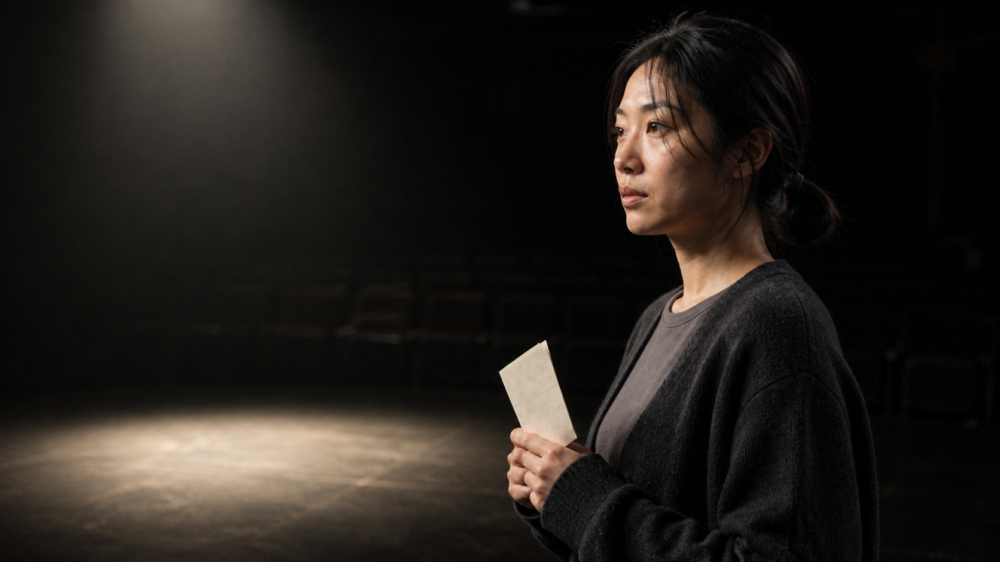

### 最终视频提示词（整段复制）

```text
[场景：空舞台聚光灯下，舞台中央明亮而观众席保持自然黑暗，远处雨声轻微。角色：程青（图中中央的人），自然肤质和湿发状态连续。镜头：近景，85mm镜头，浅景深，侧面固定机位，对焦在程青的眼睛。动作：程青越过信纸看向韩泽曾站过的空光圈，读“我不想再把喜欢藏在工作里”。]
```

<details><summary>首帧生成提示词</summary>

```text
生成一张16:9横版真人叙事电影单帧 S33，不是插画或三维渲染。场景：聚光灯下的程青侧脸。画面：程青尚未开口，信纸停在胸前，眼神不看镜头。 程青的目光越过信纸，仍落在舞台中央那片空光。。镜头：近景，85mm，浅景深，侧面机位。保留连续性圣经中的人物身份、服装、空间结构、来源明确的灯光和真实物理接触；自然肤质与衣料，不望向摄影机，不出现可读文字、标志、水印、CG、塑料皮肤或摆拍。
```

</details>

## S34｜04:23—04:30｜7秒

- 场景：程青望向舞台中央的空光圈
- 出镜：程青
- 景别／镜头：过肩中景，50mm，中等景深，程青肩后机位
- 首帧画面：程青肩后可见空观众席，但画面中心是韩泽曾站过的聚光灯空位。
- 运动提示：她向那片空光轻声读“祝你一路顺利”。
- 对白／声音：程青：“祝你一路顺利。”
- 声场／剪辑：
- 后期备注：信件、台词本及剧场文字均不生成可读内容；保持已审定空间与人物因果。


### 最终视频提示词（整段复制）

```text
[场景：空舞台中央的聚光灯空位，空观众席只在背景暗处，光圈内没有听众。角色：程青（图中前景背对镜头的人）。镜头：过肩中景，50mm镜头，中等景深，程青肩后固定机位。动作：程青向韩泽曾站过的空光圈轻声读“祝你一路顺利”，读完不立刻低头。]
```

<details><summary>首帧生成提示词</summary>

```text
生成一张16:9横版真人叙事电影单帧 S34，不是插画或三维渲染。场景：程青望向舞台中央的空光圈。画面：程青还未抬头，聚光灯中心无人，空座椅只在背景。 程青肩后可见空观众席，但画面中心是韩泽曾站过的聚光灯空位。。镜头：过肩中景，50mm，中等景深，程青肩后机位。保留连续性圣经中的人物身份、服装、空间结构、来源明确的灯光和真实物理接触；自然肤质与衣料，不望向摄影机，不出现可读文字、标志、水印、CG、塑料皮肤或摆拍。
```

</details>

## S35｜04:30—04:37｜7秒

- 场景：聚光灯内的程青与信
- 出镜：程青
- 景别／镜头：近景，65mm，浅景深，正面略侧机位
- 首帧画面：程青站在光圈边缘，湿信角贴着她的指腹，面向韩泽曾站过的中心。
- 运动提示：她继续读“我会想念你”，随后把信从胸前放低。
- 对白／声音：程青：“我会想念你。”
- 声场／剪辑：
- 后期备注：信件、台词本及剧场文字均不生成可读内容；保持已审定空间与人物因果。

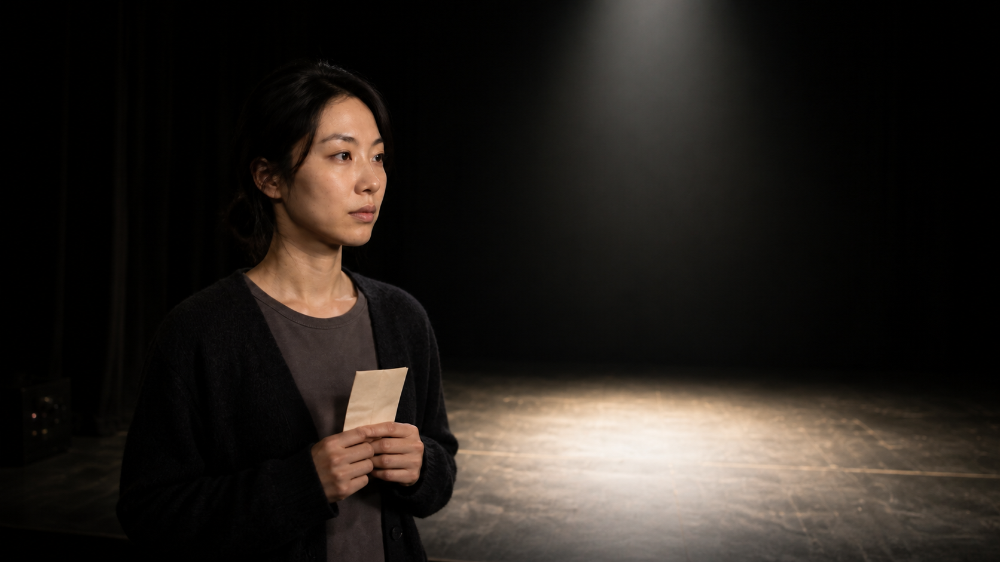

### 最终视频提示词（整段复制）

```text
[场景：空舞台聚光灯内，程青与带湿痕的信纸被单一光源照亮，韩泽曾站过的舞台中心保持空着。角色：程青（图中中央的人）。镜头：近景，65mm镜头，浅景深，正面略侧固定机位。动作：程青面向那片空位置读“我会想念你”，随后把信从胸前放低；没有其他声音。]
```

<details><summary>首帧生成提示词</summary>

```text
生成一张16:9横版真人叙事电影单帧 S35，不是插画或三维渲染。场景：聚光灯内的程青与信。画面：信仍贴在程青胸前，嘴唇未开，舞台中心无人。 程青站在光圈边缘，湿信角贴着她的指腹，面向韩泽曾站过的中心。。镜头：近景，65mm，浅景深，正面略侧机位。保留连续性圣经中的人物身份、服装、空间结构、来源明确的灯光和真实物理接触；自然肤质与衣料，不望向摄影机，不出现可读文字、标志、水印、CG、塑料皮肤或摆拍。
```

</details>

## S36｜04:37—04:44｜7秒

- 场景：空舞台中央
- 出镜：程青
- 景别／镜头：中景，40mm，大景深，观众席正中机位
- 首帧画面：程青把信平放在韩泽曾站过的位置，自己站在光圈外缘。
- 运动提示：她向那片空位置轻轻鞠躬。
- 对白／声音：无对白。
- 声场／剪辑：
- 后期备注：信件、台词本及剧场文字均不生成可读内容；保持已审定空间与人物因果。


### 最终视频提示词（整段复制）

```text
[场景：空舞台中央，单一聚光灯照亮无人站立的光圈和旧舞台地板，观众席全暗。角色：程青（图中左侧的人）。镜头：中景，40mm镜头，大景深，观众席正中固定机位。动作：程青把信平放在韩泽曾站过的位置，向那片空位置轻轻鞠躬；无对白。]
```

<details><summary>首帧生成提示词</summary>

```text
生成一张16:9横版真人叙事电影单帧 S36，不是插画或三维渲染。场景：空舞台中央。画面：信还在程青手中，光圈中央无人。 程青把信平放在韩泽曾站过的位置，自己站在光圈外缘。。镜头：中景，40mm，大景深，观众席正中机位。保留连续性圣经中的人物身份、服装、空间结构、来源明确的灯光和真实物理接触；自然肤质与衣料，不望向摄影机，不出现可读文字、标志、水印、CG、塑料皮肤或摆拍。
```

</details>

## S37｜04:44—04:52｜8秒

- 场景：空舞台与聚光灯
- 出镜：程青
- 景别／镜头：大全景，35mm，大景深，观众席后方机位
- 首帧画面：程青直起身，信留在聚光灯中央，空座位一排排延伸。
- 运动提示：她后退一步离开光圈，却没有伸手关灯。
- 对白／声音：无对白。
- 声场／剪辑：
- 后期备注：信件、台词本及剧场文字均不生成可读内容；保持已审定空间与人物因果。

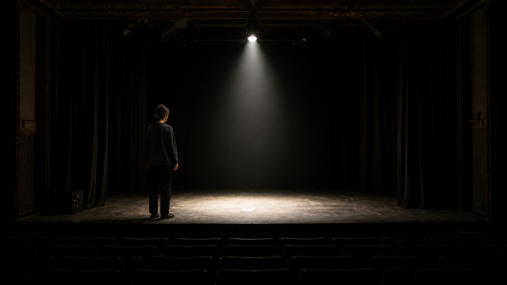

### 最终视频提示词（整段复制）

```text
[场景：散场后的空舞台，聚光灯照亮信纸与程青，空观众席一排排延伸进黑暗。角色：程青（图中中央偏左的人）。镜头：大全景，35mm镜头，大景深，观众席后方固定机位。动作：程青后退一步离开光圈，却没有伸手关灯；无对白，远处飞机低鸣。]
```

<details><summary>首帧生成提示词</summary>

```text
生成一张16:9横版真人叙事电影单帧 S37，不是插画或三维渲染。场景：空舞台与聚光灯。画面：程青仍在光圈边缘，信平放在舞台中心。 程青直起身，信留在聚光灯中央，空座位一排排延伸。。镜头：大全景，35mm，大景深，观众席后方机位。保留连续性圣经中的人物身份、服装、空间结构、来源明确的灯光和真实物理接触；自然肤质与衣料，不望向摄影机，不出现可读文字、标志、水印、CG、塑料皮肤或摆拍。
```

</details>

## S38｜04:52—05:00｜8秒

- 场景：空舞台落幕时刻
- 出镜：程青
- 景别／镜头：大全景，40mm，大景深，观众席正中固定机位
- 首帧画面：幕布在程青与聚光灯前缓慢落下，信仍在舞台中央。
- 运动提示：幕布遮住程青和光圈，最后一线灯光消失。
- 对白／声音：无对白。
- 声场／剪辑：
- 后期备注：信件、台词本及剧场文字均不生成可读内容；保持已审定空间与人物因果。

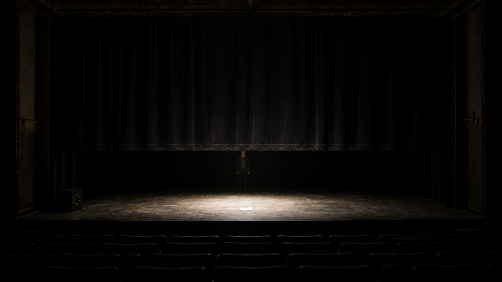

### 最终视频提示词（整段复制）

```text
[场景：空舞台落幕时刻，聚光灯照亮信纸、程青和正在下降的厚幕布，观众席无一人。角色：程青（图中中央偏后的人）。镜头：大全景，40mm镜头，大景深，观众席正中固定机位。动作：幕布缓慢遮住程青和聚光灯，最后一线灯光消失；没有掌声，只有幕布滑轨声。]
```

<details><summary>首帧生成提示词</summary>

```text
生成一张16:9横版真人叙事电影单帧 S38，不是插画或三维渲染。场景：空舞台落幕时刻。画面：幕布刚开始下降，程青站在光圈外，信没有移动。 幕布在程青与聚光灯前缓慢落下，信仍在舞台中央。。镜头：大全景，40mm，大景深，观众席正中固定机位。保留连续性圣经中的人物身份、服装、空间结构、来源明确的灯光和真实物理接触；自然肤质与衣料，不望向摄影机，不出现可读文字、标志、水印、CG、塑料皮肤或摆拍。
```

</details>
